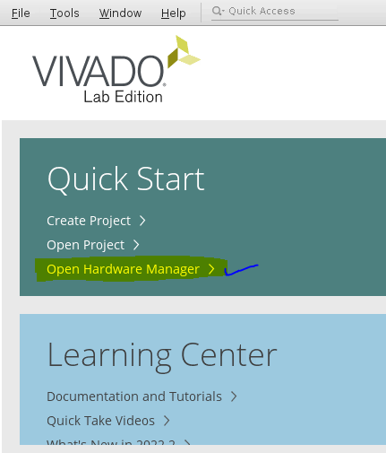
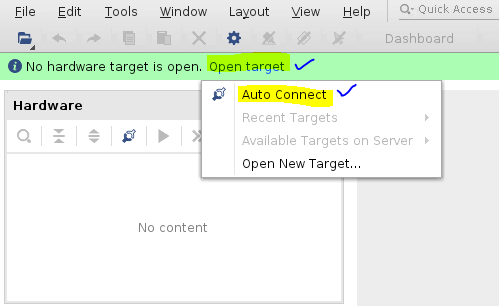
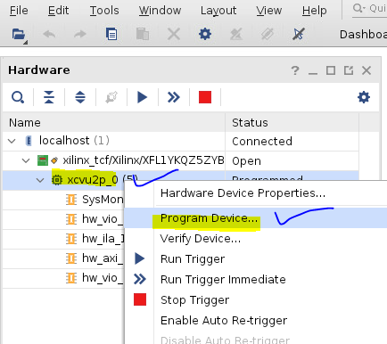
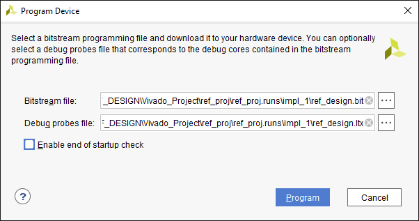

<table class="sphinxhide" width="100%">
 <tr width="100%">
    <td align="center"><h1>UL3524 Ultra Low Latency Trading</h1>
    </td>
 </tr>
</table>

# Programming the Device

## Overview

This section provides instructions to program the UL3524 card via the Vivado HW Manager.

## Instructions

Use the following instructions to program the card via Vivado HW Manager.  

Note, ensure that the project has been [created](./loading_ref_proj) and [built](./building_a_design.md) and .bit file generated.  It is recommended to run the HW Manager on a separate machine from the one the card is installed on.

1. Connect the card via USB (USB0 or USB1) or ADK to the machine running Vivado HW Manager.
2. Open the Vivado HW Manager by clicking on **Open Hardware Manager**. 

3. Connect to the device by using **Auto Connect** 

4. Program the device `xcvu2p_0` by right clicking on the device and selecting the **Program Device** option. 

5. Select the bitstream (.bit) and .ltx generated by the reference design Vivado project as shown in the following image.  Typically, these files will be located in the following directory:

`./<ref_design_name>/Vivado_Project/<project_name>/<project_name>.runs/impl_1/`

After the device is successfully programmed, the design can be debugged or validated with any instantiated ILA and VIOs.

Additional information can be found on [Vivado Design Suite User Guide: Programming and Debugging (UG908)](https://docs.xilinx.com/r/en-US/ug908-vivado-programming-debugging/Programming-the-Device).

## Support

For additional documentation, please refer to the [UL3524 product page](https://www.xilinx.com/products/boards-and-kits/alveo/ul3524.html) and the [UL3524 Lounge](https://www.xilinx.com/member/ull-ea.html).

For support, contact your FAE or refer to support resources at: <https://support.xilinx.com>

Copyright © 2020–2023 Advanced Micro Devices, Inc

<a href="https://www.amd.com/en/corporate/copyright">Terms and Conditions</a>

