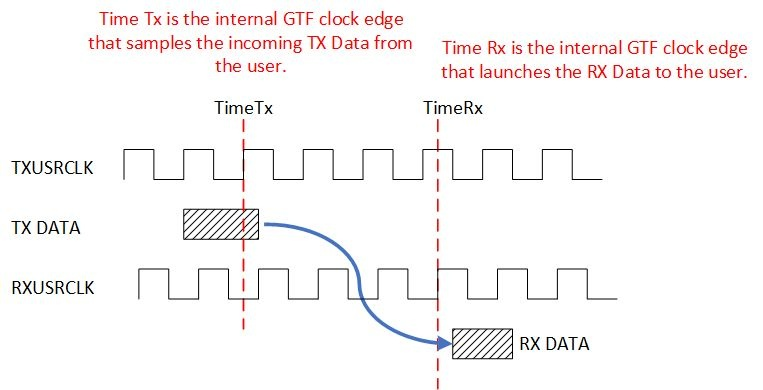
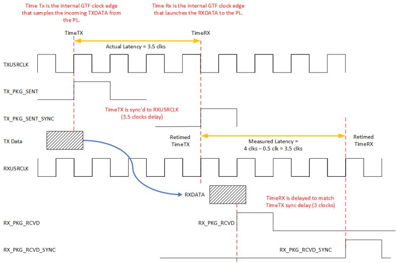
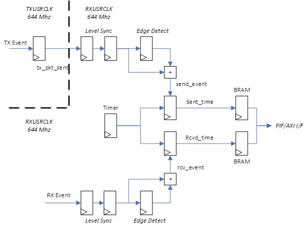

<table class="sphinxhide" width="100%">
 <tr width="100%">
    <td align="center"><h1>UL3524 Ultra Low Latency Trading</h1>
    </td>
 </tr>
</table>

# GTF Latency Benchmark Design

This section provides a high-level overview of the GTF 10G latency benchmark environments used to measure and report GTF MAC and RAW mode latency values.  The benchmark designs are used to demonstrate minimum latency and are not intended for a user design.

Latency results can be recreated using the benchmark designs running in hardware or simulation.

## Measured Latency Values

The following table list the measured base latency for MAC and RAW GTF modes of operation in hardware.

| Mode of Operation | Base Measured Latency  
(ns) |
|---|---|
| MAC | 
5.44|
| RAW | 
2.34|

**Table:** GTF Base Measured Latency Results

The base latency values represent the minimum latency values measured in hardware. It may require running the benchmark test multiple times in order to observe the minimum GTF latency value.

## Benchmark Overview

The following 10G GTF Latency benchmark designs are available.

* [GTF 10G RAW Mode Latency Synchronized](./Synchronized/GTFRAW_Latency_10G_Sync)
* [GTF 10G MAC Mode Latency Synchronized](./Synchronized/GTFMAC_Latency_10G_Sync)

In both the RAW and MAC benchmark designs, the GTF TXUSRCLK and RXUSRCLK clocks operate at the same frequency, but 180 degrees out of phase.

Each benchmark consists of the following components to run, measure and report GTF latency:

* RTL design
  * GTF TX → RX near-end loopback design transmits frame data and monitors and records latency
  * Can be run in hardware or simulation
  * Testbench included for simulation and waveform review
* Latency measurement test
  * A Tcl-based script allows running the design in hardware.  It initializes the GTF, transfers a predefined number of frames and computes latency based on the recorded TX and RX timestamps.
* Integrated Logic Analyzer (ILA)
  * ILAs incorporated into the design allow TX & RX latency values to be visually verified in hardware

Each benchmark is partitioned across several sub-directories - detailed in the following table.

| Sub Directory | Summary |
|---|---|
| Docs |  *High-level architecture design documentation  * Details how to run the design in hardware via Tcl script and capture and report latency values  *How to enable ILA signal capture in hardware * Simulation support  |
| RTL | RTL source code to generate frames and measure latency - used in the Vivado project |
| SIM | Simulation testbench and wcfg waveform files|
| Vivado_Project | Tcl script to rebuild the Vivado project |
| XDC  | XDC file associated with the Vivado project|

**TABLE: benchmark Directory Structure and Summaries**

## Benchmark Latency Design and Measurement Assumptions

The benchmark latency design and measurements are based on the following assumptions:

* GTF put in internal near-end loopback
* GTF TX and RX clocks are operate at the same frequency, approximately at  644MHz, with a 180 degrees phase shift.
* Neither the measured GTF receiver latency nor the GTF transmitter latency include protocol overheads, protocol framing, programmable logic (PL) latency, TX PL interface setup time, RX PL interface clock-to-out, package flight time, and other sources of latency.
* GTF latency is measured as the difference between start time (TX data is latched at GTF) and stop time (GTF registers the incoming TX data on the RX side)

## Latency Measurement

GTF latency is measured as the difference between start time (TX data is latched at GTF) and stop time (GTF registers the incoming TX data on the RX side).  The benchmark uses an RTL design to measure latency in hardware by latching the value of a single free running counter when TimeTx and TimeRx events occur and computing the delta.

The following image illustrates a general representation of the GTF latency measurement.  It shows both TXUSRCLK and RXUSRCLK at the same frequency but out of phase.  (Note: the benchmark designs intentionally align the two clocks 180 degrees out of phase)

* The latency start time is triggered at TimeTx and occurs when the TX data is latched by the GTF with TXUSRCLK.  It does not include the programmable logic (PL) path latency outside the GTF.
* The latency stop time is triggered at TimeRx corresponding to the RXUSRCLK edge when the GTF launches the RX data back into the PL fabric.  It does not represent the first sampling RXUSRCLK edge in the PL fabric, which occurs on the subsequent RXUSRCLK cycle.

## Variations on Measured Latency

Variations on measured latency values using the benchmark can be attributed to protocol overheads, protocol framing, PL latency, TX PL interface setup time, RX PL interface clock-to-out, package flight time, and TX and RX clock phase differences. A brief description of these impacts is given below.

### Impact of protocol overhead on measured latency

In MAC mode, protocol overhead and framing, controlled by the gearbox within the MAC block will impact the latency.  The impact of the codeword overhead on latency are detailed below:

* The AXI-S interface has 16/64b bus, and the MAC converts it to 66b codeword (adding 2 extra bits per 64 bits).
* The gearbox handles these extra bits in the data path (with bits held to be sent in the next cycle) and will need to periodically stall the data
* This shifting of bits and stalling affects the latency
* Lowest latency occurs when the gearbox is aligned with first bytes of the start of packet
* The gearbox goes through a fixed sequence (33 cycle loop) and the latency is fixed based on when the start of the packet is with respect the gearbox sequence.

### Impact of TXUSRCLK and RXUSRCLK phase differences on measured latency

The benchmark performs all latency monitoring in the RXUSRCLK domain.  Consequently, the TimeTx timestamp is synchronized from TXUSRCLK to RXUSRCLK clock domain.  The logic used to synchronize TXUSRCLK events to the RXUSRCLK domain will result in different latency depending on the phase relationship between the two clocks.  (For details, see Latency Monitor section below).

NOTE: Depending on the phase relationship between the TXUSRCLK and RXUSRCLK, differences in measured latency will be observed. RXUSRCLK and TXUSRCLK phase can change every time the GTF is reset. The benchmark uses a fixed phase delay in order to minimize the latency variation and total latency.

## Latency Monitor

This section provides an overview of the Latency Monitor logic which is common to both the MAC and RAW mode latency designs.

The latency monitor is a standalone block integrated into the benchmark design which computes the latency based on transmit (TX) and receive (RX) events.  Both the MAC mode and RAW mode latency designs use the same latency monitor logic. The only difference are the qualification of the send and receive events based on their data streams.

In MAC mode, these events are defined as:

* A 'send event' occurs when the TX_AXIS_TCAN_START signal is accepted by the GT's TX AXI-ST interface
* A 'receive event' occurs when the RX_AXIS_TSOF signal is launched on the RX AXI-ST interface.
  * Since the latency measurement logic must sample RX_AXIS_TSOF in order to know that it was launched, the latency calculation must back out one RXUSRCLK period (ie, to account for the fact TSOF was launched off the rising edge of the preceding RXUSRCLK) as demonstrated in the following figure (values are for demonstration purpose only and do not necessarily reflect actual values).

In RAW mode, these events are defined as:

* A 'send event' occurs when the sync pattern word is presented to the TX Raw Data interface.
* A 'receive event' occurs when the sync pattern word is launched on the RX Raw Data interface.
  * Because the RX Raw data is not necessarily bit aligned, the Rx Raw Data is first sampled and aligned before being compared against the expected sync pattern word.  This process takes multiple clock cycles after the presentation from the GT.  Therefore, latency measurement values are adjusted to account for this delay.

A block diagram of the latency monitor logic is shown below.  

**Figure:** Latency monitor block diagram

All latency measurements are performed in the RXUSRCLK clock domain, including the free running counter used to capture the timestamp.  The 'send event' occurs in the TXUSERCLK clock domain and is synchronized into the RXUSRCLK domain using a clock synchronization/metastability circuit.  In hardware, this synchronization requires three cycles as shown in the following synchronization sequence diagram, where the TX Data Sent event toggles Tx_pkt_sent, which is synchronized to the RXUSRCLK domain, subsequently creating the Pkt_sent pulse which latches the TX start time.

Since the 'receive event' is already in the RXUSRCLK domain it does not need synchronizing.  However, it is nonetheless sent through an identical synchronizer to match the delay of the 'send event'.

## Measured Latency Adjustment

At times TimeTx and TimeRX, received and transmit timestamps SENT_TIME and RCVD_TIME are latched based on a free-running counter. The timestamps are stored in two FIFOs which can subsequently be read via the PIF/AXI interface.

Using these timestamps, latency is computed using the following equation.

`LATENCY = ABS(RCVD_TIME - SENT_TIME) - ADJ_FACTOR`

The following table details the *ADJ_FACTOR* for each benchmark design.  The *ADJ_FACTOR* is dependent on the mode of operation (MAC or RAW).  Note, in all cases, since the TimeRx event is sampled in the PL fabric one clock cycle after the actual event, the measured latency subtracts one clock cycle when calculating latency.  

| 10G GTF Latency benchmark designs | Summary | ADJ_FACTOR  (clk cycles)|
|---|---|---|
| [GTF 10G RAW Mode Latency Synchronized](./Synchronized/GTFRAW_Latency_10G_Sync) | - TimeRx event sampled in the PL fabric one clock cycle after the actual event.  - Additional pipeline used to align the pattern detection logic adds four clocks.  - Add back half a cycle to account for 180 degree phase shift on TXUSRCLK.  | 6.5 |
| [GTF 10G MAC Mode Latency Synchronized](./Synchronized/GTFMAC_Latency_10G_Sync) | - TimeRx event sampled in the PL fabric one clock cycle after the actual event.  - Add back half a cycle to account for 180 degree phase shift on TXUSRCLK.  | 0.5 |

Multiplying the computed latency by the period of the clock driving the counter, gives the TX → RX latency in ns.

## Support

For additional documentation, please refer to the [UL3524 product page](https://www.xilinx.com/products/boards-and-kits/alveo/ul3524.html) and the [UL3524 Lounge](https://www.xilinx.com/member/ull-ea.html).

For support, contact your FAE or refer to support resources at: <https://support.xilinx.com>

Copyright © 2020–2023 Advanced Micro Devices, Inc

<a href="https://www.amd.com/en/corporate/copyright">Terms and Conditions</a>

