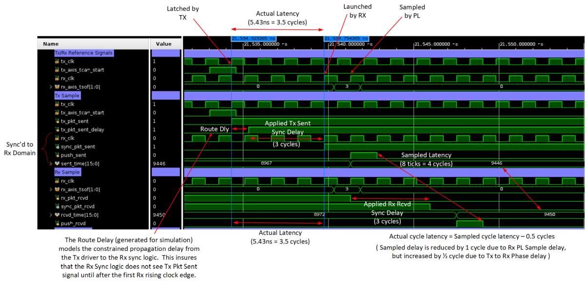
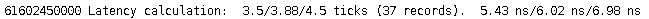

<table class="sphinxhide" width="100%">
 <tr width="100%">
    <td align="center"><h1>UL3524 Ultra Low Latency Trading</h1>
    </td>
 </tr>
</table>

# GTF MAC Synchronized Latency Measurement Design: Simulation

## Running the Simulation

To run a simulation of the design, follow the instructions detailed [here](../../../../Docs/simulating_a_design.md).

## Simulation Behavior

The following waveforms show the simulation behavior of the GTF latency measurement design in MAC mode.

**Figure: Waveform of the GTF latency measurement in MAC mode**

An example of the simulation minimum, average and maximum measured latency values are shown below.

**Figure: Example of displayed Min/Avg/Max values**

## Support

For additional documentation, please refer to the [UL3524 product page](https://www.xilinx.com/products/boards-and-kits/alveo/ul3524.html) and the [UL3524 Lounge](https://www.xilinx.com/member/ull-ea.html).

For support, contact your FAE or refer to support resources at: <https://support.xilinx.com>

Copyright © 2020–2023 Advanced Micro Devices, Inc

<a href="https://www.amd.com/en/corporate/copyright">Terms and Conditions</a>

