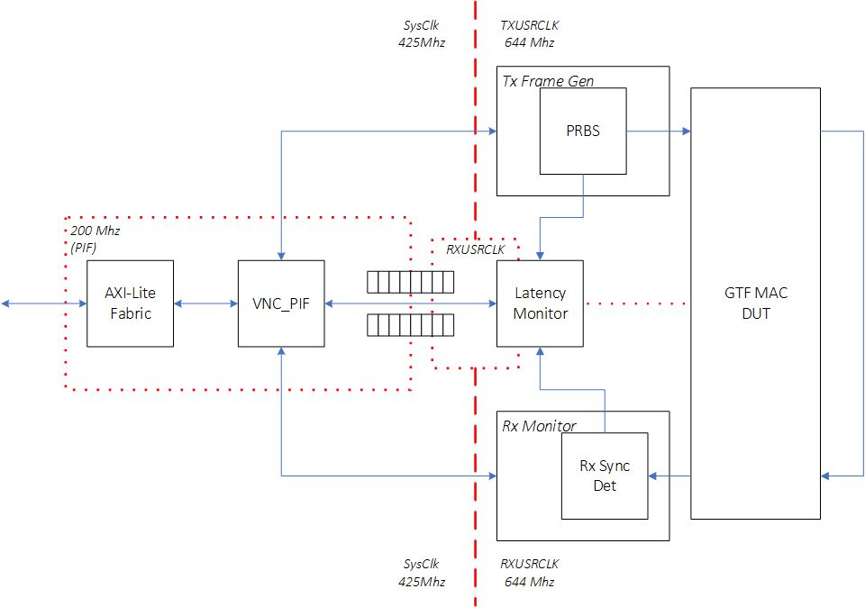
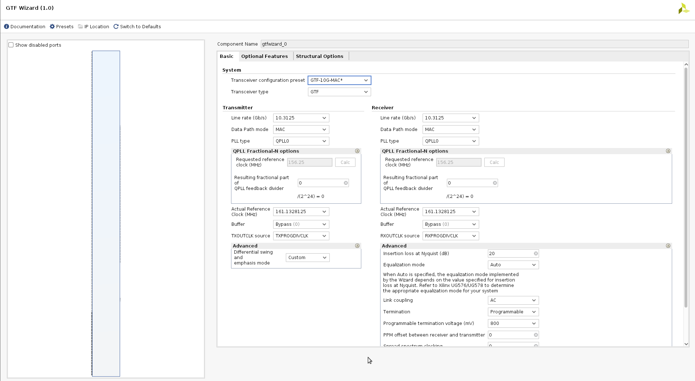
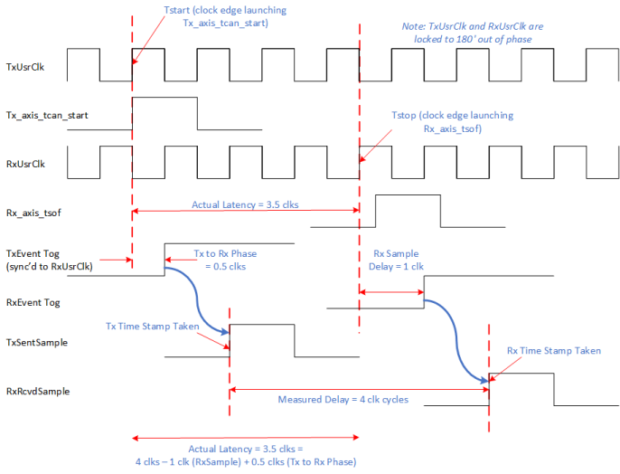

<table class="sphinxhide" width="100%">
 <tr width="100%">
    <td align="center"><h1>UL3524 Ultra Low Latency Trading</h1>
    </td>
 </tr>
</table>

# GTF MAC Synchronized Latency Benchmark Design

## Description

This reference design provides a GTF 10G latency benchmark environment used to measure and report GTF latency (TX → RX) operating in MAC mode.  The benchmark design demonstrates minimum latency and is not intended for a user design.  A [Scripts directory](./Scripts/README.md) contains scripts to run benchmark design in Vivado H/W Manager to reproduce reported latencies.

The design and measurements are based on the following assumptions:

* GTF put in internal near-end loopback
* GTF TX and RX clocks are operate at the same frequency, approximately at  644MHz, with a 180 degrees phase shift.
* Neither the measured GTF receiver latency nor the GTF transmitter latency include protocol overheads, protocol framing, programmable logic (PL) latency, TX PL interface setup time, RX PL interface clock-to-out, package flight time, and other sources of latency.
* GTF latency is measured as the difference between start time (TX data is latched at GTF) and stop time (GTF registers the incoming TX data on the RX side)

**Additional Documentation**

The following links provide additional documentation, including simulation and HW Manager support.

* [Simulation](./Docs/simulation.md)<br>
  * Describes the available simulation and description of waveforms
* [HW Manager Support](./Docs/hw_manager_support.md)<br>
  * Provides instructions to run the design in hardware and interact with the design through the HW Manager.

## Architecture

The high-level block design diagram used to measure GTF latency in MAC mode is shown below.  It consists of the following key blocks:

* TX Frame generator
* GTF instantiated in MAC mode
* RX Monitor
* Latency Monitor



**Figure:** Block diagram of the GTF MAC Latency Measurement Design

An overview of the operation of the design:

* GTF is initialized and placed in TX → RX near-end loopback mode
* The Tx FrameGen sends frames to the GTF transmit AXI-ST interface
  * Send timestamp is captured
* The Rx Monitor monitors the receive AXI-Stream activity
  * Receive timestamp is captured
* The Latency Monitor stores the timestamps into a FIFO which are subsequently serviced by system software
* The software computes the min/max/avg latency through the GTF
* Measurement activity can be captured on ILA.
* No data integrity checking is performed

## GTF MAC DUT

The GTF MAC DUT was generated using the GTF wizard.  The GTF Transceiver configuration preset field was set to *GTF-10G-MAC* in the GTF Wizard, using near-end loopback mode. All preset wizard settings from this configuration were unchanged. An image of the 'Basic' GTF Wizard tab is shown below for reference.


**Figure:** GTF Wizard MAC mode settings

## Clock Routing

The GTF DUT is slightly modified to redefine the RXUSRCLK and TXUSRCLK.  By default, these clocks are generated independently from the GTF to drive the data paths in the programmable logic region.  The modified RTL uses the RXOUTCLK as a source to both RXUSRCLK and TXUSRCLK.  The two clocks are aligned with 180 degress of phase.


**Figure:** Modified GTF Wizard MAC clock routing

## Tx Frame Generator
The Tx Frame Generator module generates a variable length stream of PRBS values that are routed through the Tx AXIS port of the GTF.  

## Rx Monitor
The Rx Monitor receives the loopback data via the Rx AXIS port from the GTF.  Although not enabled by default, this module can be configured to check the received PRBS stream and detect bit errors.

## Latency Monitor
The latency monitor is a standalone block integrated into the benchmark design which captures transmit (TX) and receive (RX) timestamps based on a 'send event' and 'receive event' respectively.  

The latency monitor has a free running timer based in the Rx clock domain.  When the latency monitor is enabled, the send/receive pulses latch the timer value and store them in a BRAM FIFO.

Software polls the FIFO status to determine when a Tx/Rx pair of timestamps are stored.  When available, software will pop the FIFO values and calculate the true latency.  

Both send event and receive event pulses are synchronized to the Rx clock domain using a rising edge pulse detection. 

The nature of the MAC mode operation in the GTF can result in different latency measurements.  The combination of processes such as MAC protocols and serialization effects can generate unoptimal latency measurements if the design uses data tracking through the GTF.  Instead, the most consistant measurement involves using Tx_axis_tstart as the send event and Rx_axis_tsof as the receive event.  This reflects a scenario when the GTF is in the best logic state to begin a packet transfer and when the first word is received.


**Figure:** Latency Monitor Pipeline

## Clock Domain Crossing Considerations

The design is modified from the GTF MAC example design to force the TxUsrClk and RxUsrClk clocks to be phase aligned at 180 degrees.  

This is accomplished by using a MMCM to generate the two user clocks from the GTF's RXOUTCLK.  This allows Vivado to autogenerate ==related== constraints for the two user clocks.


```
    BUFG_GT u_rxusrclk_inst (
        .CE      ( 1'b1             ),
        .CEMASK  ( 1'b0             ),
        .CLR     ( 1'b0             ),
        .CLRMASK ( 1'b0             ),
        .DIV     ( 3'd0             ),
        .I       ( gtf_ch_rxoutclk  ),
        .O       ( gtf_ch_rxbufgclk )
    );
    
    clk_wiz_1 phase_shift_mmcm_inst (
        .reset     ( ~gtf_ch_rxprgdivresetdone ),
        .locked    ( phase_shift_mmcm_lock     ),
        .clk_in1   ( gtf_ch_rxbufgclk          ),
        .txusrclk  ( gtf_ch_txusrclk           ),
        .rxusrclk  ( gtf_ch_rxusrclk           )
    );
```

Tx_axis_tcan_start is generated by the TxUsrClk and sampled in the latency monitor in the RxUsrClk.  This results in a known 1/2 clock cycle delay to be applied to the latency calculation.

## Detailed Latency Calculations

The start time represents the time when Tx_axis_tcan_start is asserted by the GTF in the TxUsrClk domain.  The stop time represents the the clock edge when the Rx_axis_tsof value is asserted by the GTF in the RxUsrCLk domain.  The desired latency value should represent the time delta between these two events.  This is illustrated in the following figure.



**Figure:** Latency measurement detailing adjustment calculation

The timestamps collected in the latency monitor represent samples of the free running timer in hardware.  However software must perform a simple correction calculation to remove the non-GTF related delays.

One clock cycle must be subtracted to compensate for the Rx sample delay to latch Rx_axis_tsof.  A half cycle delay must be added correlating to the Tx to Rx delay when sampling Tx_axis_tcan_start into the Rx clock domain. To generate a correct latency value, software must apply adjustment factor of 0.5 clocks to the timestamp delta.

	* Calculated Latency = (Rcvd Timestamp) - (Sent Timestamp) - 0.5

## Support

For additional documentation, please refer to the [UL3524 product page](https://www.xilinx.com/products/boards-and-kits/alveo/ul3524.html) and the [UL3524 Lounge](https://www.xilinx.com/member/ull-ea.html).

For support, contact your FAE or refer to support resources at: <https://support.xilinx.com>
<p class="sphinxhide" align="center"><sub>Copyright © 2020–2023 Advanced Micro Devices, Inc</sub></p>

<p class="sphinxhide" align="center"><sup><a href="https://www.amd.com/en/corporate/copyright">Terms and Conditions</a></sup></p>
