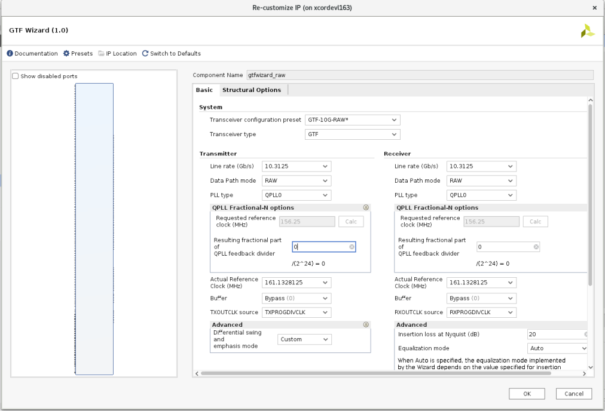
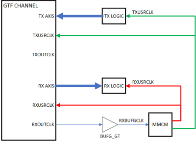
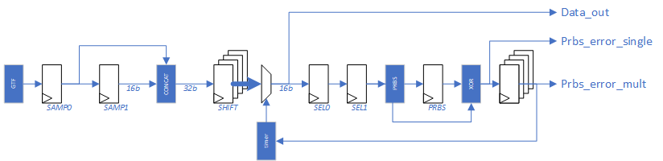
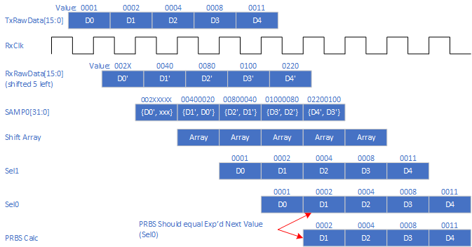
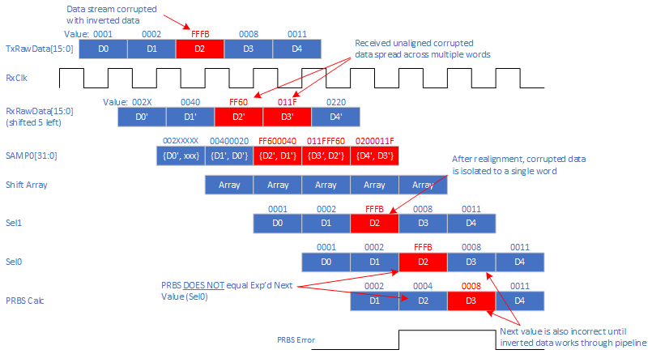
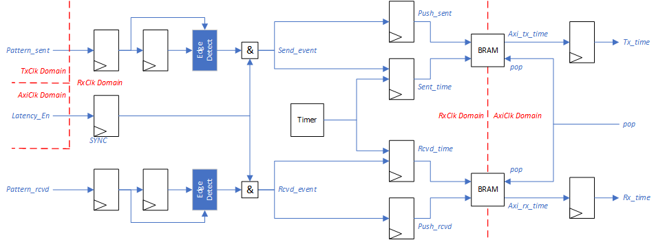
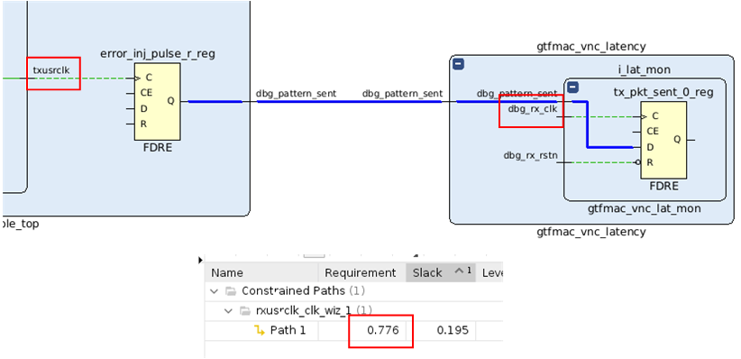
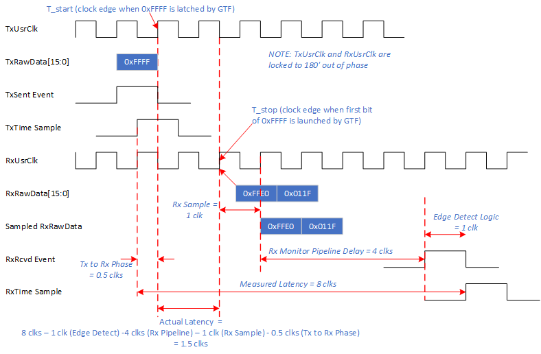

<table class="sphinxhide" width="100%">
 <tr width="100%">
    <td align="center"><h1>UL3524 Ultra Low Latency Trading</h1>
    </td>
 </tr>
</table>

# GTF RAW Synchronized Latency Measurement Design

## Description

This reference design provides a GTF 10G latency benchmark environment used to measure and report GTF latency (TX → RX) operating in RAW mode.  The benchmark design demonstrates minimum latency and is not intended for a user design.  A [Scripts directory](.Scripts/README.md) contains scripts to run benchmark design in Vivado H/W Manager to reproduce reported latencies.

The design and measurements are based on the following assumptions:

* GTF put in internal near-end loopback
* GTF TX and RX clocks are operate at the same frequency, approximately at  644MHz, with a 180 degrees phase shift.
* Neither the measured GTF receiver latency nor the GTF transmitter latency include protocol overheads, protocol framing, programmable logic (PL) latency, TX PL interface setup time, RX PL interface clock-to-out, package flight time, and other sources of latency.
* GTF latency is measured as the difference between start time (TX data is latched at GTF) and stop time (GTF registers the incoming TX data on the RX side)

**Additional Documentation**

The following links provide additional documentation, including simulation and HW Manager support.

* [Simulation](./docs/simulation.md)<br>
  * Describes the available simulation and description of waveforms
* [HW Manager Support](./docs/hw_manager_support.md)<br>
  * Provides instructions to run the design in hardware and interact with the design through the HW Manager.

## Architecture

The high-level block diagram for the RAW GTF latency design is shown below.  It consists of the following key blocks:
* GTF DUT Example (RAW) with changes/additions to…
  * PRBS Tx RawData Generator
  * PRBS Rx RawData Monitor
  * Error Injection Logic
* Latency Monitor
* GTF Link Status Logic
* System Register Array with JTAG AXI interface module
* System Clock/Reset Generation
* System VIO for system status


**Figure:** High Level Block Diagram

Running design consists of the following high-level operations:
* The system is released from reset allowing the GTF to initialize in near-end loopback mode.
* This includes enabling the PRBS Tx RawData generator to provide a constant stream of Tx to the GTF.
* The PRBS Rx RawData monitor inspects the looped data from the GTF.  This involves sampling the RxRawData bus and performing bit alignment by regenerating the PRBS sequence.
* The PRBS RxRawData monitor will report PRBS errors to the link status logic.  Once bit alignment has been achieved, the PRBS errors will disappear, and the link will stabilize.  
* The software will enable the latency monitor and instruct the error injection logic to periodically invert the TxRawData bus.  This will result in a PRBS error detected in the RxRawData monitor.  
  * Note: a single PRBS error will not result in loss of link status.  The logic filters these events assuming they are related to the error injection logic.
* The latency monitor observes the error injection and detection events and records their timestamps from a freerunning timer.
* The software polls the latency monitor, pulls the timestamps when they are available, and computes the latency through the GTF.
* Error detection and measurement activity can be captured using ILA’s.

## GTF RAW DUT

The GTF RAW DUT was generated using Vivado’s GTF wizard.  The GTF transceiver configuration preset field was set to GTF-10G-RAW in the GTF Wizard.  All preset wizard settings for this configuration were unchanged.  An image of the ‘Basic’ GTF Wizard tab is shown below for reference.



**Figure:** GTF Wizard Config Window for RAW 10Gbps

## Clock Routing

The GTF DUT is slightly modified to redefine the RXUSRCLK and TXUSRCLK. By default, these clocks are generated independently from the GTF to drive the data paths in the programmable logic region. The modified RTL uses the RXOUTCLK as a source to both RXUSRCLK and TXUSRCLK. The two clocks are aligned with 180 degrees of phase.  



**Figure:** Clock Routing Modifications from Example Design

## PRBS TxRawData Generator

The PRBS TxRawData generator module generates a continuous stream of 16bit PRBS values that are fed to the TxRawData port of the GTF.  The stream is used as a sync pattern used by the Rx Monitor to help determine when the system link is stable.

## Error Injection Logic

The Tx generator creates a deterministic continuous data stream to the GTF.  To generate a Tx event for the latency monitor, the error injection logic will invert the TxRawData value for a single clock cycle.  This interruption will result in a PRBS error in the Rx Monitor.  

Software can control the number and rate of injection events by setting two control registers.  The logic is then enabled by setting a bit in the system control register.  Once the operation has been completed, the error injection logic disables and allows the Tx data stream to continue as normal.

## PRBS RxRawData Monitor

The PRBS RxRawData monitor is a pipeline module that continuously samples the RxRawData bus from the GTF.  This data sample is likely not bit-aligned and therefore does not immediately reflect the corresponding TxRawData stream.  The Rx monitor performs a sequence of bit shifting the sample data while attempting to recreate the PRBS stream.  If the data is bit aligned, the logic should be able to calculate the next Rx data sample.  Once the PRBS sequence is stable, the logic locks in the bit alignment and continues to monitor the incoming data stream.

The Rx Monitor outputs the PRBS lock status to the link status logic and latency monitor.  Before the system is finished initializing, PRBS error indicates that the GTF needs more time to complete its link initialization process.  After the system becomes stable, single PRBS errors indicate injected error events.  

## Latency Monitor

The latency monitor captures the event markers from the error injection logic (Tx) and Rx monitor.  These events are used to sample timestamps that represent when a data pattern is latched into the GTF TxRawData port and when it’s detected back in the Rx Monitor.  
(need more here!!!!)

## System Clock/Reset

This module a basic logic block to provide basic freerunning clocks and resets for the AXI interfaces.

## VIO System

This module is a basic VIO to quickly display system status such as link status, reset settings, etc.

## Detailed Rx Monitor Logic

The Rx Monitor is a register pipeline that samples and bit aligns the RxRawData bus while monitoring the expected PRBS data stream and reporting status for the system and latency monitor.  This pipeline is detailed in the following figure:



**Figure:** Rx Monitor Pipeline

The RxRawData bus from the GTF will probably not be bit aligned which results in RxRawData not exactly matching TxRawData.  The pipeline starts by registering the RxRawData bus directly from the GTF (forces direct point to point routing without interference from other fabric resources).  The sampled 16-bit value is concatenated with the previous sampled value to create a single 32-bit value.

The 32-bit value is then broken into sixteen 16-bit registers representing the possible bit shifts needed to bit align the incoming data stream.  This effectively creates sixteen parallel pipelines representing a different bit shift configuration.

A timer is used as a window control to mux through “parallel pipelines”.  Each pipeline is selected for 128 clocks before moving to the next pipeline.  The selected pipeline is sampled and passed through a PRBS calculation to predict the next data value  If the prbs output matches the next data stream value, the timer is halted thereby allowing the current selected pipeline to continue.  If the prbs output does not match the next data stream value, the timer will increment and eventually select the next pipeline.  

If the Tx/Rx data path is stable, eventually the Rx Monitor pipeline will converge on a bit shift pipeline that consistently generates correct PRBS values that match the next data stream value.

The following figure shows a good dataflow through the pipeline.  The five data values reflect a segment of a valid PRBS data stream.  In the figure, the TxRawdata represents a good sequence (D0, D1, etc) that was sent into the GTF.  The unaligned RxRawData (D0', D1', etc) is left shifted 5 bits when sampled by the Rx monitor.  After the shift align registers, the regenerated bit aligned data stream (D0, D1, etc) is sampled in Sel1.  The data stream is then passed through the PRBS calculation and compared with the next value.  No errors are reported for this case.



**Figure:** Example Rx monitor pipeline timing diagram for good data stream

The next figure shows a failing dataflow through the pipeline similar to the previous example.  In this case, the data stream is corrupted with an inverted word (0x0004 -> 0xFFFB) which is highlighted in red text.  Note that the corrupted value is bit aligned similar to the other words in Sel1.  The latency monitor is notified when the corrupted data is launched to the GTF thereby indicating a send Tx event has occured.

Like before, when the PRBS calculation is performed on 0x0002 (D1), the next value is expected is 0x0004.  However this does not match the corrupted data 0xFFFB thereby indicating a PRBS error.  This error detection is passed to the latency monitor to indicate that a received Rx event has occurred.

Note that the PRBS calculation actually produces two consecutive errors.  The second error is due to the PRBS calculation being performed on the corrupted data passing through the pipeline (the corrupted PRBS calculation will not match the next uncorrupted pipeline value).



**Figure:** Example Rx monitor pipeline timing diagram for corrupted data stream

PRBS errors are reported to the system link status logic and latency monitor.  

Until the GTF link is stable, the Rx monitor will report a large number of PRBS errors.  Eventually, the Rx monitor will bit align the data stream and will stop reporting PRBS errors.  At this point, the status logic will monitor for errors and eventually declare that the link is stable.

During the latency measurements, PRBS errors are intentionally inserted into the TxRawData data stream.  Reporting these errors to the system link status logic will incorrectly result in resetting the GTF.   To prevent this, the Rx monitor filters out single event PRBS errors attributing them to intentional errors.  Only “large scale” PRBS errors are reported to the link status logic.

However, all PRBS errors are reported to the latency monitor.  Once the system is stable and the latency monitor is enabled, the PRBS errors are used to sample timestamps for Rx events.

## Detailed Latency Monitor Logic

The latency monitor uses signals from the data stream logic to sample timestamps for send and receive events.  The timestamp pipeline is detailed in the figure below.

Both pattern send and pattern receive pulses are synchronized to the Rx clock domain using a rising edge pulse detection.  As mentioned above in the latency monitor description, the pattern receive pulse (aka PRBS error detected) is two clock cycles wide so only the first clock cycle is valid.

The latency monitor has a free running timer based in the Rx clock domain.  When the latency monitor is enabled, the send/receive pulses latch the timer value and store them in a BRAM FIFO.

Software polls the FIFO status to determine when a Tx/Rx pair of timestamps are stored.  When available, software will pop the FIFO values and calculate the true latency.  



**Figure:** Latency Monitor Pipeline

## Clock Domain Crossing Considerations

The design is modified from the GTF RAW example design to force the TxUsrClk and RxUsrClk clocks to be phase aligned at 180 degrees.  

This is accomplished by using a MMCM to generate the two user clocks from the GTF's RXOUTGCLK.  This allows Vivado to autogenerate ==related== constraints for the two user clocks.

```bash
    BUFG_GT u_rxusrclk_inst (
        .CE      ( 1'b1             ),
        .CEMASK  ( 1'b0             ),
        .CLR     ( 1'b0             ),
        .CLRMASK ( 1'b0             ),
        .DIV     ( 3'd0             ),
        .I       ( gtf_ch_rxoutclk  ),
        .O       ( gtf_ch_rxbufgclk )
    );
    
    clk_wiz_1 phase_shift_mmcm_inst (
        .reset     ( ~gtf_ch_rxprgdivresetdone ),
        .locked    ( phase_shift_mmcm_lock     ),
        .clk_in1   ( gtf_ch_rxbufgclk          ),
        .txusrclk  ( gtf_ch_txusrclk           ),
        .rxusrclk  ( gtf_ch_rxusrclk           )
    );
```

An example for these autogenerated constraints is shown in the following figure from an implemented design.  The schematic trace shows a Tx sent event launched with txusrclk but sampled by rxusrclk.  Running a timing report through this net returns a requirement of 0.776ns which is half the frequency of txusrclk and rxusrclk.  This indicates that vivado is constraining the clock domain crossings bewtween the two related clocks.



**Figure:** Tx/Rx clock domain crossing implementation results

## Detailed Latency Calculations

The desired latency value should represent the time for a data word being sampled on the TxRawData port to when it is launched onto RxRawData port.  This is detailed in the following figure.

The start time represents the rising edge of TxUsrClk that is sampling the TxRawData value.  The stop time represents the RxUsrClk edge that launches the RxRawData value that contains the first bit of the original TxRawData.  
*Because the RxRawData value is not bit aligned, the original TxRawData value will be spread across two RxUsrClk cycles.  Therefore it's determined that the stop time qualifier shall be the location of the first received bit of the original TxRawData value in the RxUsrClk domain.*


**Figure:** Latency measurement definition

The timestamps collected in the latency monitor represent the time delta from when the data corruption is inserted into the data stream on the Tx domain and when the data corruption is detected on the Rx domain.  However, this duration is not correct because it includes the Rx monitor pipeline logic.  Therefore, software must perform a simple correction calculation to remove the non-GTF related delays.

The latency correction is detailed in the following figure.  In this example, the actual latency is 1.5 clock cycles as shown from the delay of 0xFFFF (corrupted data) from the TxRawData port sample clock edge to the RxRawData launch clock edge.  

The TxSentEvent pulse represents the clock cycle where TxRawData equals the 0xFFFF (the data word being traced through the GTF).  

The RxRcvdEvent pulse represents when the Rx monitor logic detects the corrupted data.  This event pulse is 5 clock cycles after the launch edge corresponding to the stop time.  One cycle is for the sample delay from the GTF to the Rx monitor logic.  The other 4 clock cycles are from the Rx monitor pipeline to detect the corrupted data (0xFFFF).

The two events pulses (TxSentEvent and RxRcvdEvent) are sampled by RxUsrClk.  Note that this represents a full cycle for the RxRcvdEvent, but only a half cycle for the TxSentEvent.

For this example, the measured latency is 8 clock cycles.  This is corrected by subtracting the TxSentEvent delay (0.5) cycles, RxSentEvent delay (1.0 cycles), Rx pipeline delay (4 cycles), and the Rx sample delay (1 cycle) which totals 6.5 clocks.  The calculated measurement matches the actual latency value of 1.5 cycles.



**Figure:** Detailed latency measurement with correction calculation

## Register Interface

The design implements a JTAG AXI instance to allow interfacing using Vivado hardware manager.   Below is a table that details the registers accesible from this AXI port.

| Address | Bit | Signal Name | Access | Description |
| ----------- | ----------- | ----------- | ---- | ----------- |
| 0x0000 | 0 | Link Status | RO | Immediate sync status of Tx/Rx ports|
|  | 1 | Link Stable | RO | Indicates Tx/Rx sync is stable |
|  | 2 | Link Down | RO | Indicates Tx/Rx not in sync|
| 0x0004 | 0 | gtwiz_reset_all | RW | General system reset |
|  | 1 | gtf_ch_txdp_reset | RW | Tx data port reset |
|  | 2 | gtf_ch_rxdp_reset | RW | Rx data port reset |
|  | 4 | lat_enable | RW | Latency monitor enable |
|  | 5 | lat_pop | W1C | Pop timestamp from FIFO |
|  | 6 | lat_clear | W1C | Clear latency monitor pointers |
|  | 8 | err_inj_start | W1C | Start Tx error injection logic |
| 0x0010 | [15:0] | err_inj_count | RW | Number of errors to inject |
| 0x0014 | [15:0] | err_inj_delay | RW | Clock cycles between injected errors |
| 0x0018 | [15:0] | err_inj_remain | RO | Remaining number of errors to inject  |
| 0x0028 | [15:0] | lat_tx_time | RO | Timestamp for Tx event |
| 0x002C | [15:0] | lat_rx_time | RO | Timestamp for Rx event |

## Support

For additional documentation, please refer to the [UL3524 product page](https://www.xilinx.com/products/boards-and-kits/alveo/ul3524.html) and the [UL3524 Lounge](https://www.xilinx.com/member/ull-ea.html).

For support, contact your FAE or refer to support resources at: <https://support.xilinx.com>

<p class="sphinxhide" align="center"><sub>Copyright © 2020–2023 Advanced Micro Devices, Inc</sub></p>

<p class="sphinxhide" align="center"><sup><a href="https://www.amd.com/en/corporate/copyright">Terms and Conditions</a></sup></p>
