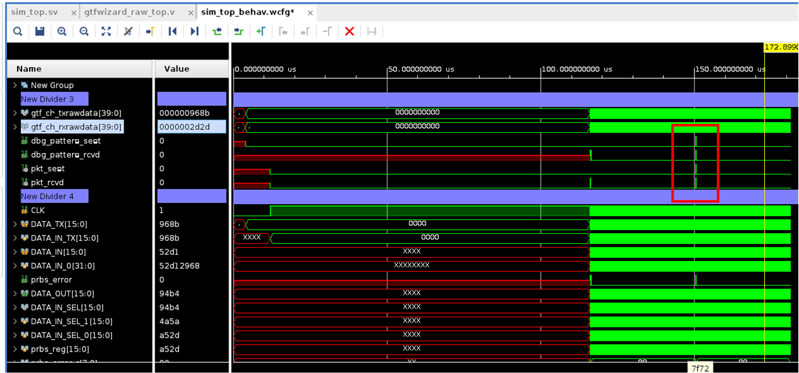

<table class="sphinxhide" width="100%">
 <tr width="100%">
    <td align="center"><h1>UL3524 Ultra Low Latency Trading</h1>
    </td>
 </tr>
</table>

# GTF Latency Synchronized Design

## Setting Up the Design
The following steps will create a local project folder and load the required design elements.  Once complete, the design can be built or simulated using the normal Vivado design flows.  Once the design has been built, it can be reloaded by loaded the xpr project file in the Vivado_Project/project_1 build folder.

1.  Cd to this folder (Vivado_Project) 
2.  Launch vivado
3.  Type 'source ./setup.tcl' in the TCL command line

## Simulating the Design

1.  If not done already, set up the design as described above
2.  Once loaded, click on 'Run Simulation' in the Flow Navigator window.
    
Note:  The initial simulation build can take a long time to load as it generates the IP blocks serially.  Consider running synthesis first to build the IP blocks in parallel.  When finished, THEN click 'Run Simulation'.  This only needs to be done once when starting the project from scratch.

3.  The simulator will build and start the design.  The first latency measurement will occur around 150us as shown in the figure below.  You will need to click on the 'Run' button to extend the simulation far enough to see this event.

## Building the Design

1.  If not done already, set up the design as described above
2.  Once loaded, click on 'Run Implementation' in the Flow Navigator window.
3.  Once complete, inspect and critical warning or timing issues that may arrive (there shouldn't be any).
4.  If all looks good, click on 'Generate Bitstream' to create the bitfile.

Note: the design should include an system VIO that shows link and reset status, along with an ILA in the Rx PRBS calculation module to show the Tx and Rx data progression used to generate event triggers to the latency logic.

## Running the Design

1.  Generate the bitfile as described above and copy the generated bitfile (bit) and debug probes files(ltx) to your local machine.
2.  Also create local copies of the tcl scripts from the project's 'scripts folder'
3.  Launch vivado and select the hardware manager (progress through the steps to link with the board)
4.  Right click the fpga in the Hardware window and click 'Program Device'.
5.  Insert paths to the generated bitfile (bit) and debug probes file (ltx).
6.  In the TCL command line window, type 'source ./runme.tcl'
7.  Once loaded, type 'reset_design' to reset the design and stabilize the GTF link.
8.  Type 'runme' in the TCL command line window.  By default, this will collect 100 samples and display the Tx/Rx sample times, the delta between the two, and the corrected latency in clock cycles.

## Support
For additional documentation, please refer to the [UL3524 product page](https://www.xilinx.com/products/boards-and-kits/alveo/ul3524.html) and the [UL3524 Lounge](https://www.xilinx.com/member/ull-ea.html).

For support, contact your FAE or refer to support resources at: https://support.xilinx.com

Copyright © 2020–2023 Advanced Micro Devices, Inc

<a href="https://www.amd.com/en/corporate/copyright">Terms and Conditions</a>

