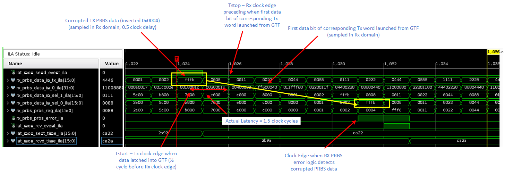

<table class="sphinxhide" width="100%">
 <tr width="100%">
    <td align="center"><h1>UL3524 Ultra Low Latency Trading</h1>
    </td>
 </tr>
</table>

# GTF RAW Synchronized Latency Measurement in Hardware

This section provides steps to run the GTF RAW benchmark design and to measure and report GTF RAW latency on the UL3524 via the Vivado HW Manager.

The key steps to run the benchmark design are:

1. Program the device
 * Program the UL3524 with the bitstream (.bit) and ILA (.ltx).
 * (Optional) Enable ILA to capture and view waveforms
2. Run the latency measurement test
 * A Tcl-based script allows running the design in hardware.  It initializes the GTF, transfers a predefined number of frames and computes latency based on the recorded TX and RX timestamps.

These steps are described in detail below.

## Programming the Device

It is necessary to program the device prior to running the GTF benchmark design.  **Be sure to build the design prior to following these steps.**

1. [Connect to the card via the HW Manager and program the FPGA](../../../../Docs/programming_the_device.md) with the bitfile (*.bit) and ILA debug (*.ltx) files located in the following sub-directory (assumes the design was built within *Vivado_Project*:

* `./Vivado_Project/<project_name>/<project_name>.runs/impl_1/`

## Running the Latency Measurement Test

Instructions to run the GTF latency measurement test are given below.

1. In the Vivado Tcl console, change the working directory to:
   * `cd ./GTF_Latency/Synchronized/GTFRAW_Latency_10G_Sync/Scripts`
2. Use the following command to run the Tcl script.  When the has completed, it will display 'Complete' in the Tcl console.
   * `source ./run_tests.tcl`
3. Once the test is complete, you can review the output log found in the following directory.
   * `./GTF_Latency/Synchronized/GTFRAW_Latency_10G_Sync/Scripts/Test_Output`

### Example Output Files

Two output files are generated in the "Test_Output" folder once we run the run_tests.tcl. A csv file and a log file.They have the same contents but in a different format.

An example of the generated output log from `run_tests.tcl` is shown below.  There will be **num_test** tests, with each test transferring **pkt_cnt** frames.  In the example output below, **num_test** is 10 and **pkt_cnt** is 250.  These and other parameters can be changed from their default values if needed. For more information regarding the test parameters, please refer [the scripts documentation](../Scripts/README.md#test-parameters).

Each line displays the minimum, average and maximum (min/avg/max) measured latency values for a given test along with the latency distributions in terms of clock cycles. The average latency value is the sum of all latency values for a test, divided by **pck_cnt**.  

Variations in the measured latency values are expected and describe [here](../../../README.md#variations-on-measured-latency).

```bash
==========================================================================================
Test Number: 0
Latency (min/avg/max):  1.500ns / 1.500ns / 1.500ns
Clk Cnts  (0.5, 1.5, 2.5, 3.5): 0  / 250  / 0 / 0
Percent   (0.5, 1.5, 2.5, 3.5): 0% / 100% / 0% / 0%
==========================================================================================

==========================================================================================
Test Number: 1
Latency (min/avg/max):  1.500ns / 1.500ns / 1.500ns
Clk Cnts  (0.5, 1.5, 2.5, 3.5): 0  / 250  / 0 / 0
Percent   (0.5, 1.5, 2.5, 3.5): 0% / 100% / 0% / 0%
==========================================================================================

==========================================================================================
Test Number: 2
Latency (min/avg/max):  1.500ns / 1.500ns / 1.500ns
Clk Cnts  (0.5, 1.5, 2.5, 3.5): 0  / 250  / 0 / 0
Percent   (0.5, 1.5, 2.5, 3.5): 0% / 100% / 0% / 0%
==========================================================================================

==========================================================================================
Test Number: 3
Latency (min/avg/max):  1.500ns / 1.500ns / 1.500ns
Clk Cnts  (0.5, 1.5, 2.5, 3.5): 0  / 250  / 0 / 0
Percent   (0.5, 1.5, 2.5, 3.5): 0% / 100% / 0% / 0%
==========================================================================================
```

**Figure:** Example log output

```bash
1.500,1.500,1.500
1.500,1.500,1.500
1.500,1.500,1.500
1.500,1.500,1.500
1.500,1.500,1.500
1.500,1.500,1.500
1.500,1.500,1.500
1.500,1.500,1.500
1.500,1.500,1.500
1.500,1.500,1.500
```

**Figure:** Example csv output

## ILA

An ILA is included in the design to allow one to observe and verify the behavior of the design on HW. The ILA in the design is connected to the Rx PRBS error detection logic.

The ILA, all the signals are clocked by `RXUSRCLK`, and TXDATAIN is the sampled TxRawData bus sampled in the Rx clock domain. The two clocks have the same frequency and are 180 degrees out of phase in order to provide consistant delays for clock domain crossing.

**NOTE**: It is necessary to enable ILAs in order to capture and view the waveforms.

The following **hw_ila_1** example waveform shows the latency measurement on HW.



The *sent_time* and the *rcvd_time* are latched when a sent or receive event is received respectively.

The *delta_time* is calculated as follows:

 *delta_time* = abs(*sent_time* + *rcvd_time*) - 6.5

where the measurement is compensated for the fact that

 - the TX sent event was sync'd from the Tx domain (-0.5 clock),
 - RX data is launched off of the preceding `RXUSRCLK` (-1.0 clock), and 
 - RX data detection pipeline (-4.0 clock)
 - Edge sample delay to trigger receive event (-1.0 clock)

It also shows the corrupted PRBS value (inverted 0x0004) that identifies the start of the latency measurement.

It also shows when the corrupted word is detected in the Rx PRBS monitor (expected value is 0x0004, actual value is 0xFFFB).

## Support

For additional documentation, please refer to the [UL3524 product page](https://www.xilinx.com/products/boards-and-kits/alveo/ul3524.html) and the [UL3524 Lounge](https://www.xilinx.com/member/ull-ea.html).

For support, contact your FAE or refer to support resources at: <https://support.xilinx.com>

<p class="sphinxhide" align="center"><sub>Copyright © 2020–2023 Advanced Micro Devices, Inc</sub></p>

<p class="sphinxhide" align="center"><sup><a href="https://www.amd.com/en/corporate/copyright">Terms and Conditions</a></sup></p>
