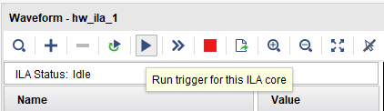
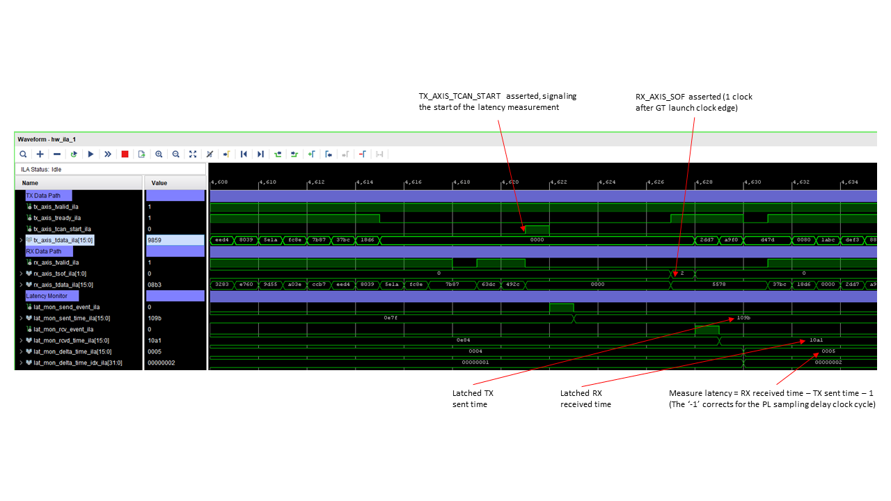

<table class="sphinxhide" width="100%">
 <tr width="100%">
    <td align="center"><h1>UL3524 Ultra Low Latency Trading</h1>
    </td>
 </tr>
</table>

# GTF MAC Unsynchronized Latency Measurement in Hardware
This section provides steps to run the GTF MAC benchmark design and to measure and report GTF MAC latency on the UL3524 via the Vivado HW Manager.

The key steps to run the benchmark design are:
1. Program the device
	* Program the UL3524 with the bitstream (.bit) and ILA (.ltx).
	* (Optional) Enable ILA to capture and view waveforms
2. Run the latency measurement test
	* A Tcl based script which initializes the GTF and enables the transfer of a predefined number of frames.

These steps are described in detail below.

## Programming the Device
It is necessary to program the device with the reference design prior to running the GTF benchmark design.  Be sure to build the design prior to following these steps.

1. [Connect to the card via the HW Manager and program the FPGA](../../../../Docs/programming_the_device.md) with the following files:
 * `./GTF_Latency/Unsynchronized/GTFMAC_Latency_10G_Unsync/Vivado_Project/<project_name>/<project_name>.runs/impl_1/gtfmac_vnc_top.bit`
* `./GTF_Latency/Unsynchronized/GTFMAC_Latency_10G_Unsync/Vivado_Project/<project_name>/<project_name>.runs/impl_1/gtfmac_vnc_top.ltx`
2. (Optional) To enable ILA waveform capture, perform the following two steps:
	* On the Tcl console, enter the following command:
      * `source ./GTF_Latency/Unsynchronized/GTFMAC_Latency_10G_Unsync/Scripts/config_ila_mac.tcl`
	* Right click on the device (xcvu2p_0) and click on *Refresh Device*.
	* Trigger all the ILAs by clicking on *Run trigger for this ILA core*


	
**NOTE**: ILA waveform capture does not impact the latency results.  It can be used to observe and verify the behavior of the design on hardware.

## Running the Latency Measurement Test
Instructions to run the GTF latency measurement test are given below.

1. In the Vivado Tcl console, change the working directory to the following:
   * `cd ./GTF_Latency/Unsynchronized/GTFMAC_Latency_10G_Unsync/Scripts`
2. Use the following command to run the measurement script.  When the has completed, it will display 'Complete' in the Tcl console.
   * `source ./run_tests.tcl`
3. Once the test is complete, you can review the output log found in the following directory.
   * `./GTF_Latency/Unsynchronized/GTFMAC_Latency_10G_Unsync/Scripts/Test_Output`

### Example Output Files

Two output files are generated in the "Test_Output" folder once we run the run_tests.tcl. A csv file and a log file.They have the same contents but in a different format.

An example of the generated output log from `run_tests.tcl` is shown below.  Each line represents a single test.  There will be **num_test** tests, with each test transferring **pkt_cnt** frames.  In the example output below, **num_test** is 10 and **pkt_cnt** is 250.  These and other parameters can be changed from their default values if needed. For more information regarding the test parameters, please refer [the scripts documentation](../Scripts/README.md#test-parameters).

Each line displays the minimum, average and maximum (min/avg/max) measured latency values for a given test. The average values is the sum of all latency values for a test, divided by **pck_cnt**.  

Variations in the measured latency values are expected and describe [here](../../README.md#variations-on-measured-latency).
It may require running the test multiple times in order to observe the minimum GTF latency value.  See [Measured Latency Values](../../README.md#measured-latency-values) for minimum measured values.

```bash
Latency of 250 packets (min/avg/max): 6.2060 ns / 6.2060 ns / 6.2060 ns
Latency of 250 packets (min/avg/max): 6.2060 ns / 6.4046 ns / 7.7575 ns
Latency of 250 packets (min/avg/max): 4.6545 ns / 5.8150 ns / 6.2060 ns
Latency of 250 packets (min/avg/max): 6.2060 ns / 6.7832 ns / 7.7575 ns
Latency of 250 packets (min/avg/max): 6.2060 ns / 6.5908 ns / 7.7575 ns
Latency of 250 packets (min/avg/max): 4.6545 ns / 5.8212 ns / 6.2060 ns
Latency of 250 packets (min/avg/max): 4.6545 ns / 5.8212 ns / 6.2060 ns
Latency of 250 packets (min/avg/max): 4.6545 ns / 5.6226 ns / 6.2060 ns
Latency of 250 packets (min/avg/max): 6.2060 ns / 6.4046 ns / 7.7575 ns
Latency of 250 packets (min/avg/max): 4.6545 ns / 6.3984 ns / 7.7575 ns
```
**Figure:** Example log output

```bash
6.2060,6.2060,6.2060 
6.2060,6.4046,7.7575 
4.6545,5.8150,6.2060 
6.2060,6.7832,7.7575
6.2060,6.5908,7.7575
4.6545,5.8212,6.2060
4.6545,5.8212,6.2060
4.6545,5.6226,6.2060
6.2060,6.4046,7.7575
4.6545,6.3984,7.7575
```
**Figure:** Example csv output

## ILA / VIO
An ILA and VIOs are included in the design to allow one to observe and verify the behavior of the design on HW. The ILA in the design is connected to the latency monitor signals and the AXI-Stream interface of the TX and RX of the GTF.

Since the latency monitor signals are delayed due to clock domain crossing, the TX and RX signals are also delayed by three clock cycles before entering the ILA to align them with latency monitor signals.

The ILA, the RX AXI-Stream signals, and the latency monitor signals are clocked by `RXUSRCLK`, and TX AXI-Stream signals are clocked by `TXUSRCLK`. Though they are same in frequency but are not phased aligned. Therefore the ILA waveform is not cycle accurate. However, they provide a great estimate of the actual HW behavior of the latency measurement design.

**NOTE**: It is necessary to enable ILAs in order to capture and view the waveforms.

The following **hw_ila_1** example waveform shows the latency measurement on HW. 



The *sent_time* and the *rcvd_time* are latched when a sent or receive event is received respectively. 

The *delta_time* is calculated as follows:

*delta_time* = abs(*sent_time* + *rcvd_time*) -1

where the minus one is compensation for the fact that RX date is launched off of the preceding `RXUSRCLK`.

It also shows when `tx_axis_tcan_start` gets captured by the GTF MAC, starting the latency measurement.

It also shows when `rx_axis_sof` is launched by the GTF MAC with regards to the `RXUSRCLK`, after `delta_time` later.

## Support
For additional documentation, please refer to the [UL3524 product page](https://www.xilinx.com/products/boards-and-kits/alveo/ul3524.html) and the [UL3524 Lounge](https://www.xilinx.com/member/ull-ea.html).

For support, contact your FAE or refer to support resources at: https://support.xilinx.com

<p class="sphinxhide" align="center"><sub>Copyright © 2020–2023 Advanced Micro Devices, Inc</sub></p>

<p class="sphinxhide" align="center"><sup><a href="https://www.amd.com/en/corporate/copyright">Terms and Conditions</a></sup></p>
