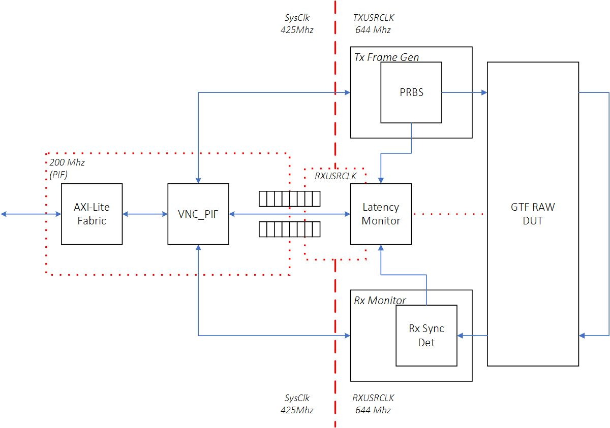
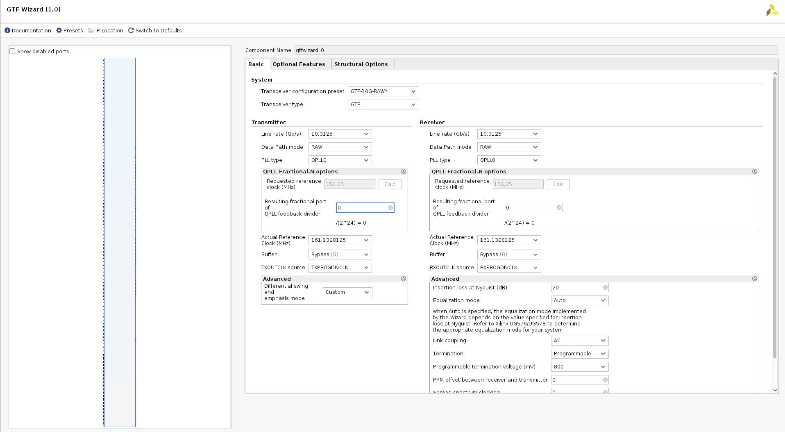

<table class="sphinxhide" width="100%">
 <tr width="100%">
    <td align="center"><h1>UL3524 Ultra Low Latency Trading</h1>
    </td>
 </tr>
</table>

# GTF RAW Unynchronized Latency Measurement Design
This section provides a detailed overview of the RTL design used in conjunction with the benchmark environment to measure GTF RAW latency.

## Architecture
The high-level block design diagram used to measure GTF latency in RAW mode is shown below.  It consists of the following key blocks:

* TX Frame generator
* GTF instantiated in RAW mode
* RX Monitor
* Latency Monitor

**Figure:** Block diagram of the GTF RAW latency measurement design

An overview of the operation of the design:

* GTF is initialized and placed in TX → RX near-end loopback mode
* The Tx FrameGen sends frames to the GTF transmit AXI-ST interface
	* Send timestamp is captured
* The Rx Monitor monitors the receive AXI-Stream activity
	* Receive timestamp is captured
* The Latency Monitor stores the timestamps into a FIFO which are subsequently serviced by system software
* The software computes the min/max/avg latency through the GTF
* Measurement activity can be captured on ILA.
* No data integrity checking is performed

### GTF RAW DUT
The GTF RAW DUT was generated using the GTF wizard.  The GTF Transceiver configuration preset field was set to *GTF-10G-RAW* in the GTF Wizard, using near-end loopback mode.  All preset wizard settings from this configuration were unchanged.  An image of the 'Basic' GTF Wizard tab is shown below for reference.

**Figure:** GTF Wizard RAW mode settings

### Tx Frame Generator
The Tx Frame generator sends a repeatable frame, with an identifiable sync pattern, to the TxRawData port of the GTF.  An event trigger is sent to the latency monitor logic when the sync pattern is launched to the GTF.  The sync pattern is used by the Rx Monitor to identify when the corresponding unaligned rx data is received.

### Rx Monitor
The Rx Monitor receives the loopback data via the RxRawData port from the GTF.  A simple bit alignment function is used to detect the sync pattern and adjust future received data to recreate the tx data stream.  Once bit alignment is achieved and sustained, the Rx Monitor reports a successfully link up status.  An event trigger is sent to the latency monitor logic when the sync pattern is detected following the alignment logic.

NOTE: The RX monitor does not perform error checking or correction.

## Latency Monitor
The latency monitor is a standalone block integrated into the benchmark design which captures the transmit (TX) and receive (RX) timestamps based on a 'send event' and 'receive event' respectively.  The timestamps are used to compute the latency.

For complete details see [Latency Monitor](../../README.md#latency-monitor) in the top-level documentation.

## Support
For additional documentation, please refer to the [UL3524 product page](https://www.xilinx.com/products/boards-and-kits/alveo/ul3524.html) and the [UL3524 Lounge](https://www.xilinx.com/member/ull-ea.html).

For support, contact your FAE or refer to support resources at: https://support.xilinx.com

Copyright © 2020–2023 Advanced Micro Devices, Inc

<a href="https://www.amd.com/en/corporate/copyright">Terms and Conditions</a>

