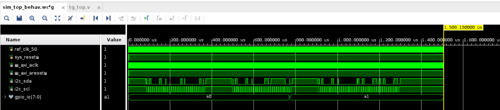
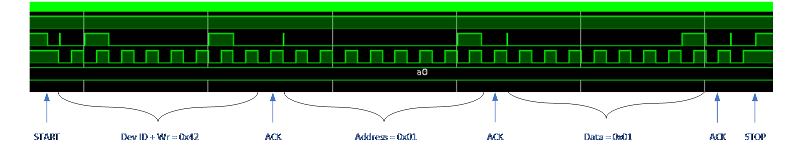
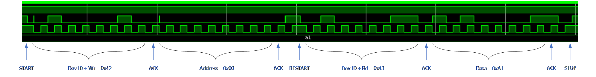

<table class="sphinxhide" width="100%">
 <tr width="100%">
    <td align="center"><h1>UL3524 Ultra Low Latency Trading</h1>
    </td>
 </tr>
</table>

# PCIe DDR Reference Design: Simulation

## Running the Simulation

To run a simulation of the design, follow the instructions detailed [here](../../Docs/simulating_a_design.md).

## DDR I2C Power Plane Enable

Simulation of enabling the DDR power plane via I2C is provided below. The waveform should run for approximately 1.5ms. At this time, a test complete message will appear in the log window.

Figure: Waveform window consisting of the three I2C transfers.

### Power Enable Transfer #1

Figure: Set P0 output value to 1 (set bit 0 of register 0x1).

### Power Enable Transfer #2

Figure: Set P0 to output mode (clear bit 0 of register 0x3).

### Power Enable Transfer #3

Figure: Read back register 0x0 which corresponds to value of P0 to P7. Bit 0 is set because of the previous transfers. Bits 7 and 5 are set because the simulation has these two pins connected to pull-ups.

## Support

For additional documentation, please refer to the [UL3524 product page](https://www.xilinx.com/products/boards-and-kits/alveo/ul3524.html) and the [UL3524 Lounge](https://www.xilinx.com/member/ull-ea.html).

For support, contact your FAE or refer to support resources at: <https://support.xilinx.com>

Copyright © 2020–2023 Advanced Micro Devices, Inc

<a href="https://www.amd.com/en/corporate/copyright">Terms and Conditions</a>

