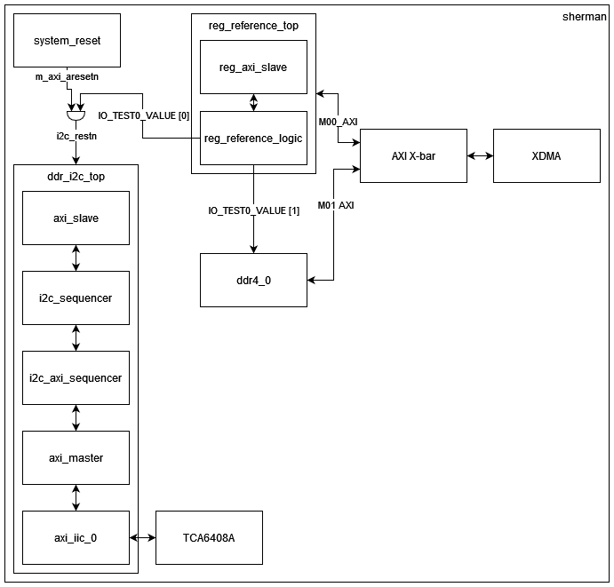

<table class="sphinxhide" width="100%">
 <tr width="100%">
    <td align="center"><h1>UL3524 Ultra Low Latency Trading</h1>
    </td>
 </tr>
</table>

# PCIe DDR Reference Design

## Description

This reference design demonstrates how to enable the DDR power plane through I2C commands.  In addition, a provided memory test is detailed, and can be used bring up the DDR and perform memory read/write functions.  Finally, recommended DDR4 memory controller IP settings are provided.

**Additional Documentation**

The following links provide additional documentation, including simulation and HW Manager support.

* [Simulation](./Docs/simulation.md)<br>
  * Describes the available simulation and description of waveforms
* [HW Manager Support](./Docs/hw_manager_support.md)<br>
  * Provides instructions to run the design in hardware and interact with the design through the HW Manager.

## Reference Design Hierarchy

The design hierarchy block diagram is given below. The subsequent table provides descriptions of the key modules within the design.

### Block Diagram



**Figure:** Block diagram of the PCIe DDR reference design

### Module Description

**Table:** Description of design modules

| File Name | Description |
| --- | --- |
| system_reset.v | Asserts system reset (*m_axi_arestn*) to 0 after FPGA startup. |
| reg_axi_slave.v | Translates AXI-Lite transactions for register bank access. |
| reg_reference_logic.v | A register bank with four 32b registers. |
| axi_slave | This module translates an AXI-Lite interface to a simple register access interface. If desired, this allows the reference design to connect to a larger design using an AXI interface. The i2c_sequencer automatically runs its state machine, so the user interface is optional. However, this interface can be included to allow the user to monitor the design, perform a manual reset, or add user functions. |
| i2c_sequencer | This module is the high level register sequencer that drives the overall process. It’s a simple state machine that sequences through the three register access described above. The logic sets up the req/ack interface to the i2c_axi_sequencer. |
| i2c_axi_sequencer | This module is a simple state machine that performs the required AXI commands for the I2C controller. A simple req/ack interface provides the device ID, command/address bytes, and optional write data. When the req is asserted, the state machine initializes the I2C controller, programs the output FIFO, starts the transfer and monitors the status. Read requests will return data when the transfer completes. |
| axi_master | This module translates a simple register access interface to the AXI-Lite interfaces required by the I2C controller IP. |
| axi_iic_0 | This I2C controller module is generated from the Vivado IP Catalog. The user interface is an AXI-Lite interface. |
| TCA6408A | TI I/O expander with I2C interface. Allows us to enable the DDR power plane. |
| ddr4_0 | This DDR memory controller is generated with the Memory Interface Generator from the Vivado IP Catalog. The user interface is an AXI interface. |
| XDMA | This PCIe DMA module is generated from the Vivado IP Catalog. The user interface is an AXI interface. |
| AXI X-bar | This AXI interconnect is generated from the Vivado IP Catalog. It connects XDMA (Master) to reg_reference_top (Slave 0) and ddr4_0 (Slave 1) |

**Table:** Descriptions of key modules.

## Enabling the DDR Power Plane

The DDR4 memory subsystem power (2V5_Vpp) is disabled upon power up and requires the following two steps to enable:

1. DDR4 I/O expander must be taken out of reset.
2. Enable DDR4 power via the CLKGEN I2C bus.

The following figure shows the I2C bus connected to various devices on the card. The DDR4 I/O expander and subsequent DDR4 enable signal (EN_2V5_vpp) are shown at the top of the figure.


**Figure:** DDR4 Power Enable Communication Routing 

### DDR4 I/O expander must be taken out of reset

Since the I/O expander device has an active-low reset pin connected to an external pull-down resister, it is necessary to take the expander device out of reset.  This is done by asserting reset pin, DDR_PSUIO_RESET (pin AU19).

### Enable DDR4 power via the CLKGEN I2C bus

With the I/O expander out of reset, the DDR4 memory subsystem power can be controlled via the I2C I/O expander, address 0x42 (8-bit), via the FPGA CLKGEN I2C bus highlighted in the above figure. This is done by configuring both the output value and output enable registers of I/O expander port 0 pin (the remaining seven ports of the expander are not connected).  This is accomplished by writing the following two registers:

* Register 0x1 to set the output value.
* Register 0x3 to configure the output enable.

The steps to perform this operation are shown in the following table.

| Configuration Step | I2C Sequence | Description |
| --- | --- | --- |
| Set DDR (EN2V5_vpp) power enable pin on port 0 | 0x42, 0x01, 0x01 | Programs output value register bit<br>0 = DDR4 power enable |
| Enable output mode for port 0 | 0x42, 0x03, 0xFE | Programs output config register<br> (0=output, 1 = input) |
| Optional step | 0x42, 0x00, restart, 0x43 | Read the P0 value to verify the programming by reading register 0x0 of the I/O expander |

**Table:** DDR4 I2C power enable steps

## Memtest Function Descriptions

`memtest.c` is a simple C program that brings up the DDR I2C and the DDR IP and performs a memory test.

Descriptions of the functions within `memetest.c` is given below.

| Function Name | Arguments | Description |
| --- | --- | --- |
| main | `-c cycle`: specify a number of cycles for memtest | Brings up the DDR power plane and DDR memory. <br><br> Performs data integrity test on the DDR memory using *memtest* |
| memtest | *cycles*: number of words to write and read from the memory | Sequentially load a block of DDR addresses with 32-bit PRBS. <br><br> Sequentially read back the same block and compare with expected values. |
| gen_prbs32 | *value*: non-zero value initializes the PRBS seed with the value provided and returns the value provided <br><br> If zero, it returns the computed PRBS value| Generates a pseudorandom binary sequence. |
| initialize_memory | *device0*: device BDF value | Configures memory mapping of the UL3524 DDR memory regions. |
| init_ddr | | Pulls ddr_i2c (active high) out of reset first then the DDR memory controller (active low). The first bit controls the ddr_i2c reset and second bit contorls the DDR memory controller reset. |
| write_reg | *region*: device memory region <br> *addr*: write address <br> *wdata*: write data | Writes *wdata* to *addr* of *region*. Returns 0. |
| read_reg | *region*: device memory region <br> *addr*: read address <br> | Read from *addr* of *region*. Returns read data. |
| process_cmdline | *argc*: argument count <br> *argv*: argument vector | Processes the command line arguments for *memtest*. |

**Table 2.** Descriptions of memtest.c functions and their arguments

## DDR4 Memory Controller

When instantiating a DDR4 memory controller using the Vivado tools, it is recommended to use the parameters outlined in the following table.

| Parameter        | Value                           |
|------------------|------------------------------------|
| Controller/PHY Mode ^   | Ctrl and PHY layer |
| Memory Dev. Interface Speed | 833 ps ^^    |
| Reference Input Clock   | 300 MHz    |
| Memory Type/Config   | Components   |
| Memory Part     | MT40A2G8VA-062E  |
| Slot       | Single    |
| IO Voltage     | 1.2V     |
| Burst Length     | 8      |
| CAS Latency     | 17     |
| CAS Wr Latency    | 12     |
| Data Width     | 72     |

```bash
^  AXI4 interface will be enabled automatically. It can be disabled.
^^ 833 ps = 1200 MHz, PHY to Ctrl Freq Ratio= 4:1
```

**Table 2.** DDR4 Memory Controller IP Parameter Settings

When implementing the controller in your design, reference *FPGA Bank I/O Mapping* section in UG1585 for the allocated FPGA banks.

Use the external 300 MHz reference clock supplied to HPIO 66. For additional details, see *Clocking* section in UG1585.

## Reference

### TCA6408APWR Register Map

| Command Byte     | Register                          | Power Up Default         |
|------------------|-----------------------------------|--------------------------|
| 0x00             | Input Port                        | xxxx xxxx                |
| 0x01             | Output Port                       | 1111 1111                |
| 0x02             | Polarity Inversion                | 0000 0000                |
| 0x03             | Configuration (1=input, 0=output) | 1111 1111 (dflt = input) |

**Table 3.** Descriptions of the TCA6408APWR register map.

### UL3524 Pinout

| Package Pin     | Name            | Description         |
|-----------------|-----------------|---------------------|
| AU19            | DDR_PSUIO_RESET | I/O Expander Resetb |
| AR20            | CLKGEN_SCL_R    | I2C Clock           |
| AT20            | CLKGEN_SDA_R    | I2C Data            |

**Table 4.** Descriptions of the UL3524 pinout.

## Support

For additional documentation, please refer to the [UL3524 product page](https://www.xilinx.com/products/boards-and-kits/alveo/ul3524.html) and the [UL3524 Lounge](https://www.xilinx.com/member/ull-ea.html).

For support, contact your FAE or refer to support resources at: <https://support.xilinx.com>

<p class="sphinxhide" align="center"><sub>Copyright © 2020–2023 Advanced Micro Devices, Inc</sub></p>

<p class="sphinxhide" align="center"><sup><a href="https://www.amd.com/en/corporate/copyright">Terms and Conditions</a></sup></p>
