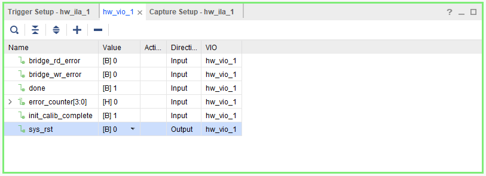
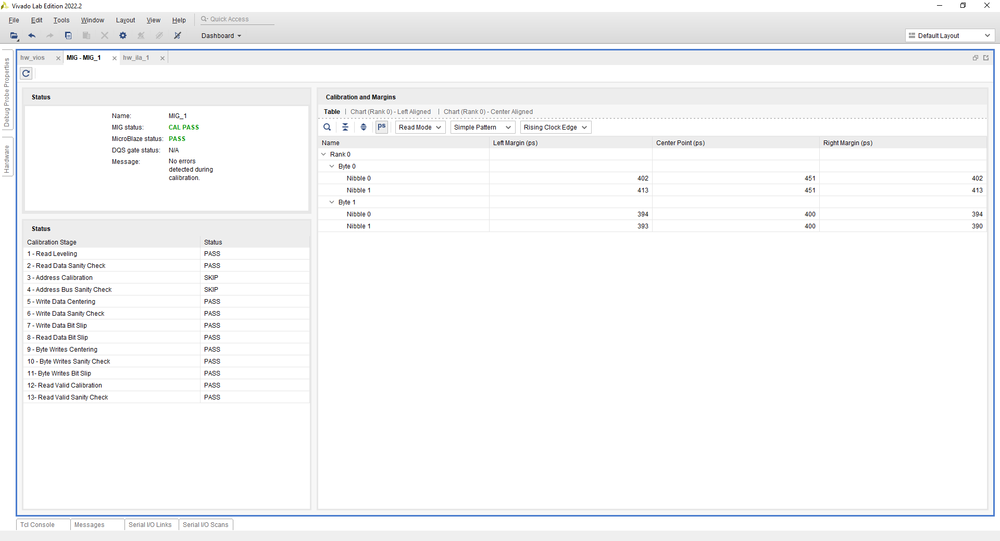
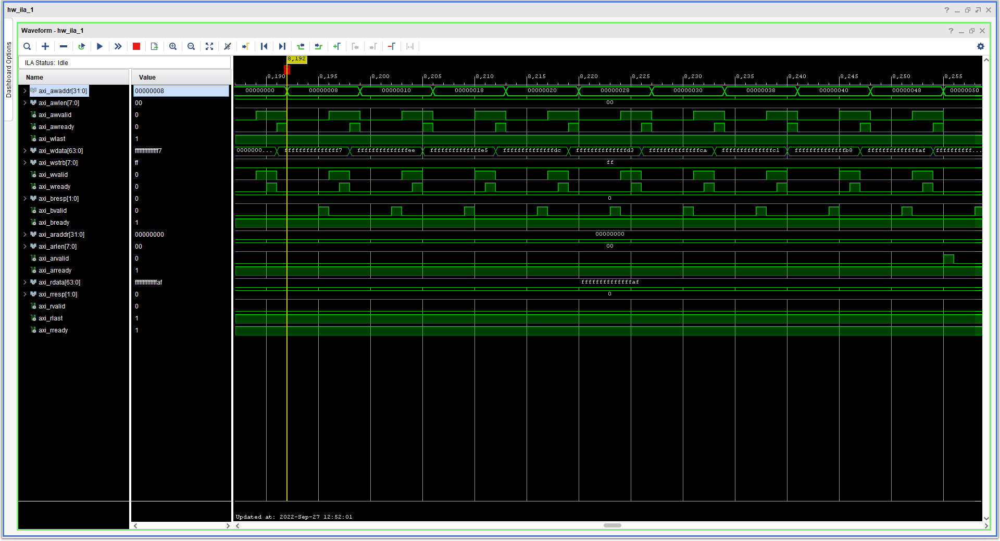

<table class="sphinxhide" width="100%">
 <tr width="100%">
    <td align="center"><h1>UL3524 Ultra Low Latency Trading</h1>
    </td>
 </tr>
</table>

# QDRII+ MIG Reference Design: HW Manager Support

The design's functionalities are verified on the board through the HW Manager. This section provides instructions on how to set up the VIO signals to interact with the design and demonstrates the correct functionalities of the MIG self-calibration and AXI transactions through the MIG status tab and ILA.

## Programming the Device

[Connect to the card via the HW Manager and program the FPGA](../../Docs/programming_the_device.md) with the following files:

* `./QDR_MIG/Vivado_Project/<project_name>/<project_name>.runs/impl_1/qdriip_ref_simple_top.bit`
* `./QDR_MIG/Vivado_Project/<project_name>/<project_name>.runs/impl_1/qdriip_ref_simple_top.ltx`

## Using ILA / VIO

Use the following steps to add signals to the VIO window:

1. Open Vivado HW Manager and program the device
2. Click on the "hw_vio_1" tab
3. Add the signals by clicking on the plus sign and selecting all available signals
4. Click **Okay**
5. Toggle **sys_rst** from **1** to **0**
6. Click on **Run Trigger Immediate** on the ILA window to observe the data transactions

Figure: VIO debug signals.

The available VIO debug signals along with their definitions are given below:

| VIO Debug Signal | Definition | Direction |
|---|---|---|
| bridge_rd_error | asserted high if the AXI-QDRII+ bridge RX FIFO underflows or overflows | Input |
| bridge_wr_error | asserted high if the AXI-QDRII+ bridge TX FIFO underflows or overflows | Input |
| done | asserted high when all the AXI transaction has completed | Input |
| error_counter | reports the total number of data errors detected | Input |
| init_calib_complete | asserted high when the MIG has completed its calibration | Input |
| sys_rst | active high system reset signal used to reset the design, when the design is reset MIG will re-calibrate and the design will restart its state machine | Output |

Additional or different signals can be added to the design by re-configuring and re-instantiating the VIO IP in the Vivado project.

## MIG Calibration

The QDRII+ MIG performs self calibration after a system reset. You can view the MIG status by selecting the MIG tab on the HW Manager. The correct operation of the calibration stages can be confirmed there along with the overall calibration status and more detailed information about the margins and the center point.

Figure: MIG window with calibration passing status

More information about memory calibration can be found on [Ch. 17 of UltraScale Architecture-Based FPGAs Memory IP Product Guide (PG150)](https://docs.xilinx.com/api/khub/documents/NxaDKjH9BQF5nh4fRma_7g/content?Ft-Calling-App=ft%2Fturnkey-portal&Ft-Calling-App-Version=4.0.11&filename=pg150-ultrascale-memory-ip.pdf#G24.305944).

## ILA

The design's AXI transactions can be monitored and verified with the ILA.

### Write

Figure: ILA waveform of the AXI write transactions. Handshaking of the write addresses and data can be observed along with the linearly increasing address and data.

### Read

Figure: ILA waveform of the AXI read transactions. Handshaking of the read addresses can be observed along with read data that have the same values as the write data.

Additional or different signals can be added to the design by re-configuring and re-instantiating the ILA IP in the Vivado project.

## Support

For additional documentation, please refer to the [UL3524 product page](https://www.xilinx.com/products/boards-and-kits/alveo/ul3524.html) and the [UL3524 Lounge](https://www.xilinx.com/member/ull-ea.html).

For support, contact your FAE or refer to support resources at: <https://support.xilinx.com>

Copyright © 2020–2023 Advanced Micro Devices, Inc

<a href="https://www.amd.com/en/corporate/copyright">Terms and Conditions</a>

