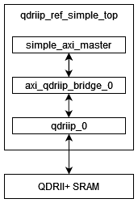

<table class="sphinxhide" width="100%">
 <tr width="100%">
    <td align="center"><h1>UL3524 Ultra Low Latency Trading</h1>
    </td>
 </tr>
</table>

# QDRII+ MIG Reference Design

## Description

This reference design demonstrates how to interface with the QDRII+ MIG IP through an AXI-QDRII+ bridge. It validates the correct pinout to the QDRII+ interface and reference clocks. In addition, it also performs data integrity checks by writing and subsequently reading data. The design behavior can be validated on HW via ILA and VIO.

**Additional Documentation**

The following links provide additional documentation, including simulation and HW Manager support.

* [Simulation](./Docs/simulation.md) 
  * Describes the available simulation and description of waveforms
* [HW Manager Support](./Docs/hw_manager_support.md) 
  * Provides instructions to run the design in hardware and interact with the design through the HW Manager.

## Reference Design Hierarchy

The block diagram of the design hierarchy is given below. The subsequent table provides descriptions of the key modules within the design.

### Block Diagram

**Figure:** Reference design hierarchy diagram.

### Module Description

**Table:** Description of design modules

| Name | Description |
|---|---|
| qdriip_ref_simple_top | Top-level design. Connects to the QDRII+ Memory Interface (Bank 0) and the corresponding 300 MHz reference clock. |
| simple_axi_master | This module is a simple AXI traffic generator and performs 100 writes and 100 reads. It performs data integrity checks by writing and subsequently reading data. The **error_counter** signal reports the number of data errors. |
| axi_qdriip_bridge_0 | This module converts AXI transactions into QDRII+ User Interface commands.    The bridge adds an odd-parity bit for each byte, e.g. 64b data -> 72b data. |
| qdriip_0 | QDRII+ Memory Controller generated with the MIG. |

## QDRII+ MIG Configuration

Prior to creating a design with QDR-II+, you must add the GSI QDRII+ MIG IP to your Vivado library before use found in the *qdriip_v1_4* directory [here](./IP/README.md). To add to your library, follow the steps outline in *Vivado Design Suite User Guide: Creating and Packaging Custom IP ([UG1118](https://docs.xilinx.com/r/en-US/ug1118-vivado-creating-packaging-custom-ip/Creating-and-Packaging-Custom-IP))*.

Since the MIG only supports a single QDR instance, two MIG controllers must be instantiated to connect to both external interfaces on the card.

The QDR memory controller does not have any configuration interface or registers as it has been built specifically for the QDR device.

Because the generated MIG only supports the native APP interface, as described in *UltraScale Architecture-Based FPGAs Memory IP LogiCORE IP Product Guide ([PG150](https://docs.xilinx.com/v/u/en-US/pg150-ultrascale-memory-ip))*, an AXI interface bridge must be used to connect to the AXI data path, if desired.

If using the AMD QDR MIG IP, the field settings in the 'Basic' tab should be assigned the values given in the following table.  Parameters in the *Advanced Clocking and Options* tabs were not changed.

| Parameter | Value | Notes |
| --- | --- | --- |
|Memory device I/F speed | 1818 ps    | Specification of the SRAM device and is selected as **1818 ps** (**550 MHz**) to match the GSI memory spec. |
|Ref. input clock speed  | 300 MHz   | **3334 ps** (**300.03 MHz**) to match the reference clock from the board for the QDRII+     | 
|Memory part    | GS82582DT20GE-550 | 288 Mb, x18, Addr=22 |
|Data width     | 18    |  N/A    |

**Table:** Settings for QDR MIG IP — Basic tab

More information can be found on [Section IV of UltraScale Architecture-Based FPGAs Memory IP Product Guide (PG150)](https://docs.xilinx.com/api/khub/documents/NxaDKjH9BQF5nh4fRma_7g/content?Ft-Calling-App=ft%2Fturnkey-portal&Ft-Calling-App-Version=4.0.11&filename=pg150-ultrascale-memory-ip.pdf#G21.274376).

## Support

For additional documentation, please refer to the [UL3524 product page](https://www.xilinx.com/products/boards-and-kits/alveo/ul3524.html) and the [UL3524 Lounge](https://www.xilinx.com/member/ull-ea.html).

For support, contact your FAE or refer to support resources at: <https://support.xilinx.com>

Copyright © 2020–2023 Advanced Micro Devices, Inc

<a href="https://www.amd.com/en/corporate/copyright">Terms and Conditions</a>

