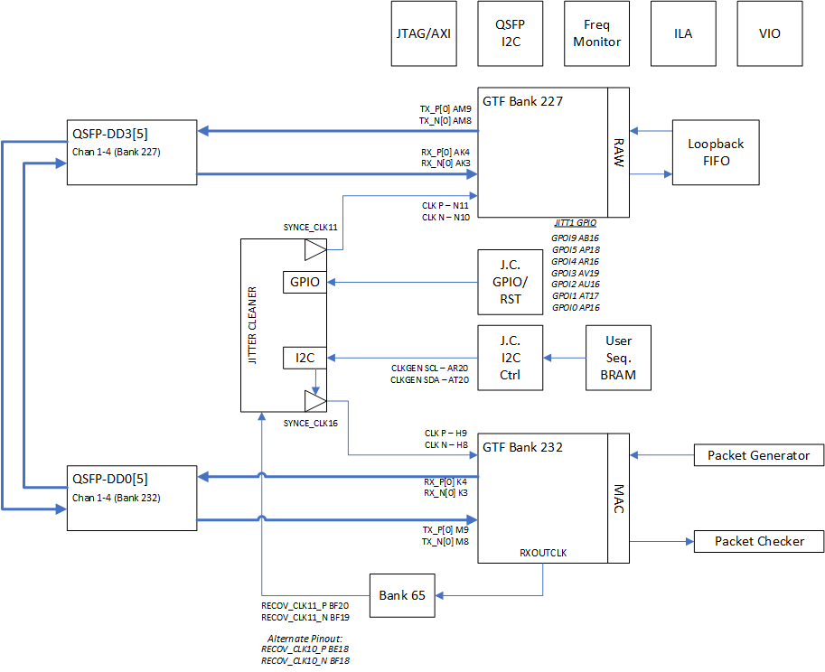
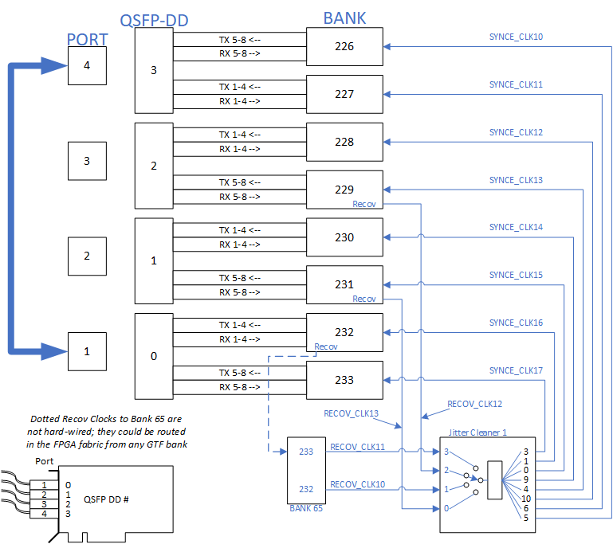
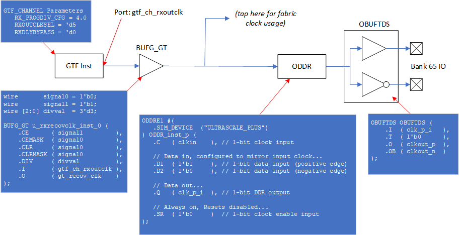
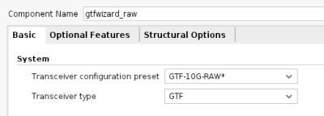
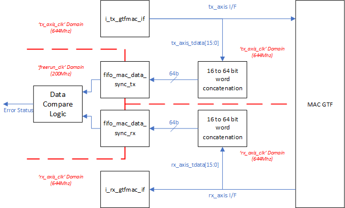
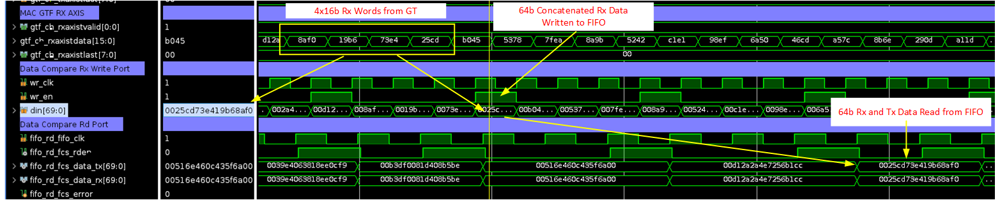

<table class="sphinxhide" width="100%">
 <tr width="100%">
    <td align="center"><h1>UL3524 Ultra Low Latency Trading</h1>
    </td>
 </tr>
</table>

# Recovered Clock Reference Design

## Description

This reference design demonstrates how to setup the QSFP-DD Renesas device and route the recovered clock through Bank 65.

Some highlights of the design include:

* Resetting and programming the Renesas device
* Data generator and checker logic
* Clock frequency monitor
* Details how to route GTF recovered clock to a pin

**Requirements:** This example design requires a QSFP-DD cable.  The design was tested using an Amphenol 1.0 meter QSFP-DD cable (part NDYYJR-0001).

**Additional Documentation**

The following links provide additional documentation, including simulation and HW Manager support.

* [Simulation](./Docs/simulation.md)<br>
  * Describes the available simulation and description of waveforms
* [HW Manager Support](./Docs/hw_manager_support.md)<br>
  * Provides instructions to run the design in hardware and interact with the design through the HW Manager.

## Architecture Overview

The design incorporates a number of features and components required to perform basic GTF serial transmissions while including the ability manage the recovered clock routing and processing with the Renesas Jitter Cleaner chip.  The high-level block design diagram used in the design is shown below consisting of the following key blocks:

* GTF instance in MAC mode as a data stream generator (Bank 232)
  * This GTF includes two FIFO's to store and compare the Tx and Rx datastreams for data integrity checking
* GTF instance in RAW mode utilized as simple loopback path (Bank 227)
* GPIO controller to program Renenas GPIO and reset pins
* Two I2C controllers
  * One to program Renesas Jitter Cleaner (JC)
  * One to enable and monitor QSFP-DD ports
* Clock frequency monitors to measure various clock frequencies
* JTAG/AXI interface for HwManager access



**Figure:** Block diagram of the Recovery Clock design

The two QSFP-DD ports are enabled by a set of state machines that automatically start once the FPGA is ready.  The state machines enable the four power domains for the four ports and configure the default settings for the low speed QSFP-DD signals.  Following the initial setup, the state machines continuously poll the QSFP ports monitoring for module insertions or removals, and apply resets accordingly.

The two GTF modules are designed to provide a simple 4 channel data loop while only requiring one board:

* The MAC GTF user logic is a slighly modified version of it's example design.  It is used as a traffic generator and monitor for basic data integrity checking.  The user provides a few parameters such as number of packets or continuous mode, test duration, and number of test cycles.  When enabled, this module will perform the desired transactions and report any error detection.  The MAC GTF design is also modified to route the GTF's RXCLKOUT signal to the RECOV_CLK11_LVDS_P pin.

* The RAW GTF user logic is also slightly modifed from it's example design.  The modified logic includes a small FIFO to connect the RXRAWDATA to the TXRAWDATA.  This logic simply reroutes the Rx data back through the Tx port.  It does not have error detection.  

The design also includes logic to program the Renesas Jitter cleaner.  First is a user accessible register array to program the JITT_GPIO and JITT_RESETn to configure the programming sequence of the jitter cleaner.  Second is logic to transmit a programming sequence via I2C to the jitter cleaner.  The sequence is orignally generated by Renesas development tool as simple txt file detailing a list of write functions.  This txt file will be converted into a special formated COE memory file that the user loads into a BRAM.  The user then initiates a state machine that will transfer the contents of the BRAM through an I2C controller to the jitter cleaner.

This example design uses a Renesas example that reduces the SYNCE clock from 161Mhz to 100Mhz.  In conjunction with the frequency monitors, its allows the user to easily step through the programming sequence and verify the changes.  However, this specific test configuration is outside the operating range of the GTF thereby making the data loop nonfunctional.  But in demonstrating this procedure, it allows the user to apply their own valid Renensas sequences and monitor the affects on a fully functional test system.

The frequency monitors consist of 8 timers that provide user visibility to the GTF's SYNCE reference clocks.  This logic is self contained in a single module so the user can easily connect to other fabric clocks of interest.

## GTF Placement and Recovered Clock Routing

The MAC GTF is placed in QSFP Port 0

* Bank 232 (Tx/Rx lines 1-4)
* GT Ref Clock: SYNCE_CLK16 (Q1 of Renesas JC)
* GT Recov Clock: RECOV_CLK11 via Bank 65

The RAW GTF is placed in QSFP Port 3

* Bank 227 (Tx/Rx lines 1-4)
* GT Ref Clock: SYNCE_CLK11 (Q6 of Renesas JC)

The following figure provides a high level diagram of the board connectivity for this design. QSFP-DD ports 1 and 4 are connected via an external QSFP cable, as show by the thick line in the diagram.  
A couple of general notes:

* Any GTF bank can provide a recovered clock through the fabric to Bank 65 (RECOV_CLK10 and RECOV_CLK11).  
* RECOV_CLK12 and RECOV_CLK13 are hardwired from the GTF's in Banks 229 and 231 to a local dedicated FPGA pin. Hence, these board signals cannot be moved or redefined.



**Figure:** Block diagram of board clock routing

## Internal Recovered Clock Routing

Routing the RXOUTCLK from the GTF to a pin in Bank 65 requires specific resources and logic detailed below and shown in the following figure.

* An initial BUFG_GT is required to route the GTF clock onto the PL clock tree.
  * The output of this BUFG_GT can be tapped for programmable logic and clock frequency measurements.  
* Routing the clock directly to a pin is not allowed so an ODDR instance can be configured to generate an output pattern that mirrors it's source clock.  The DDR output can then be routed through the pin.
* An ODDR instance is required to route the clock to a pin as routing directly to a pin is not allowed.
  * The ODDR should be configured to generate an output pattern that mirrors it's source clock.  
  * The DDR output can then be routed through the pin.



**Figure:** Block diagram detailing how to route a GTF clock to an HDIO pin

**NOTE**: Consider including an XDC constraint to place the BUFG_GT close to the GTF common module generating the source clock.  Otherwise, Vivado may place the BUFG_GT in the wrong clock region. An example for this constraint is as follows:

```bash
# Add pblock for GTF Bank 227
create_pblock pblock_test
resize_pblock [get_pblocks pblock_test] -add { CLOCKREGION_X5Y3:CLOCKREGION_X5Y3 }
add_cells_to_pblock [get_pblocks pblock_test] [get_cells gtf_top_0/u_gtfwizard_0_example_gtfmac_top/i_gtfmac/gen_blk_multi_ch[0].u_bufg_gt_gtf_recov_clk]
```

## GTF MAC

The GTF MAC instance was generated using the GTF wizard.  The GTF Transceiver configuration preset field was set to *GTF-10G-MAC* in the GTF Wizard. All preset wizard settings from this configuration were unchanged. An image of the 'Basic' GTF Wizard tab is shown below for reference.


**Figure:** GTF Wizard selection for 10Gbps Transceiver MAC Mode Configuration.  All other settings should be their default selection.

## GTF RAW

The GTF RAW instance was generated using the GTF wizard.  The GTF Transceiver configuration preset field was set to *GTF-10G-RAW* in the GTF Wizard. All preset wizard settings from this configuration were unchanged. An image of the 'Basic' GTF Wizard tab is shown below for reference.



**Figure:** GTF Wizard selection for 10Gbps Transceiver RAW Mode Configuration.  All other settings should be their default selection.

## Additional Guidance

# Reconfiguring QSFP Ports

The design uses two GTF ports using 4 channels.  The number of channels can be quickly changed by using the NUM_CHANNEL parameter in the top file 'RTL/clk_recov.v'
The two GTFs are currently located in QSFP port 1 and 4 but can be moved if desired.  This user must consider changes in the XDC to reflect the GTF pinout, GTF resource (gtf channel and common) locations, and internal clock resource locations (such as BUFG_GT).
Note: The reduction of GTF channels may result in critical warnings in the design build due to constraints for logic that has been removed and can be disregarded.

# Data Integrity Checking

The design also include logic to perform data comparisons on the data sent to and received from the MAC GTF.  The following figure provides a high level depiction of how this is accomplished.  

In both data paths, the Tx/Rx_axis_tdata buses are sampled according to the valid state of the AXIS interface.  Four 16 bit samples are packed into a single 64 bit word and stored into a FIFO (one for Tx, one for Rx).  The two FIFO's allow the data to be resync'd before being compared.

The data compare logic monitors the FIFOs and determines when each has at least one stored entry.  The logic then reads them together and compares the outputs.  When working correctly, the TX FIFO will have more entries than the RX FIFO due to the latency of the data loop.  



**Figure:** Data Comparison Schematic Showing Data Collection FIFOs and Respective Clock Domains

The following figure shows an example sequence of how data is collected from the RX AXIS port from the GTF, stored in the RX FIFO, and read by the data compare logic.  The example shows the original four 16b words in gtf_ch_rxaxistdata coming from the GTF (0x8AF0, 0x19B6, 0x73E4, 0x25CD) at 644Mhz.  These are packed and passed into the FIFO data write port (0x25CD_73E4_19B6_8AF0).  Soon after, the data compare logic reads 64b values from both the RX and TX FIFOs (the TX FIFO was written earlier) and checks their values.  Any bit errors will be identified and flagged by 'fifo_rd_fcs_error'.



**Figure:** RX Data concatenation, write to FIFO, and read from FIFO

NOTE: Included in the RTL is an example placement for an ILA to debug any detected errors.  Beware that adding an ILA to each channel will negatively affect timing closure, so use cautiously.

# Frequency Measurements

The default configuration of the example design connects the 8 GTF SYNCE reference clocks to the frequency monitor logic as shown below.  The user can change the clk_samp_* ports to any fabric accessible clock in the design.  A sample function ('measure_frequency') in the HwMgr scripts can be used as a template to read and calculate the measurements.

```bash
freq_counter_top freq_counter_top (
    // System Interface
    .sys_if_clk    ( sys_if_clk         ),
    .sys_if_rstn   ( sys_if_rstn        ),
    .sys_if_wen    ( sys_if_wen_1       ),
    .sys_if_addr   ( sys_if_addr_0      ),
    .sys_if_wdata  ( sys_if_wdata       ),
    .sys_if_rdata  ( sys_if_rdata_1     ),
    // Clock to be sampled....
    .clk_samp_7    ( SYNCE_CLK17_OUT    ),
    .clk_samp_6    ( SYNCE_CLK16_OUT    ),
    .clk_samp_5    ( SYNCE_CLK15_OUT    ),
    .clk_samp_4    ( SYNCE_CLK14_OUT    ),
    .clk_samp_3    ( SYNCE_CLK13_OUT    ),
    .clk_samp_2    ( SYNCE_CLK12_OUT    ),
    .clk_samp_1    ( SYNCE_CLK11_OUT    ),
    .clk_samp_0    ( SYNCE_CLK10_OUT    )
);
```

## Support

For additional documentation, please refer to the [UL3524 product page](https://www.xilinx.com/products/boards-and-kits/alveo/ul3524.html) and the [UL3524 Lounge](https://www.xilinx.com/member/ull-ea.html).

For support, contact your FAE or refer to support resources at: <https://support.xilinx.com>

<p class="sphinxhide" align="center"><sub>Copyright © 2020–2023 Advanced Micro Devices, Inc</sub></p>

<p class="sphinxhide" align="center"><sup><a href="https://www.amd.com/en/corporate/copyright">Terms and Conditions</a></sup></p>
