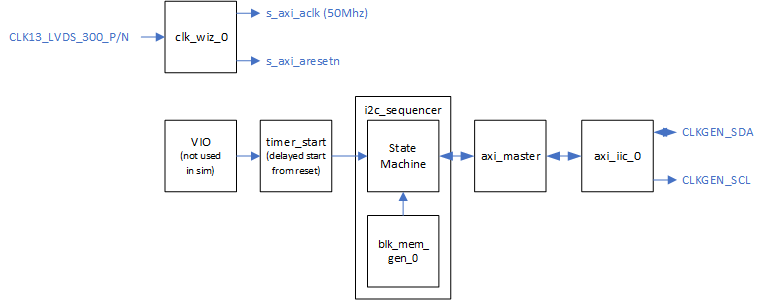
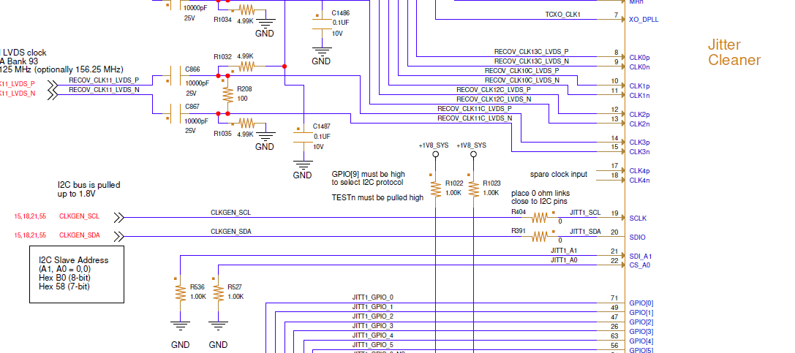

<table class="sphinxhide" width="100%">
 <tr width="100%">
    <td align="center"><h1>UL3524 Ultra Low Latency Trading</h1>
    </td>
 </tr>
</table>

# Renesas I2C Reference Design

## Description

This reference design demonstrates how to program the Renesas devices via I2C interface. The design can be built stand-alone or integrated into other designs. It also comes with a simulation testbench.

In addition to the design, an included PERL script can be used to convert Renesas programming file into a BRAM memory file (.coe), used by the design.

**Additional Documentation**

The following links provide additional documentation, including simulation and HW Manager support.

* [Simulation](./Docs/simulation.md)<br>
  * Describes the available simulation and description of waveforms
* [HW Manager Support](./Docs/hw_manager_support.md)<br>
  * Provides instructions to run the design in hardware and interact with the design through the HW Manager.

## Reference Design Hierarchy

The design consists of the following key components and is shown in the following high-level block diagram.

* A state machine sequencer, with associated BRAM holding the Renesas I2C commands and
* I2C interface connected to the two Renesas devices


**Figure: Top-level block diagram**

Details about the design:

1. The design uses a clock wizard to generate a 50Mhz clock from a 300Mhz source.
2. A VIO is included in the design to drive an active low reset to the design.
3. After de-asserting the reset, the sequencer state machine automatically begins operation and completes when it reaches the end of the programming sequence
4. The state machine assumes that the programming sequence only includes I2C writes and does not assume any delays between i2C transfers
5. The provided design only accesses one Renesas devices.  The user can concatenate the .coe BRAM file to program both devices.

## Renesas Device IDs

The UL3524 card has two Renesas devices.  Both are connected via the CLKGEN_SDA/SCL interface and have the device IDs shown in the following table.  See UG1585 for additional details.

| Renesas Device Description | Device ID (8-bit HEX) |
|---|---|
| Jitter Cleaner 1 (QSFP-DD Port)| 0xB0|
| Jitter Cleaner 2 (Expansion Port)| 0xB2|

**Table: Renesas Device IDs**

The following three schematic snippets show the connection of the I2C lines (CLKGEN_SDA/SCL) between the FPGA and Renesas devices.


**Figure: FPGA CLKGEN_SDA/SCL lines**



**Figure: Jitter Cleaner 1 CLKGEN_SDA/SCL lines**


**Figure: Jitter Cleaner 2 CLKGEN_SDA/SCL lines**

## Converting a Renesas programming script to a BRAM coe file

The reference design's sequencer state machine generates I2C transfers to the Renesas devices based on programming data stored in the local BRAM.  The programming data is derived from the Renesas programming file, which consists of data size, offset and data as shown in the following example.

```bash
########################################                                
\# I2C, OneByteAddresses                                                 
\# ClockMatrix (28.2)                                                    
\# 10/6/2022 9:50:49 AM                                                  
########################################                                
                                                                        
                                                                        
Size: 0x4, Offset: FC, Data: 0x00C01020                                 
Size: 0x4, Offset: FC, Data: 0x00811020                                 
Size: 0x4, Offset: FC, Data: 0x00C11020                                 
Size: 0xA, Offset: 60, Data: 0x00000000000000000000                     
Size: 0x2, Offset: 6C, Data: 0x0000                                     
Size: 0x1, Offset: 70, Data: 0x00                                       
Size: 0x7, Offset: 71, Data: 0x00000000000000                           
Size: 0x13, Offset: 80, Data: 0x00000000000000000000000000000000000C00  
Size: 0x8, Offset: 93, Data: 0x07002D3101000000                         
Size: 0x14, Offset: 9B, Data: 0x88000000000000000000942369DC02FFFF00008E
```

***Figure: Example Renesas Programming Script File***

An included PERL-based script is provided to convert a Renesas programming script file into a .coe BRAM memory file format.
For each valid line in the Renesas programming script file, the PERL script extracts the programming details and creates the corresponding .coe file.

An example of the generated .coe file is shown below.

```bash
memory_initialization_radix=16;
memory_initialization_vector=
01b0,
0204,
04fc,
0820,
0810,
08C0,
1000,
0204,
...
```

***Figure: Example .coe Programming File***

### Running the Script

**NOTE:** Perl must be installed in your system to run the script.

The conversion script is located in the **./Renesas_I2C_Programming/Scripts** directory and is called **txt_to_mem.pl** .

The following shows the command to run the script.  It takes three command arguments described in the following table.

`./txt_to_mem.pl -i <input_renesas_file> -o <output_coe_file> -id <deviceID>`

| Command Argument | Description |
|---|---|
| input_renesas_file | Name of the Renesas programming script file to be converted.  Must have the Renesas script format described above.|
| output_coe_file | Name of output file to be generated.  Extension needs to be included in the name i.e. **my_coe_program.coe**|
| deviceID | 8-bit i2c device ID in hex.  i.e. **0xB0** . Must be one of the two deviceIDs described in the above table: **Renesas Device IDs**|

**Table: Script Command Argument Definition**

**Note:** A .log file, containing a human readable format of the converted data, will be created in the current directory after the script is run.  Provided to better understand the .coe memory file.

Use the following instructions to run the Renasas to .coe conversion script.

1. CD to the directory of the conversion script

 i.e. `cd ./Renesas_I2C_Programming/Scripts`

2. Run the Perl script with the following syntax.

 `./txt_to_mem.pl -i <input_renesas_file> -o <output_coe_file> -id <deviceID>`

3. Replace the .coe file used the example project to use the newly generated file.  This can be done by

* Updating `./Vivado_Project/setup.tcl` to use the new coe file :

          i.e on the following line:
    `CONFIG.Coe_File ${_origin_dir_}/RTL/sequence/seq_dbg.coe \`

  * Or, after loading the project in Vivado, edit the 'blk_mem_gen_0' module and change the .coe file property to target the new built .coe file.

## Setting up and running the project

1. Start Vivado
2. Within the Tcl window, change directory to the Vivado_Project folder
3. Type 'source ./setup.tcl'
4. Build or simulate the design using the Flow Navigator Window

## Support

For additional documentation, please refer to the [UL3524 product page](https://www.xilinx.com/products/boards-and-kits/alveo/ul3524.html) and the [UL3524 Lounge](https://www.xilinx.com/member/ull-ea.html).

For support, contact your FAE or refer to support resources at: <https://support.xilinx.com>
<p class="sphinxhide" align="center"><sub>Copyright © 2020–2023 Advanced Micro Devices, Inc</sub></p>

<p class="sphinxhide" align="center"><sup><a href="https://www.amd.com/en/corporate/copyright">Terms and Conditions</a></sup></p>
