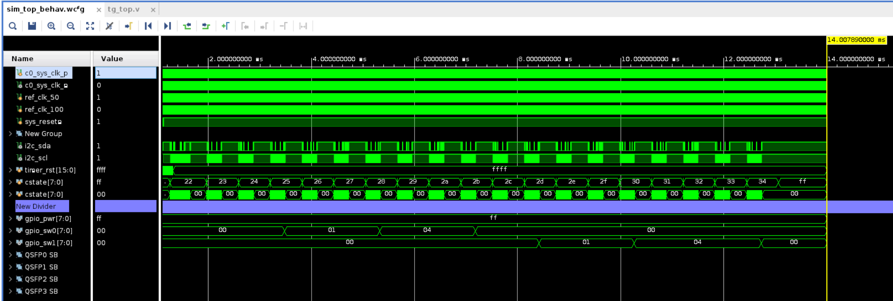
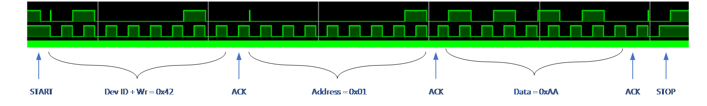

<table class="sphinxhide" width="100%">
 <tr width="100%">
    <td align="center"><h1>UL3422 Ultra Low Latency Trading</h1>
    </td>
 </tr>
</table>

# QSFP I2C Reference Design: Simulation

## Running the Simulation

To run a simulation of the design, follow the instructions detailed [here](../../Docs/simulating_a_design.md).

## QSFP I2C Power Plane Enable Simulation Behavior

After the waveform window is done loading, click the Run All button. The waveform should run for approximately 1.5ms. At this time, a test complete message will appear in the log window. The waveform window should look like this, consisting of three I2C transfers.

Figure: Waveform showing completed simulation.

### Power Enable Transfer #1

Figure: Assert P1, P3, P5, and P7 (set 0xAA to register 0x01).

### Power Enable Transfer #2

Figure: Configure P1, P3, P5, and P7 to output mode (set 0x55 to register 0x03).

## Support

For additional documentation, please refer to the [UL3422 product page](https://www.xilinx.com/products/boards-and-kits/alveo/ul3422.html) and the [UL3422 Lounge](https://www.xilinx.com/member/ull-ea.html).

For support, contact your FAE or refer to support resources at: <https://support.xilinx.com>

Copyright © 2024 Advanced Micro Devices, Inc.

<a href="https://www.amd.com/en/corporate/copyright">Terms and Conditions</a>

