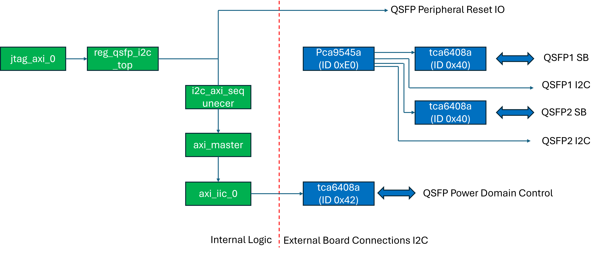
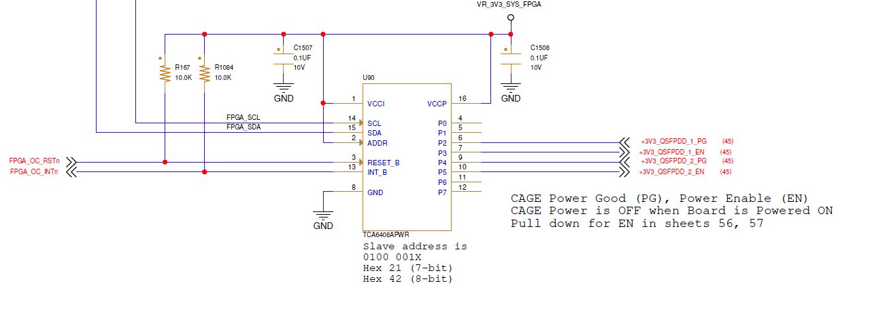
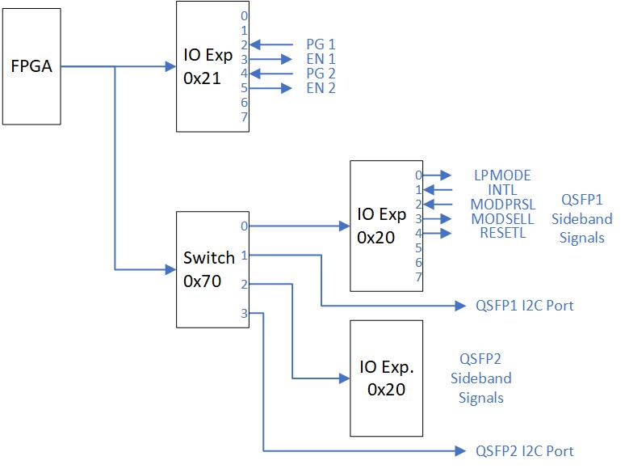
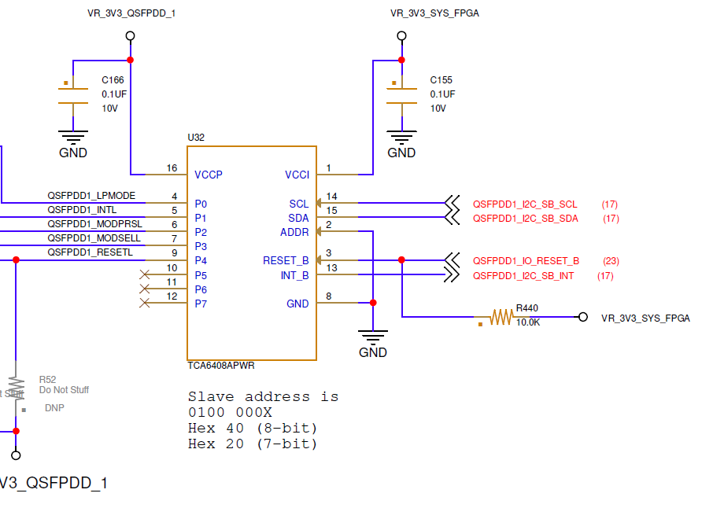

<table class="sphinxhide" width="100%">
 <tr width="100%">
    <td align="center"><h1>UL3422 Ultra Low Latency Trading</h1>
    </td>
 </tr>
</table>

# QSFP I2C Reference Design

## Description

This reference design demonstrates how to enable QSFP modules, power planes, and sideband signals via I2C interface.

**Additional Documentation**

The following links provide additional documentation, including simulation and HW Manager support.

* [Simulation](./Docs/simulation.md) 
  * Describes the available simulation and description of waveforms
* [HW Manager Support](./Docs/hw_manager_support.md) 
  * Provides instructions to run the design in hardware and interact with the design through the HW Manager.

## Reference Design Hierarchy

A high-level block diagram of the reference design module hierarchy *qsfp_i2c_top* (shown in greeen) including the QSFP I2C endpoints (shown in blue) is shown in the following figure.  A description of functionality of the design modules are given in the following table.

**Table:** Description of design modules

| Name | Description |
|---|---|
| jtag_axi_0 | This module interfaces with the Vivado hardware manager via JTAG to provide access to internal control and status registers via AXI-lite interface. |
| reg_qsfp_i2c_top | This module contains an AXI Lite accessible register array that controls the design. Once I2C commands are configured, the module initiates the transfer to the i2c_axi_sequencer.  |
| i2c_axi_sequencer | This module implements a state-machine that performs the required AXI commands for the I2C controller. A simple req/ack interface provides the device ID, command/address bytes, and optional write data. When the req is asserted, the state machine initializes the I2C controller, programs the output FIFO, starts the transfer and monitors the status. Read requests will return data when the transfer completes. |
| axi_master | This module translates a simple register access interface to the AXI-Lite interfaces required by the I2C controller IP. |
| axi_iic_0 | This I2C controller module is generated from the Vivado IP Catalog. The user interface is an AXI-Lite interface. |

## Card Details

### QSFP-DD Card Logic Overview

The following gives a high-level overview of the QSFP-DD logic.  Specific details are given further below.

* Power domains for each QSFP-DD are separately controlled via I2C I/O expander, device ID 0x42 (8-bit).

* QDFP-DD I2C ports and low speed sideband signals are accessed through a pair of I2C switches:
  * I2C Switch 0
    * Device ID is 0xE0 (8-bit)
    * Connects to QSFP-DD 1 and 2

* Each I2C switch has two I2C targets for each associated QSFP-DD:
  * An I/O expander to control/monitor the following low speed QSFP-DD sideband signals
    * LPMODE
    * INITL
    * MODPRSL
    * MODSELL
    * RESETL
  
* A direct I2C connection to the QSPF-DD module’s I2C port.

### QSFP Power Enable

Each QSFP module on the UL3422 card has an independent power plane which can be enabled independently via the FPGA I2C interface.  The below schematic capture image shows the FPGA I2C interface and I/O expander device (TCA6408APWR).  Each QSFP module can be enabled by asserting the respective enable signals QSFPDD_1_EN, QSFPDD_2_EN. These signals are map to I/O expander ports P3 and P5, respectively which are controlled by the FPGA I2C interface.

Additionally, power good status for each QSFP power plane (QSFPDD_1PG, QSFPDD_2_PG) can be read from ports P2,or P4 respectively. See section [Powering On/Off the QSFP-DD Domains](#powering-onoff-the-qsfp-dd-domains) for details.

This I/O expander is enabled by default, but can be reset by deasserting FPGA_OC_RSTn.

**Figure:** Schematic capture of I/O expander logic

Asserting the power enable pins is done by performing two I2C transfers:

* Program I2C register 0x1 to assert the desired pin(s), and
* Program I2C register 0x3 to 0x55 set the enable pin(s) as outputs and the power good status pins as inputs.

### QSFP-DD I2C Topology

As shown in the following figure, the card uses a combination of I2C switches (PCA9545A) and I/O expanders (TCA6408A) to access and control power and sideband signals for both of the QSFP-DD modules.  For clarity, only QSFP-DD0 I/O expander sideband signals are shown. The other QSFP-DD I/O expanders have identical sideband signals but are not explicitly shown.  To access/control particular QSFP signals requires enabling particular combination of I2C switches and I/O expanders.

  **Note: Each I/O expander (one per QSFP-DD) has the same I2C device ID (0x40).**

**Figure:** QSFP port and sideband control block diagram

### I2C Peripheral Resets

Each I2C I/O expander and switch component has an active-Low reset connected to the FPGA. All components have an external pullup resister and therefore will be enabled following a power reset. However, they can also be manually controlled by the FPGA using the following pins:

| Signal | Peripheral | FPGA Pin | External Pullup |
|---|---|---|---|
|FPGA_MUX_RSTn |Switches 0  |G14 |3.3V|
|FPGA_MUX_RSTn |Power enable expander |G15 |3.3V|
|QSFPDD1_IO_RESET_B |QSFP-DD 1 I/O expander |H16 |3.3V|
|QSFPDD2_IO_RESET_B |QSFP-DD 2 I/O expander |F15 |3.3V|

**Table:** I2C peripheral resets

## I2C Operations

### Powering On/Off the QSFP-DD Domains

Enabling or disabling the individual QSFP-DD power domains is achieved by configuring a TCA6408APWR I/O expander. Even bits/pins should be configured as inputs and reflect the power good status of each domain. Odd bits/pins should be configured as outputs and control the power enables for each domain as shown in the following table.

|Bit |Function |Direction|Signal|
|---|---|---|---|
|0 |Unused  |  |  |
|1 |Unused  |  |  |
|2 |QSFP-DD 1 Power Good  |Input |QSFP1 PG|
|3 |QSFP-DD 1 Power Enable  |Output |QSFP1 EN|
|4 |QSFP-DD 2 Power Good  |Input |QSFP2 PG|
|5 |QSFP-DD 2 Power Enable  |Output |QSFP2 EN|
|6 |Unused |  | |
|7 |Unused  |  | |

**Table:** QSFP-DD Power Good/Enable Bit Allocation

|Function          |I2C           |Sequence Detail           |
|---|---|---|
|Set power enable pins       |0x42, 0x01, 0xAA        |Programs output value register.       |
|Enable output mode for even numbered pin |0x42, 0x03, 0x55        |Programs output config register (0 = output, 1 = input) |
|Read power good status      |0x42,0x00, (I2C restart), 0x43, (read data) |Reads input value register        |

**Table:** Power Expander Example Programming

### Configuring/Reading QSFP Sideband Signals

Once enabled, the QSFP sideband signals are configured by configuring two PCA9545A I2C switch devices to route the I2C to the TCA6408A I/O Expander controlling the target QSFP sideband signals. This is done by a series of I2C transfers.

1. Configure both PCA9545A (ID’s 0xE0 and 0xE4) to route the I2C path.

2. Configure the output pin value and output enable for the targeted TCA6408A

**WARNING: Each TCA6408A has an ID of 0x40, so the I2C switches must be configured to route to only <u>ONE</u> such device to prevent bus contention.**

Each TCA6408A is enabled by means of pull-up resisters to RESET_B as shown in the following figure. This can be manually overwritten by driving the respective QSFPDDx_IO_RESET_B signal from the FPGA.  See section [I2C Peripheral Resets](#i2c-peripheral-resets) for details.

## Example I2C Sequences for Common Functions

### Powering On/Off the QSFP-DD Domains

Enabling or disabling the individual QSFP-DD power domains is achieved by configuring the TCA6408APWR I/O expander that drives the power enable signals.

The following table details three steps to configure the I/O expander, enable the outputs, and read back the power good values for verification.

**Table:** QSFP-DD Power Good/Enable Bit Allocation

|Function          |I2C           |Sequence Detail           |
|---|---|---|
|Set power enable pins       |0x42, 0x01, 0xAA        |Programs output value register.       |
|Enable output mode for even numbered pin |0x42, 0x03, 0x55        |Programs output config register (0 = output, 1 = input) |
|Read power good status      |0x42,0x00, (restart), 0x43, (read data) |Reads input value register        |

### Accessing Low Speed Sideband Control/Status Signals

Before accessing one of the QSFP-DD module’s I2C port or sideband expander, it is necessary to first program both I2C switches to configure the appropriate routing.

**IMPORTANT! Because of duplicate target device IDs, the switches must have only one target path enabled at a time. This can be managed by performing two I2C sequences when changing targets using the following reference table.**

|Target |First I2C Sequence| Second I2C Sequence| Selected Mux 0 Port| Selected Mux1 Port|
|---|---|---|---|---|
|QSFP-DD 1 |Sideband |0xE0, 0x04 |0xE4, 0x00 2  |Disabled |
|QSFP-DD 1 |I2C   |0xE0, 0x08 |0xE4, 0x00 3  |Disabled |
|QSFP-DD 2 |Sideband |0xE0, 0x00 |0xE4, 0x01  |Disabled 0 |
|QSFP-DD 2 |I2C   |0xE0, 0x00 |0xE4, 0x02  |Disabled 1 |

**Table:** I2C Switch Settings to Access QSFP-DD Low Speed Sideband Signal

### Example QSFP-DD Module I2C Access
Assuming the power domains are enabled correctly the following example shows how to access
the QSFP-DD 3 module’s I2C port. The same procedure can be modified to access the other
three modules.

|Function|      DevID| Addr/Cmd |Write Data |Read Data |Description|
|---|---|---|---|---|---|
|Deselect Mux0 Ports    |0xE0 |0x00  |N/A   |N/A   |Disable Mux0|
|Select QSFP-DD3 I2C via Mux 1 |0xE4  |0x08   |N/A   |N/A   |Select Port 4 of Mux1|

**Table:** QSPF-DD3 I2C Access Example

### Example QSFP-DD Low Speed Sideband Access
Each QSFP-DD low speed sideband signals are connected to a TCA6408A I/O expander, whose pinouts are detailed in the following table.  Access to these signals involves configuring the PCA9545A I2C Switches to route to the targeted I/O expander, then configuring or reading the I/O expander.

**Table:** QSFP sideband signal definition

| Pin     | Signal Name     | Input/Output     | Output Value     |
|---------|-----------------|------------------|------------------|
| 0       | LPMODE          | Output           | 0                |
| 1       | INTL            | Input            | 0                |
| 2       | MODPRSL         | Input            | 0                |
| 3       | MODSELL         | Output           | 0                |
| 4       | RESETL          | Output           | 1                |
| 5       | N/C             | Input            | 0                |
| 6       | N/C             | Input            | 0                |
| 7       | N/C             | Input            | 0                |

By default, the I/O expanders are configured for input only, so the LPMODE, MODSELL and RESETL signals will not be driven until initialized.

The following table illustrates how QSFP1 can be initialized.  Similar steps must be taken to initialized the other expanders.

***Table:** Example Configuring QSFP1 I/O Expander

|Function							|Sequence    				|Description											|
|---								|---						|---													|
|Disable PCA9545A (0xE0)			| 0x42, 0xE0, 0x00   		|Gates I2C communication to QSFP0 and QSFP1 expanders	|
|Disable PCA9545A (0xE4)			| 0x42, 0xE4, 0x00			|Gates I2C communication to QSFP2 and QSFP3 expanders	|
|Enable Port 2 of PCA9545A (0xE0)	| 0x42, 0xE0, 0x04			|Enables I2C routing to QSFP							|
|Program QSFP1 TCA6008A (0x40) 		| 0x40, 0x01, 0x10			|Sets RESETL, clears LPMODE, MODSEL (pins 0,3,4)		|
|Program QSFP1 TCA6008A (0x40) 		| 0x40, 0x03, 0xE6			|Configures output enables for pins 0,3,4				|

### Detailed Example of Programming Steps

The following table steps provide a complete example for enabling the power domains and configuration for QSPF-DD1. Once power is enabled, the same procedure can be modified to access the other three modules.

|Function        |DevID    |Addr/Cmd    |Write Data    |Read Data    |Description|
|---|---|---|---|---|---|
|Disable Switch 0      |0xE0    |0x0     |N/A      |N/A                    |Disable all ports        |
|Enable QSFP-DD Power for all ports |0x42    |0x01     |0xAA      |N/A                    |Set Output Value 1 = Enabled, 0 = Disabled |
|         |0x42    |0x03     |0x55      |N/A                    |Config Output Enable 1 = Input, 0 = output |
|Check for Power Good Status  |0x42    |0x00     |N/A      |Bit 0: QSFP-DD 0 Bit 2: QSFP-DD 1 Bit 4: QSFP-DD 2 Bit 6: QSFP-DD 3 |1 = Good Status        |
|Select QSFP-DD 1 Sideband   |0xE0    |0x04     |N/A      |N/A                    |Select Port 2 of Mux0       |
|Configure QSFP-DD 1 Sideband Output Values |0x40  |0x01     |0x10  Bit 0 = LPMODE Bit 1 = MODSEL Bit 4 = RESETL | N/A          |Once the endpoint has been identified via the switch configuration, the desired output values of the I2C expander must be established by programming register 1 of the I2C expander. The three bits shown on the left are outputs to the QSFP-DD modules. See the QSFP-DD documentation to determine the desired values of these signals.|
|Configure QSFP-DD 0 Sideband Output Enables  |0x40 |0x03 |0xE6 Bit 0 = LPMODE Bit 1 = MODSEL Bit 4 = RESETL      |N/A         |Enable outputs for bits 0,1 and 4|
|Check for Module Present   |0x40    |0x00     |N/A      |Check Bit 3 0 = installed 1 = not installed | |

**Table:** QSPF-DD1 Power and Control Enabling Example

## JTAG AXI Access

By setting the USE_JTAG_AXI parameter in the top source file, the user can connect to the design using Vivado Hardware Manager via a JTAG interface.  The following table illustrates the register map for this configuration to control the associated board resets for the I2C peripheral components and initiate I2C transfers.  

**Table:** Register map
  
    Addr    Register Description
    ----    ----------------------------------
    0x0000  I2C Control - Writing to this register initiates an I2C read/write transfer.
                          Write this register AFTER setting the I2C address and write data registers - defined below.
                Bit(s)  Description
                31      1=Read Operation, 0=Write Operation   
                30      1=Operation Complete, clears when this register is written to
                7:0     8-bit I2C Device ID (Do not set RW bit 0) 
            
    0x0004  I2C Address - Specifies the 8-bit I2C register address
                Bits    Description
                7:0     I2C Address
    
    0x0008  I2C Write Data - For write operations, this specifies the 8-bit data to be written
                Bits    Description
                7:0     I2C Write Data
    
    0x000C  I2C Read Data - For read operations, the returned 8-bit data is stored in this register
                Bits    Description
                7:0     I2C Read Data
    
    0x0010  RESETB - this register controls the various I/O resets to QSFP related peripherals 
                Bit     Description
                6       I2C Resetn - (reset to internal I2C controller)
                5       Unused       
                4       QSFPDD2_IO_RESET_B       
                3       QSFPDD1_IO_RESET_B       
                2       Unused       
                1       FPGA_MUX1_RSTN
                0       FPGA_MUX0_RSTN       

## References

TCA6408A product details can be found [here](https://www.ti.com/product/TCA6408A). 
PCA9545A product details can be found [here](https://www.ti.com/product/PCA9545A).

### TCA6408APWR Register Map

| **Command Byte** | **Register**                      | **Power Up Default**     |
|------------------|-----------------------------------|--------------------------|
| 0x00             | Input Port                        | xxxx xxxx                |
| 0x01             | Output Port                       | 1111 1111                |
| 0x02             | Polarity Inversion                | 0000 0000                |
| 0x03             | Configuration (1=input, 0=output) | 1111 1111 (dflt = input) |

### PCA9545A Register Map

| **B7** | **B6** | **B5** | **B4** | **B3** | **B2** | **B1** | **B0** | **Command**        |
|--------|--------|--------|--------|--------|--------|--------|--------|--------------------|
| x      | x      | x      | x      | x      | x      | x      | 0      | Channel 0 Disabled |
|        |        |        |        |        |        |        | 1      | Channel 0 Enabled  |
| x      | x      | x      | x      | x      | x      | 0      | x      | Channel 1 Disabled |
|        |        |        |        |        |        | 1      |        | Channel 1 Enabled  |
| x      | x      | x      | x      | x      | 0      | x      | x      | Channel 2 Disabled |
|        |        |        |        |        | 1      |        |        | Channel 2 Enabled  |
| x      | x      | x      | x      | 0      | x      | x      | x      | Channel 3 Disabled |
|        |        |        |        | 1      |        |        |        | Channel 3 Enabled  |

### UL3422 Pinout

| **Package Pin** | **Name**        | **Description**     |
|-----------------|-----------------|---------------------|
| AU19            | DDR_PSUIO_RESET | I/O Expander Resetb |
| AR20            | CLKGEN_SCL_R    | I2C Clock           |
| AT20            | CLKGEN_SDA_R    | I2C Data            |

## Support

For additional documentation, please refer to the [UL3422 product page](https://www.xilinx.com/products/boards-and-kits/alveo/ul3422.html) and the [UL3422 Lounge](https://www.xilinx.com/member/ull-ea.html).

For support, contact your FAE or refer to support resources at: <https://support.xilinx.com>

Copyright © 2024 Advanced Micro Devices, Inc.

<a href="https://www.amd.com/en/corporate/copyright">Terms and Conditions</a>

