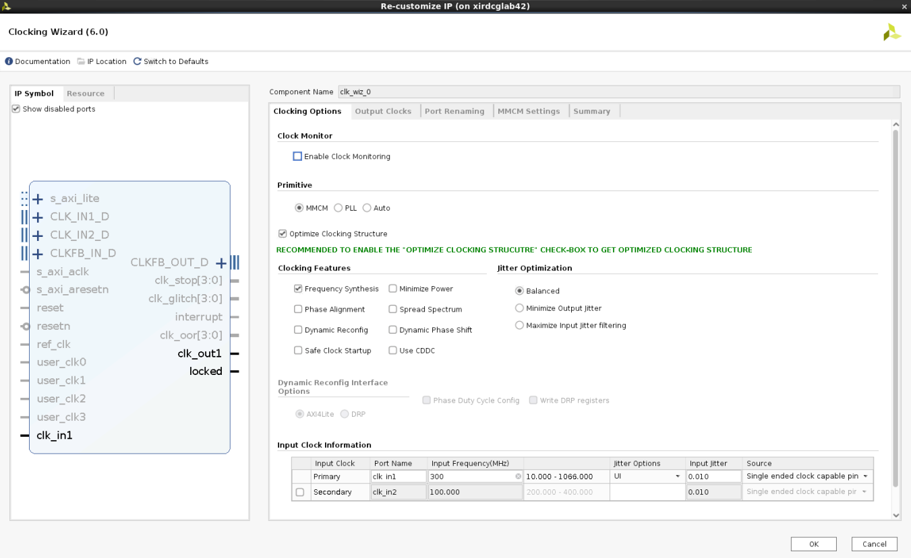

<table class="sphinxhide" width="100%">
 <tr width="100%">
    <td align="center"><h1>UL3524 Ultra Low Latency Trading</h1>
    </td>
 </tr>
</table>

# FINN Latency Measurement Design

This section provides a detailed overview of the RTL design used in conjunction with the benchmark environment to measure FINN MLP latency. This parameterization resulted in a 37 cycle latency. This is derived in the simulation analysis found here [Simulation Analysis](./simulation.md).

## Architecture

The high-level block design diagram used to measure FINN latency is shown below.  It consists of the following key blocks:

* FINN MLP IP
* Stimulus Generator
* Internal Logic Analyzer
* Clock Manager
* Reset Synchronizer

**Figure 1:** Block diagram of the FINNLatency Measurement Design

An overview of the operation of the design:

* MMCM (clock Generator) synchronizes to the 300 MHz board clock
* MMCM generates a 320 MHz system clock
* MMCM asserts lock which is used as system reset
  * LOCK is synchronized to the 320 MHz clock  
  * LOCK is active high
  * Stimulus generator has an active high reset
  * FINN MLP IP has an active low reset
* The stimulus generator drives the FINN input AXI interface
  * TVALID is driven from the block
  * TDATA is asserted for 10 clocks
  * FINN core requires 10 clocks of data at 60 bits per cycle  

All functions are held in reset until LOCK asserts. LOCK is used as the synchronous reset. The stimulus is applied continuously in a loop to the FINN block which allows measurement in simulation and in hardware of the IP latency.

## FINN MLP IP

The FINN MLP IP was generated using the FINN compiler.  

Details for FINN IP generation can be found [HERE](../IP/README.md).

## STIMULUS GENERATOR

The stimulus generator creates the TVALID and TDATA signals for the FINN block. For this example design TREADY from FINN is left unconnected and the FINN core is not permitted to back pressure the stimulus generator.

Stimulus Genertion occurs on a 128 cycle period.

* The data output for the first 20 clocks is 64 bits of 0. TVALID is deasserted.
* The data output for the next 10 clocks, cycle 21 to 30, is 64'hABCDABCDEFABCDEF which causes the FINN output to evaluate to '1'. TVALID is asserted
* The data output for the next 54 clock is 64 bits of 0 with TVALID deasserted.
* The data output for clocks 84 to 93 is 64'h0 with TVALID asserted.
* The data output for clocks 94 to 128 is 64'h0 with TVALID deasserted.

The cycle repeats continuously. Simulation results of this behavior are found in this link. [Simulation Documentation](./simulation.md)

## CLOCK MANAGER

A clock manager IP block is generated to provide a reset and 320 MHz clock.

The ULL platform provides a 300 MHz user clock on ports AW18(N)/AW19(P). This clock is conditioned to provide a 320 MHz clock. The design can run much faster but cannot run at the 644 MHz GTF clock rate. 320 MHz was chosen as approximately half the GTF clock. Implementations have been successfull at the 400 MHz clock rate.

## INTERNAL LOGIC ANALYZER

The ILA core is built using the IP catalog. The depth of 4096 is arbitrary and could easily be reduced for the purposes of this investigation. The Stimulus Generator creates stimulus on a 128 bit cycle and there is start up time for the core so a minimum recommended depth would be 256 bits with 512 being a good compromise if space is limited.

5 Ports are required to evaluate the FINN core in a hardware environment. The chosen platform is the UL3524. While there are 8 output bits captured only the LSB is valid. The FINN compiler creates an 8 bit port but for this design only the LSB is significant.

* Probe 0 is a 64 bit port that captures the TDATA input to the FINN MLP.
* Probe 1 is a 1 bit port that captures TVALID which qualifies the 64-bit input TDATA signal.
* Probe 2 is 1 bit port that captures the TREADY signal which is an input to the FINN core to provide back pressure to the FINN core. It is tied high as back pressure is not tested in this example.
* Probe 3 is an 8 bit port that captures the 8 bit FINN  output. Only the LSB is relevant.
* Probe 4 is a 1 bit port that captures TVALID sourced from the FINN core which qualifies the output result.

## RESET SYNCHRONIZER

The system reset is derived from the LOCK signal which is generated in the 300 MHz domain. This system synchronizes the reset to the 320 MHz domain. This particular circuit is used in many other ULL reference designs and is parameterized to 3 stages in this implementation.

## Support

For additional documentation, please refer to the [UL3524 product page](https://www.xilinx.com/products/boards-and-kits/alveo/ul3524.html) and the [UL3524 Lounge](https://www.xilinx.com/member/ull-ea.html).

For support, contact your FAE or refer to support resources at: <https://support.xilinx.com>

Copyright © 2020–2023 Advanced Micro Devices, Inc

<a href="https://www.amd.com/en/corporate/copyright">Terms and Conditions</a>

