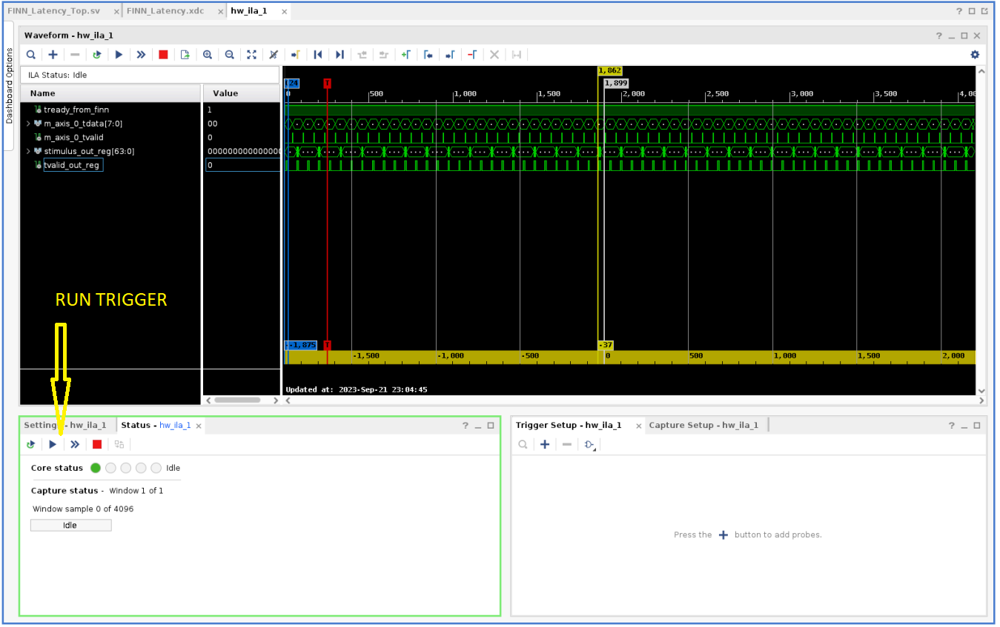
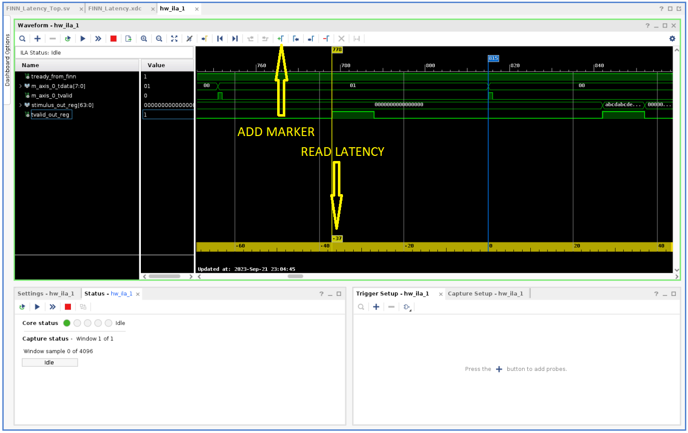

<table class="sphinxhide" width="100%">
 <tr width="100%">
    <td align="center"><h1>UL3524 Ultra Low Latency Trading</h1>
    </td>
 </tr>
</table>

# FINN MLP IP Latency Measurement in Hardware

This section provides steps to run the FINN Latency benchmark design and to measure FINN latency on the UL3524 via the Vivado HW Manager.

The key steps to run the benchmark design are:

1. Program the device : Program the UL3524 with the bitstream (.bit) and ILA probes file (.ltx).

2. Manually measure latency via the Marker functionality in the hardware manager waveform viewer.

These steps are described in detail below.

## Programming the Device

It is necessary to program the device with the reference design prior to running the FINN Latency benchmark design.  Be sure to build the design prior to following these steps.

1. DETAILED PROGRAMMING STEPS FOUND HERE : [Connect to the card via the HW Manager and program the FPGA](../../Docs/programming_the_device.md) with the following files: `{PROJ_DIR}/FINN_Latency/Vivado_Project/<project_name>/<project_name>.runs/impl_1/gtfmac_vnc_top.bit` AND `{PROJ_DIR}/FINN_Latency/Vivado_Project/<project_name>/<project_name>.runs/impl_1/gtfmac_vnc_top.ltx`, where PROJ_DIR is the directory path to the FINN_Latency design.

2. To enable ILA waveform capture, perform the following:

* Trigger all the ILAs by clicking on *Run trigger for this ILA core*

**NOTE**: ILA waveform capture does not impact the latency results.  It can be used to observe and verify the behavior of the design on hardware.

## Latency Measurementment

Waveform markers are added to the design by using the "add marker" function and then dragging a marker to aligh with the required edges. The first edge to select is the edge associated with the rising edge of TVALID on the slave port, which also aligns with first data, 64 bit TDATA. The next edge to align is the rising edge of TVALID on the output, master port. This marks the beginning of the clock cycle which contains data.

READ the clock cycle latency directly from the waveform. The total time in nanoseconds is 37 * 3.125ns at 320 MHz clock rate.

## ILA

An ILA is included in the design to allow observation and verification of the behavior on HW. The ILA in the design is connected to the required pins on the FINN core. These pins can be seen in the waveform. TVALID and TDATA inputs to the slave port are captured. On the output master port TVALID and TDATA are captured along with TREADY, although this signal is held high.

## Support

For additional documentation, please refer to the [UL3524 product page](https://www.xilinx.com/products/boards-and-kits/alveo/ul3524.html) and the [UL3524 Lounge](https://www.xilinx.com/member/ull-ea.html).

For support, contact your FAE or refer to support resources at: <https://support.xilinx.com>

Copyright © 2020–2023 Advanced Micro Devices, Inc

<a href="https://www.amd.com/en/corporate/copyright">Terms and Conditions</a>

