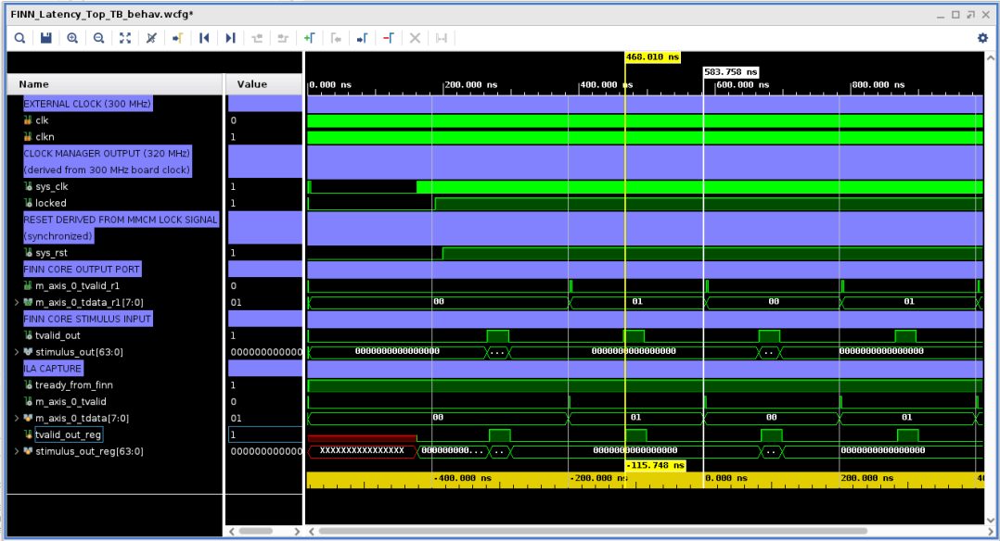

<table class="sphinxhide" width="100%">
 <tr width="100%">
    <td align="center"><h1>UL3524 Ultra Low Latency Trading</h1>
    </td>
 </tr>
</table>

# FINN Latency Measurement Design: Simulation

## Running the Simulation

To run a simulation of the design, follow the instructions detailed [here](../../Docs/simulating_a_design.md).

## Simulation Behavior

The following waveform shows the simulation behavior of the FINN latency measurement design. The latency is measured from the first assertion of TVALID at the input to the FINN core to the next assertion of tvalid at the output from the FINN core.  This value can be read from the waveform as 115.748 ns.

## Figure 1: Waveform of the FINN latency measurement Design**

The following waveform illustrates the clocks used for analysis. There are 2 clocks with the first clock being source by the clock driver on the ULL board. It has a frequency of 300 MHz. The second set of markers are aligned to 2 consecutive rising edges of this clock and show the period to be 3.33 ns.

The second clock is generated by the MMCM and is a 320 MHz clock. It's period can be read directly from the waveform and is 3.125 ns which equates to 320 MHz.

## Figure 2: Clock Period Waveform**

# FINN Latency Calculation

Calculation of the latency in clock cycles is obtained by dividing the FINN processing time of 115.748ns by the clock period at the input to the FINN core of 3.125 ns.

This yields a latency in clock cycles at 320 MHz of 37 clocks.

## Support

For additional documentation, please refer to the [UL3524 product page](https://www.xilinx.com/products/boards-and-kits/alveo/ul3524.html) and the [UL3524 Lounge](https://www.xilinx.com/member/ull-ea.html).

For support, contact your FAE or refer to support resources at: <https://support.xilinx.com>

Copyright © 2020–2023 Advanced Micro Devices, Inc

<a href="https://www.amd.com/en/corporate/copyright">Terms and Conditions</a>

