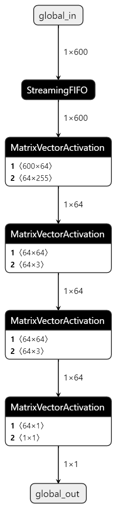

<table class="sphinxhide" width="100%">
 <tr width="100%">
    <td align="center"><h1>UL3524 Ultra Low Latency Trading</h1>
    </td>
 </tr>
</table>

# FINN MLP Design

The base for the FINN MLP design is taken directly from the opensource [Cybersecurity-MLP](https://github.com/Xilinx/finn-examples/tree/main/build/cybersecurity-mlp) example design.

For the FINN Latency reference design, the [Cybersecurity-MLP](https://github.com/Xilinx/finn-examples/tree/main/build/cybersecurity-mlp) example is modified as detailed in [the following section](#modifications).

This reference design is not intended to be a FINN tutorial.

To learn about using the FINN compiler, quantisation and re-training with Brevitas, and generating customised FINN IP blocks, please refer to the official [FINN Documentation](https://finn.readthedocs.io/).

## Modifications

- [Targeting a specific part](#targeting-a-specific-part) describes how to generate FINN IP for the UL3524.
- [Improving performance through folding](#improving-performance-through-folding) adjusts the PE and SIMD parameters for each layer to achieve the desired latency based on available FPGA resources.

### Targeting a specific part

While FINN does provide support for various platforms, it can also target specific parts. In the case of targeting a specific part, a stitched IP is generated and can then be integrated into a larger Vivado project.

To configure the target part, the [design build script](https://github.com/Xilinx/Alveo-Cards/blob/ul3524/FINN_Latency/IP/finn-mlp-design/build.py) needs to be modified. Specifically, change the value of *fpga_part*. In this example, the UL3524 part *xcvu2p-fsvj2104-3-e* is being targeted.

For further information on FINN build configurations, see the [FINN API](https://finn.readthedocs.io/en/latest/source_code/finn.builder.html#finn.builder.build_dataflow_config.DataflowBuildConfig).

### Improving performance through folding

One of the key features of FINN is the ability to fully unfold a network to improve performance and optimize a model to take full advantage of the available resources on the FPGA. This is achieved by adjusting the parallelization parameters (PE & SIMD). See the [FINN Tutorial on Folding](https://github.com/Xilinx/finn/blob/dev/notebooks/advanced/3_folding.ipynb) for a walkthrough of exactly how this works.

The model generated by FINN looks like this:



Each layer has been translated to a MatrixVectorActivation(MVAU) IP block. The input and output of each layer can also be identified which is necessary for folding.

When folding, there are some rules which must be considered. In the case of MVAUs, the input and output sizes (MW and MH respectively), PE and SIMD are subject to the following constraints:

``````text
MW % SIMD == 0
MH % PE == 0
``````

Total folding for an MVAU is defined as:

``````text
Total folding = (MH/PE) x (MW/SIMD)
``````

Ideally, the total folding for each layer would be 1 meaning each layer should only take 1 cycle to complete.

E.g. for L1:

``````text
MW = 600
SIMD = 600
MH = 64
PE = 64

Total folding = (64/64) x (600/600) = 1
``````

This is unfortunately not currently possible due to a HLS limitation found during the development of this example. See the [Limitations](#limitations) section for further details.

The final folding configurations for this example can be found [here](https://github.com/Xilinx/Alveo-Cards/blob/ul3524/FINN_Latency/IP/finn-mlp-design/folding_config.json). These are the values used to generate the prebuilt example. They are pulled into the build in the build script at this [line](./build.py#L24). Either modify the json file directly or point to a new config if changing the parameter values.

#### Limitations

While building this example, a number of limitations where identified:

- There is a Vitis HLS bitwidth limit which prevents fully unfolding this model. The constraint is the following:

``````text
SIMD*PE*Weight_width < 8192
``````

To fully unfold this model, the first layer alone would need *SIMD=600* and *PE=64* which is far beyond this constraint. This is a known issue and will hopefully be resolved in the near future.

- FINN generates a number of reports based on estimated results. While these can be a useful indicator, they provided to be very unreliable/inaccurate during development. This is being investigated by the FINN team.

<p class="sphinxhide" align="center"><sub>Copyright © 2020–2023 Advanced Micro Devices, Inc</sub></p>

<p class="sphinxhide" align="center"><sup><a href="https://www.amd.com/en/corporate/copyright">Terms and Conditions</a></sup></p>
