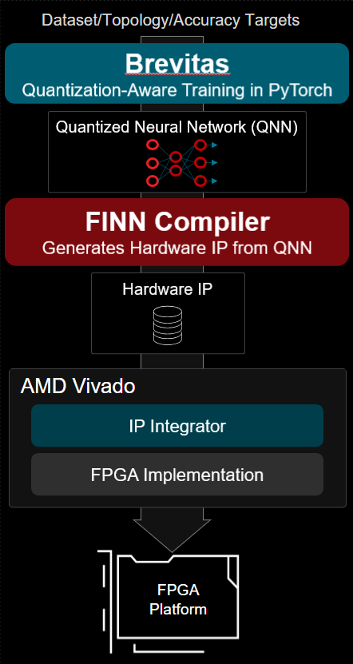

<table class="sphinxhide" width="100%">
 <tr width="100%">
    <td align="center"><h1>UL3524 Ultra Low Latency Trading</h1>
    </td>
 </tr>
</table>

# FINN on UL3524

## Description

This reference design demonstrates the latency of a data stream through a [FINN](https://finn.readthedocs.io/en/latest/) IP block on the UL3524.

The [FINN compiler](https://github.com/xilinx/finn) is an open source tool that generates Quantized Neural Network (QNN) Hardware IP blocks targeting AMD FPGAs.
q`3`

The QNNs are generated by [Brevitas](https://github.com/Xilinx/brevitas)  based on PyTorch network descriptions.

The output of FINN is in the form of a "Stitched IP" block, which can be integrated into a custom FPGA design with Vivado™ IP Integrator.

This design is not a complete solution, but rather a demonstration of how the FINN tool can be used to generate a FINN IP block targeting the UL3524 board.

As a starting point, the well documented [Cybersecurity-mlp](https://github.com/Xilinx/finn-examples/tree/main/build/cybersecurity-mlp) example is modified to target the UL3524. In addition, the [Cybersecurity-mlp](https://github.com/Xilinx/finn-examples/tree/main/build/cybersecurity-mlp) configuration is modified to minimize data latency through the block.

## Building the Design

For General instructions refer to this link [Design Creation](../Docs/loading_ref_proj.md)
The setup.tcl file for FINN_Latency in particular runs extra steps including synthesis and implementation. This is necessary because there are constraint conflicts that must be removed or critical warnings are reported. The details can be observed in the `setup.tcl` file found here [FINN Latency setup.tcl](https://github.com/Xilinx/Alveo-Cards/blob/ul3524/FINN_Latency/Vivado_Project/setup.tcl)

## Sections

The following links provide additional design details, including simulation and HW Manager support.

[FINN IP Generation](./IP/README.md)

[Design Overivew](./Docs/design.md)

[Simulation](./Docs/simulation.md)

[HW Manager Support](./Docs/hw_manager_support.md)

## Support

For additional documentation, please refer to the [UL3524 product page](https://www.xilinx.com/products/boards-and-kits/alveo/ul3524.html) and the [UL3524 Lounge](https://www.xilinx.com/member/ull-ea.html).

For support, contact your FAE or refer to support resources at: <https://support.xilinx.com>

Copyright © 2020–2023 Advanced Micro Devices, Inc

<a href="https://www.amd.com/en/corporate/copyright">Terms and Conditions</a>

