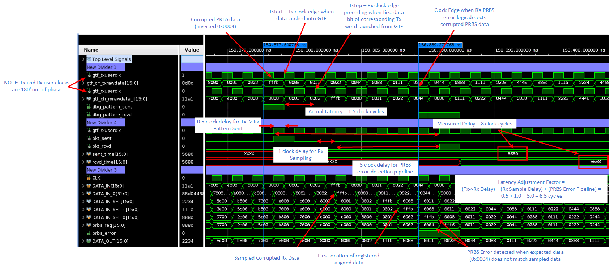
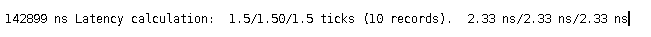

<table class="sphinxhide" width="100%">
 <tr width="100%">
    <td align="center"><h1>UL3524 Ultra Low Latency Trading</h1>
    </td>
 </tr>
</table>

# GTF RAW Synchronized Latency Measurement Design: Simulation

## Running the Simulation

To run a simulation of the design, follow the instructions detailed [here](../../../../Docs/simulating_a_design.md).

### Debug Tip

The design normally operates by injecting PRBS error based on the error injection timer as shown in the following code from rtl/gtfwizard_raw_example_top.v

```bash
  // PRBS Error generated based on error inject timer
  assign error_inj_pulse = (error_inj_remain != 'h0) && (error_inj_timer == 'h1);
```

However, this will corrupt random data which makes it difficult to tracing the unaligned corrupted data through the logic.  To make the debug more efficient, uncomment the included code to only corrupt when TxRawData is a specific value.  It will cause simulation to last much longer but identifies a specific known data point.

```bash
  // PRBS Error generated when TX data is a particular value 
  //    -- helpful by using a consistant data point
  //assign error_inj_pulse = (error_inj_remain != 'h0) && (tx_prbs_data[16*(0+1)-1:16*0] == 'h0004);
```

## Simulation Behavior

The following waveforms show the simulation behavior of the GTF latency measurement design in RAW mode.



**Figure: Waveform of the GTF latency measurement in RAW mode**

An example of the simulation minimum, average and maximum measured latency values are shown below.



**Figure: Example of displayed Min/Avg/Max values**

## Support

For additional documentation, please refer to the [UL3524 product page](https://www.xilinx.com/products/boards-and-kits/alveo/ul3524.html) and the [UL3524 Lounge](https://www.xilinx.com/member/ull-ea.html).

For support, contact your FAE or refer to support resources at: <https://support.xilinx.com>

<p class="sphinxhide" align="center"><sub>Copyright © 2020–2023 Advanced Micro Devices, Inc</sub></p>

<p class="sphinxhide" align="center"><sup><a href="https://www.amd.com/en/corporate/copyright">Terms and Conditions</a></sup></p>
