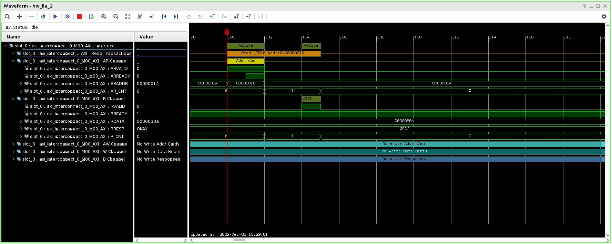
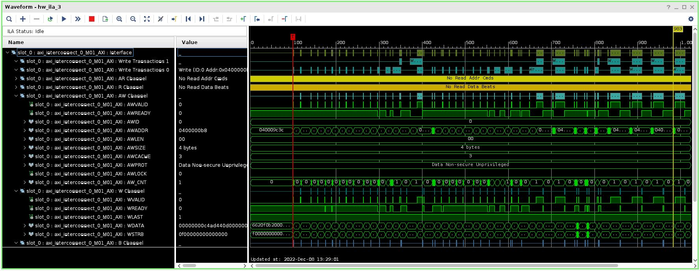
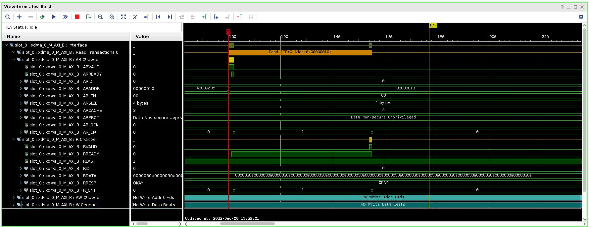

<table class="sphinxhide" width="100%">
 <tr width="100%">
    <td align="center"><h1>UL3524 Ultra Low Latency Trading</h1>
    </td>
 </tr>
</table>

# PCIe DDR Reference Design: HW Manager Support

This section provides instructions on how to

* Observe the behavior of the design via ILA through the HW Manager and
* Run a memory test on the DDR memory (Linux machine)

## Programming the Device

[Connect to the card via the HW Manager and program the FPGA](../../Docs/programming_the_device.md) with the following files:

* `./PCIE_DDR/Vivado_Project/<project_name>/<project_name>.runs/impl_1/sherman.bit`
* `./PCIE_DDR/Vivado_Project/<project_name>/<project_name>.runs/impl_1/sherman.ltx`

## ILAs

The four included ILAs, described in the table below, provide a way to observe and verify the behavior of the design on HW.

| Name | Description |
| --- | --- |
| hw_ila_1 | Connects to the internal DDR I2C signals. |
| hw_ila_2 | Connects to the AXI Lite interface to the control registers. |
| hw_ila_3 | Connects to the DDR AXI interface. |
| hw_ila_4 | connects to the PCIE AXI output interface. |

**Table 1.** Description of signals captured by the ILAs

### ILA Setup Instructions

1. On the Tcl console, enter the following command: `source ./PCIE_DDR/Scripts/config_ila.tcl`
    * The AXI triggers are setup for AWVALID or ARVALID to go high.  
    * The I2C trigger is setup for when reset is deasserted.
2. Right click on the device (xcvu2p_0) and click on *Refresh Device*.

## Memory Test

In addition to the ILA, the DDR memory can be tested via a `memtest.c` program.
The program, which runs on a Linux system, brings up the DDR I2C and the DDR IP and performs a memory test using 32-bit PRBS data. More detail on `memtest.c` can be found in [PCIe DDR Reference Design: Overview](./design.md#memtest-function-descriptions).

### Running the Memory Test

Instructions on how to run `memtest.c` are given below.

1. Display the card BDF and region 1 and 2 values which will be used in `memtest.c`.

* Run the following command to determine the card BDF(power cycle the card before executing this cmd): <br>`lspci -vv -d 10ee:`

An example output of this command is given below.  In this example, the following BDF and region 1 and 2 values are:

* BDF = 0000:01:00.0  (must be of the form 0000:00:00.0)
* Region 0 = 0xc0000000
* Region 1 = 0x80000000

```console
$ sudo lspci -vv -d 10ee:
01:00.0 Serial controller: Xilinx Corporation Device 9048 (prog-if 01 [16450])
Subsystem: Xilinx Corporation Device 0007
Control: I/O+ Mem+ BusMaster- SpecCycle- MemWINV- VGASnoop- ParErr- Stepping- SERR- FastB2B- DisINTx-
Status: Cap+ 66MHz- UDF- FastB2B- ParErr- DEVSEL=fast >TAbort- <TAbort- <MAbort- >SERR- <PERR- INTx-
Interrupt: pin A routed to IRQ 16
Region 0: Memory at c0000000 (32-bit, non-prefetchable) [size=128K]
Region 1: Memory at 80000000 (32-bit, non-prefetchable) [size=1G]
Capabilities: <access denied> 
```

2. Edit the following `memtest.c` code to match the BDF and region values of the card installed obtained in the previous step
   * device0 - set to the BDF value (must be of the form 0000:00:00.0)
   * region0_address - set to the 'Region 0' value
   * region1_address - set to the 'Region 1' value

`memtest.c` code to modify is shown below:

```bash
// Global Variables...
char  device0[32]     = "0000:01:00.0";
void* region0_address = (void*)0xc0000000;
void* region1_address = (void*)0x80000000;
```

3. Compile the code:<br>`gcc ./memtest.c -o memtest.exe`
4. Run the program (Note: must run as sudo):<br>`sudo ./memtest.exe [-c #cycles]`
   * -c : specifies the number of 32-bit addresses to write/read  

Example output when memtest runs successfully:

```bash
$ sudo ./memtest.exe -c 1000
Initializing Memory Pointers...
Enabling DDR power and DDR IP...
Starting memtest
running 1000 cycles
...memtest complete 
```

Example output if memtest encounters data errors:

```bash
# INDEX = READ DATA - REFERENCE DATA
[READ] ERROR :: 0x00000020 = 0x00000023 - 0x00000011
```

## Example ILA Waveforms

ILA 2 monitors the AXI interface to the I2C control registers.


ILA 3 monitors the AXI interface to the DDR data interface.


ILA 4 monitors the primary AXI interface from the PCIE XDMA IP.


## Support

For additional documentation, please refer to the [UL3524 product page](https://www.xilinx.com/products/boards-and-kits/alveo/ul3524.html) and the [UL3524 Lounge](https://www.xilinx.com/member/ull-ea.html).

For support, contact your FAE or refer to support resources at: <https://support.xilinx.com>

<p class="sphinxhide" align="center"><sub>Copyright © 2020–2023 Advanced Micro Devices, Inc</sub></p>

<p class="sphinxhide" align="center"><sup><a href="https://www.amd.com/en/corporate/copyright">Terms and Conditions</a></sup></p>
