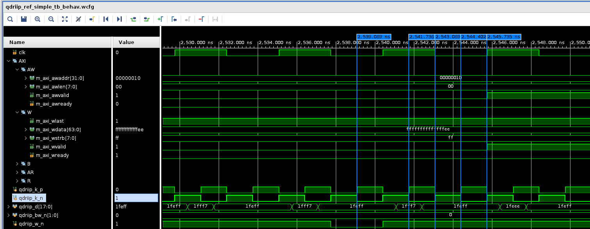

<table class="sphinxhide" width="100%">
 <tr width="100%">
    <td align="center"><h1>UL3524 Ultra Low Latency Trading</h1>
    </td>
 </tr>
</table>

# QDRII+ MIG Reference Design: Simulation

## Running the Simulation

To run a simulation of the design, follow the instructions detailed [here](../../Docs/simulating_a_design.md).

## Simulation Behavior

This section will outline the expected simulation behavior of the qdriip_ref_simple_tb. It will go through an example AXI write and read transaction and show the corresponding QDRII+ write and read operation.

### Write

The following waveforms show an example of an AXI write to the memory address **0x0000_0008**.

**Figure:** An example of AXI write address and data handshake and sampling of a QDRII+ write command. Starting from the leftmost marker:

1. Handshake of the write data *m_axi_wdata[63:0]* (**0xffff_ffff_ffff_fff7**)
2. Handshake of the write address *m_axi_awaddr[31:0]* (**0x0000_0008**)
3. Sampling of the corresponding QDRII+ write command *qdriip_w_n* on the posedge of *qdriip_k_p*

**Figure:** Waveform of the corresponding QDRII+ write operation (burst length: 4). Starting from the leftmost marker:

1. Sampling of the corresponding QDRII+ write command *qdriip_w_n* on the posedge of *qdriip_k_p*
2. Sampling of *qdriip_d[17:0]* (**0x1_fff7**) on the posedge of *qdriip_k_p*
3. Sampling of *qdriip_d[17:0]* (**0x1_feff**) on the posedge of *qdriip_k_n*
4. Sampling of *qdriip_d[17:0]* (**0x1_feff**) on the posedge of *qdriip_k_p*
5. Sampling of *qdriip_d[17:0]* (**0x1_feff**) on the posedge of *qdriip_k_n*

**Note**: Each byte of the AXI write data gets XOR'ed for an odd parity bit. E.g. 0xfff7 -> 0x1_fff7.

### Read

The following waveforms show an example of an AXI read to the memory address **0x0000_0008**.

**Figure:** An example of AXI read address handshake and sampling of the corresponding QDRII+ read command. Starting from the leftmost marker:

1. Handshake of the read address *m_axi_araddr* (**0x0000_0008**).
2. Sampling of the corresponding QDRII+ read command *qdriip_r_n* with read address *qdriip_sa[21:0]* (**0x00_0001**) on the posedge of *qdriip_k_p*

**Figure:** Waveform of the corresponding QDRII+ (burst length: 4) read operation. Starting from the leftmost marker:

1. Sampling of the corresponding QDRII+ read command *qdriip_r_n* with read address *qdriip_sa[21:0]* (**0x00_0001**) on the posedge of *qdriip_k_p*
2. Sampling of *qdriip_q[17:0]* (**0x1_fff7**) on the posedge of *qdriip_k_p*
3. Sampling of *qdriip_q[17:0]* (**0x1_feff**) on the posedge of *qdriip_k_n*
4. Sampling of *qdriip_q[17:0]* (**0x1_feff**) on the posedge of *qdriip_k_p*
5. Sampling of *qdriip_q[17:0]* (**0x1_feff**) on the posedge of *qdriip_k_n*

*qdriip_cq_p/n* are the echo clock returned from the memory derived from *qdriip_k_p/n* and are used as strobes.

**Figure:** Waveform of the handshake of an AXI read data *m_axi_rdata* (**0xffff_ffff_ffff_fff7**).

## Support

For additional documentation, please refer to the [UL3524 product page](https://www.xilinx.com/products/boards-and-kits/alveo/ul3524.html) and the [UL3524 Lounge](https://www.xilinx.com/member/ull-ea.html).

For support, contact your FAE or refer to support resources at: <https://support.xilinx.com>

Copyright © 2020–2023 Advanced Micro Devices, Inc

<a href="https://www.amd.com/en/corporate/copyright">Terms and Conditions</a>

