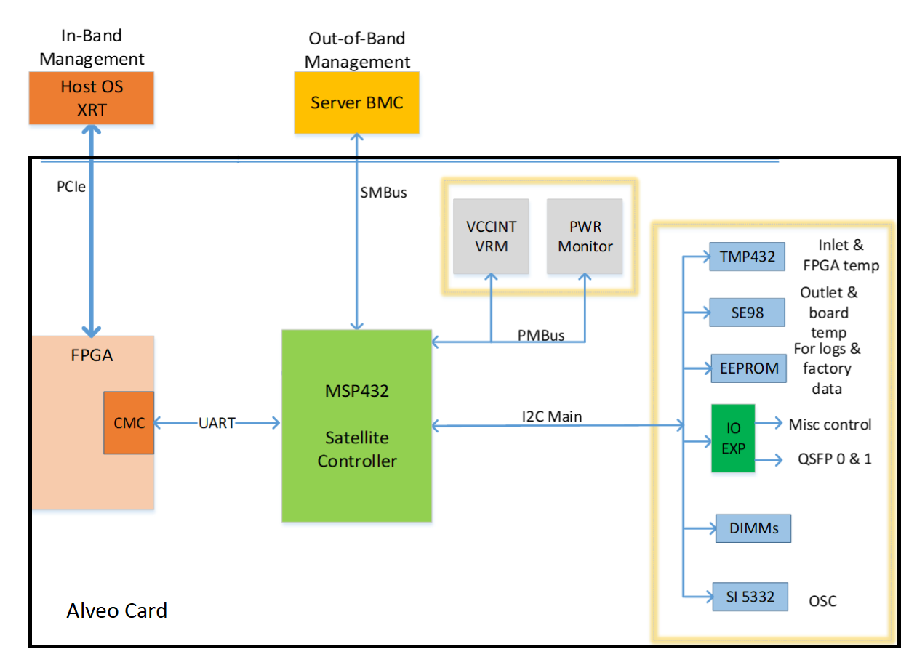

<table class="sphinxhide">
 <tr>
   <td align="center"><h1>Alveo Debug Guide</h1>
   </td>
 </tr>
</table>

# Alveo System
The following generic Alveo card system diagram visualizes the interaction between the various areas of the card and can be useful during debugging.

## Alveo System Diagram
The key points of the diagram include:
- The host communicates via [XRT](terminology.md#xrt) drivers and utilities with the card's FPGA based [CMC](terminology.md#cmc) over the PCIe bus
- The Satellite Controller ([SC](terminology.md#sc)) communicates with the CMC to provide sensor data and card status
  - Only the SC reads the on-card sensors
- For XRT status requests and card management, the communication path occurs via the PCIe bus ↔ CMC ↔ SC
- On servers there is a direct connection between the SC and the Sever BMC via a [SMBus](https://www.kernel.org/doc/html/latest/i2c/summary.html) communication path

 

### Xilinx Support

For additional support resources such as Answers, Documentation, Downloads, and Alerts, see the [Xilinx Support pages](http://www.xilinx.com/support). For additional assistance, post your question on the Xilinx Community Forums – [Alveo Accelerator Card](https://forums.xilinx.com/t5/Alveo-Accelerator-Cards/bd-p/alveo).

If you have a suggestion, or find an issue, send an email to alveo_cards_debugging@xilinx.com .

### License

All software including scripts in this distribution are licensed under the Apache License, Version 2.0 (the "License"); you may not use this file except in compliance with the License.

You may obtain a copy of the License at
[http://www.apache.org/licenses/LICENSE-2.0](http://www.apache.org/licenses/LICENSE-2.0)

All images and documentation, including all debug and support documentation, are licensed under the Creative Commons (CC) Attribution 4.0 International License (the "CC-BY-4.0 License"); you may not use this file except in compliance with the CC-BY-4.0 License.

You may obtain a copy of the CC-BY-4.0 License at
[https://creativecommons.org/licenses/by/4.0/](https://creativecommons.org/licenses/by/4.0/)

Unless required by applicable law or agreed to in writing, software distributed under the License is distributed on an "AS IS" BASIS, WITHOUT WARRANTIES OR CONDITIONS OF ANY KIND, either express or implied. See the License for the specific language governing permissions and limitations under the License.

XD027 | &copy; Copyright 2021 Xilinx, Inc.

