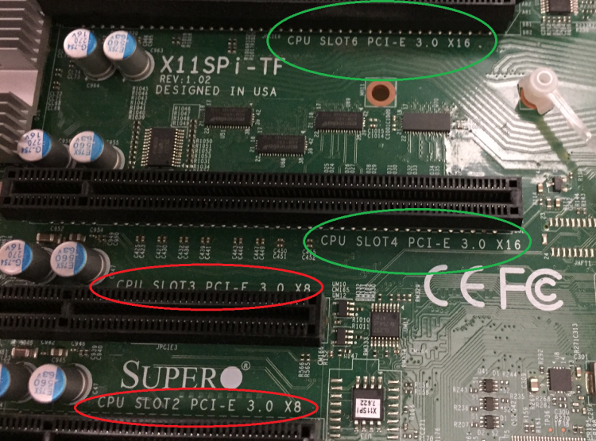
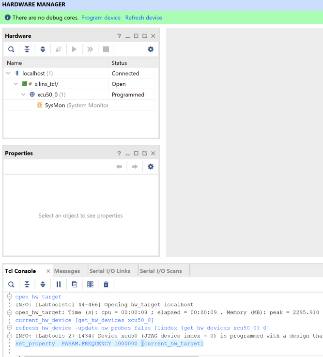
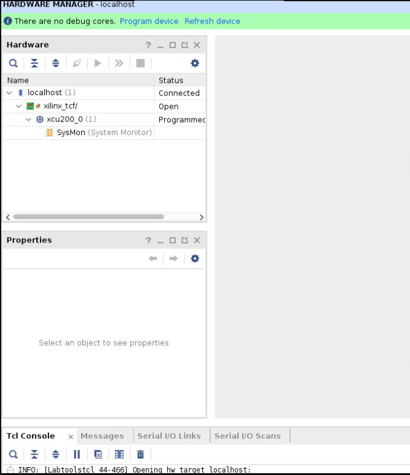

<table class="sphinxhide">
 <tr>
   <td align="center"><h1>Alveo Debug Guide</h1>
   </td>
 </tr>
</table>

# Common Steps

This page provides sets of techniques, used by other pages in the debug guide, which can help facilitate debugging. It is not intended to be used stand alone. If you are just starting to debug please consult the [main page](../README.md) to determine the best starting point for your needs.

## This Page Covers

 This page covers instructions for common debug steps over the following three sections:

| Section      | Items Covered |
| ----------- | ----------- |
|[System Steps](#system-steps) | Host hardware, BIOS, and OS setup|
|[XRT Steps](#xrt-steps) | XRT installation and operation|
|[Card Steps](#card-steps)| Card programming and operation|

## System Steps

This section covers steps involving the host hardware, BIOS, and OS setup.

---

### Log machine state

Use [WTSxrtLog.sh](./scripts/WTSxrtLog.sh) to collect information on the system, XRT, and card state. The script captures:

- Initial dmesg state
- OS
- lscpi state
- System information with dmidecode and BIOS settings
- XRT state
- Determine which cards validate
- dmesg state after XRT commands

This information is used to provide reference information while debugging.

---

### Root sudo access

For certain actions, root/sudo privileges are required.  Determine root/sudo privileges using the  `whoami`  and or `sudo whoami` commands:

`whoami` will tell you who the user is

```
:~> whoami
 root
```

If the response is `root`, you have the needed permissions. Otherwise, try the following:

```
:~> sudo whoami
root
```

`root` indicates your account has sudo access. If you do not have the needed permissions speak with your sys-admin

---

### Host machine and hypervisor information

To display host machine information and determine if a VM environment is being used, run the following </span> [linux dmidecode command](https://linux.die.net/man/8/dmidecode)
`sudo dmidecode | less`

It will display:

1. Serial Number
2. Model
3. BIOS version

As of 2020.2 XRT has support for the KVM hypervisor and virtual machines. The dmidecode output has enough information to confirm if XRT is running on a physical machine vs a virtual machine using the manufacturer and product name lines in the beginning of the report. You can also use this information to determine if the machine is a workstation or a server, with a web search.

A physical machine will report the manufacturer and model of the hardware. Common manufacturers include Dell, HP, SuperMicro and IBM.  An example of this output, for a Dell server, is displayed below.

```
Handle 0x0100, DMI type 1, 27 bytes
System Information
	Manufacturer: Dell Inc.
	Product Name: PowerEdge R730
	Version: Not Specified
	Serial Number: xxxxxx
```

An example of the BIOS version found is displayed below.  The BIOS displayed is version 2.8.0 in this case.

```
Handle 0x0000, DMI type 0, 24 bytes
BIOS Information
	Vendor: Dell Inc.
	Version: 2.8.0
```

A virtual machine does not list a specific product model. The manufacturer also changes to the VM provider (normally a software company) as displayed below:

```
Handle 0x0100, DMI type 1, 27 bytes
System Information
Manufacturer: QEMU
Product Name: Standard PC (Q35 + ICH9, 2009)
```

Common VM manufacturers include QEMU, Xen, VMware, VirtualBox/Oracle, OpenStack, KVM. Only KVM is supported - see  <https://developer.xilinx.com/en/articles/using-alveo-data-center-accelerator-cards-in-a-kvm-environment.html> for setup details.

---

### Determine Linux release

Use the `cat /etc/*release` command to determine the Linux release

```
:~> cat /etc/*release
CentOS Linux release 7.4.1708 (Core)
NAME="CentOS Linux"
VERSION="7 (Core)"
ID="centos"
ID_LIKE="rhel fedora"
VERSION_ID="7"
PRETTY_NAME="CentOS Linux 7 (Core)"
ANSI_COLOR="0;31"
CPE_NAME="cpe:/o:centos:centos:7"
HOME_URL="https://www.centos.org/"
BUG_REPORT_URL="https://bugs.centos.org/"

CENTOS_MANTISBT_PROJECT="CentOS-7"
CENTOS_MANTISBT_PROJECT_VERSION="7"
REDHAT_SUPPORT_PRODUCT="centos"
REDHAT_SUPPORT_PRODUCT_VERSION="7"

CentOS Linux release 7.4.1708 (Core)
```

In this example, the first line tells us the system is running CentOS 7.4

Ubuntu or RHEL outputs look similar.

---

### Determine Linux kernel and header information

For XRT usage, the machine needs to have compilation header files that match the machine's linux kernel. Run `uname -r` to get the kernel version as below:

```
:~> uname -r
4.15.0-112-generic
```

In this example the system is running kernel version 4. For Ubuntu, only the GA kernels released with the LTS are supported and not the HWE kernels (refer to the latest XRT Release Notes for supported OS/kernel versions in [UG1451](https://www.xilinx.com/search/site-keyword-search.html#q=ug1451)

The kernel headers package names change between distributions. Directions for Ubuntu and RHEL/CentOS follow

#### Ubuntu

Run `sudo apt list | grep linux-headers-` plus the results for the kernel, from `uname -r`,  to check which version of the headers package is installed as shown below:

```
:~> sudo apt list | grep linux-headers-4.15.0-112-generic

linux-headers-4.15.0-112-generic/bionic-security,now 4.15.0-112.113 amd64 [installed,automatic]
```

#### RHEL/CentOS

Run `yum list | grep kernel-` to check what versions of the `kernel-devel` and `kernel-headers` packages are install as displayed below:

```
:~> yum list | grep kernel-
Repository 'UIM_install' is missing name in configuration, using id
Repository 'opencl' is missing name in configuration, using id
kernel-devel.x86_64                        3.10.0-693.el7         @anaconda
kernel-headers.x86_64                      3.10.0-693.el7         @anaconda
....
kernel-tools-libs-devel.x86_64             3.10.0-693.el7         xlnx-base
```

---

### Determine PCIe slot type and speed

Run `dmidecode` to display slot capabilities and determine how many slots in the motherboard support the intended shell's PCIe configuration (i.e Gen3x16).

```
:~> sudo dmidecode | grep -A 10 PCI | grep -A 10 -B 1 Type | less
....
Handle 0x00C2, DMI type 9, 19 bytes
System Slot Information
        Designation: PCI-E Slot 1
        Type: x16
        Current Usage: Available
        Length: Long
        Characteristics:
                3.3 V is provided
                PME signal is supported
        Bus Address: 0000:03:00.0
```

The  `Type:` field shows this is a x16 slot. Any other value display will indicate it is not a x16 slot.

Some machines will report a slot is `Available` or `In Use` in the `Current Usage:` field. In the example above the slot is `Available`.

The actual speed depends on the card/slot negotiation. The `lspci` command displays the actual slot speed.  The example below shows a card running at x4 speeds in a x16 slot.

```
:~> sudo lspci -vvvd 10ee: | grep LnkCap
                LnkCap: Port #0, Speed 8GT/s, Width x4, ASPM not supported, Exit Latency L0s unlimited, L1 unlimited
```

If the card is running slower than the slot, review the shell capabilities with `xbmgmt` as shown below:

```
:~> sudo xbmgmt flash --scan
...
Card [0000:c3:00.0]
    Card type:          u50lv
    Flash type:         SPI
    Flashable partition running on FPGA:
        xilinx_u50lv_gen3x4_xdma_base_2,[ID=0xca1bd5610169a52c],[SC=5.0.27]
```

This is a Gen3 x4 shell. The x4 link is expected.

**NOTE:** Make sure to match the BDF (c3:00.0 in this case) with the output from `dmidecode` to ensure you are looking at the right card.

Another option is to look directly at the the silk screening on a motherboard or in the case of a server it may be on the risers. Here is an example picture:



The green circles show a slot that supports Gen3 x16 cards. The red circles show a Gen3 x8 that do not support Gen3 x16 speeds.

---

### Disable fastboot

Use this if the [system recognizes the card](common-steps.md#confirm-system-recognizes-cards) only after a warm boot

- Boot the system into the BIOS setup menu
  - F12 on many machines
- Disable the settings that allows the BIOS to skip initialization steps for a faster boot
  - Review system documentation to determine the right setting if there are questions

On cold boot the on-card FGPA (with the PCIe link) is being programmed while the machine and bios are booting up. Sometimes the BIOS will finish enumerating the PCIe device before the FPGA programming is finished. A warm boot will cause the BIOS to re-enumerate the devices while the FPGA PCIe link is up.

---

### Check for unpopulated CPUs

On modern systems the PCIe controller is built into the CPU. If there are one or more missing CPUs you may not be able to use all the PCIe slots. Review system documentation to determine which slots are usable.

To check for missing CPUs, look for a `Central Processor` entry with `Status: Unpopulated` in the dmidecode log as shown below.  The line `Status: Unpopulated` means this system has at least one missing CPU.  

```
Handle 0x0401, DMI type 4, 42 bytes
Processor Information
	Socket Designation: CPU2
	Type: Central Processor
	Family: Unknown
	Manufacturer: Not Specified
	ID: 00 00 00 00 00 00 00 00
	Version: Not Specified
	Voltage: Unknown
	External Clock: Unknown
	Max Speed: 4000 MHz
	Current Speed: Unknown
	Status: Unpopulated
```

---

### Determine UEFI and Secure Boot

As of XRT 2020.1 the drivers do not have the signing to enable Secure Boot and will not work if the BIOS has the UEFI Secure Boot feature enabled.

If you have the mokutil package installed you can determine if Secure Boot is enabled with the following command:

```
:~> mokutil --sb-state
 SecureBoot enabled
```

Any other output indicates Secure Boot is not enabled.

Not all machines have mokutil installed - its an optional package. You may have to install the package or check the Secure Boot setting in the system BIOS.

## XRT Steps

This section covers steps involving XRT installation and operation.

---

### Confirm XRT/platform compatibility

Not all versions of XRT work with all platforms. To determine which XRT versions work with a platform refer to [UG1120](https://www.xilinx.com/support/documentation/boards_and_kits/accelerator-cards/ug1120-alveo-platforms.pdf).

---

### Determine XRT version

The `Build Version Branch:` field shows the XRT github branch. It is normally tied to a release like `2019.2`, `2019.2_PU2`, or `2020.2`.

If the value is `Master`, you are using an un-official release.

`XRT Build Version`: indicates the build as seen via the `xbutil --version` example below:

```
:~> xbutil --version
       XRT Build Version: 2.8.726
    Build Version Branch: 2020.2
      Build Version Hash: 7c93966ead2dec777b92bdc379893f22b5bd561e
 Build Version Hash Date: Wed, 11 Nov 2020 13:45:32 -0800
      Build Version Date: Thu, 12 Nov 2020 04:28:18 +0000
                    XOCL: 2.8.726,7c93966ead2dec777b92bdc379893f22b5bd561e
                 XCLMGMT: 2.8.726,7c93966ead2dec777b92bdc379893f22b5bd561e
```

The XOCL and XCLMGMT versions must match. If not, XRT will not operate correctly.

---

### Determine XRT packages using the package manager

You will want to determine which versions (if any) of the below packages are installed 

- XRT
- Deployment platform(s)
- xbtest (an optional Alveo™ related package - see [AR 75656](https://www.xilinx.com/support/answers/75656.html) for more details)
- Development platform(s)

#### Ubuntu

Determine the platform and xbtest packages with `sudo apt list | grep -i xilinx-`. The machine in the example example below has the U250 xdma 201830\_2 development and deployment platforms for the U250. No xbtest is installed.

```
:~> sudo apt list | grep -i xilinx-

WARNING: apt does not have a stable CLI interface. Use with caution in scripts.

xilinx-u250-xdma/now 201830.2-2580015 all [installed,local]
xilinx-u250-xdma-dev/now 201830.2-2580015 amd64 [installed,local]
```

Determine the XRT package with `sudo apt list | grep -i xrt`. The example below has xrt 2.5.309 installed.

```
:~> sudo apt list | grep -i xrt

WARNING: apt does not have a stable CLI interface. Use with caution in scripts.

xrt/now 2.5.309 amd64 [installed,local]
```

Use [the XRT release table](common-steps.md#xrt-release-versions-and-download-locations)  to see if the XRT version is an official release.

#### RHEL/CentOS

Determine the platform and xbtest packages with `yum list | grep -i xilinx-` The machine in the example below has two different U50 platforms installed and xbtest only installed for the gen3x16 platform. No development platforms are installed.

```
:~> yum list | grep -i xilinx-
Repository 'UIM_install' is missing name in configuration, using id
Repository 'opencl' is missing name in configuration, using id

xilinx-cmc-u50.noarch                     1.0.20-2853996        @/xilinx-cmc-u50-1.0.20-2853996.noarch
xilinx-sc-fw-u50.noarch                   5.0.33-1.6a767ec      @/xilinx-sc-fw-u50-5.0.33-1.6a767ec.noarch
xilinx-u50-gen3x16-xdma-blp.noarch        1-2784799             @/xilinx-u50-gen3x16-xdma-201920.3-2784799.noarch
xilinx-u50-gen3x16-xdma-dev.noarch        201920.3-2784799      @/xilinx-u50-gen3x16-xdma-dev-201920.3-2784799.noarch
xilinx-u50-gen3x4-xdma-2-202010-1-dev.noarch
                                          1-2902115             @/xilinx-u50-gen3x4-xdma-2-202010-1-dev-1-2902115.noarch
xilinx-u50-gen3x4-xdma-base.noarch        2-2902115             @/xilinx-u50-gen3x4-xdma-base-2-2902115.noarch
xilinx-u50-gen3x4-xdma-validate.noarch    2-2902115             @/xilinx-u50-gen3x4-xdma-validate-2-2902115.noarch
xilinx-xbtest-common.x86_64               1.0-1.7.4.1708        @/xilinx-xbtest-common-1.0-1.7.4.1708.x86_64
xilinx-xbtest-sw-4.x86_64                 0-1.7.4.1708          @/xilinx-xbtest-sw-4-0-1.7.4.1708.x86_64
xilinx-xbtest-xilinx-u50-gen3x16-xdma-blp-1.noarch
                                          4.0-2787592           @/xilinx-xbtest-xilinx-u50-gen3x16-xdma-blp-1-4.0-2787592.noarch
```

Determine the XRT package with `yum list | grep -i xrt`. The example below has xrt 2.7.766 installed.

```
:~> yum list | grep -i xrt
Repository 'UIM_install' is missing name in configuration, using id
Repository 'opencl' is missing name in configuration, using id
xrt.x86_64                                2.7.766-1             @/xrt_202010.2.7.766_7.4.1708-x86_64-xrt
```

Use the [XRT release table](#xrt-release-versions-and-download-locations) to see if the XRT version is an official release.

---

### Unload/reload XRT drivers

Use `modprobe -r` to remove the drivers as shown below

```
sudo modprobe -r xocl
sudo modprobe -r xclmgmt
```

Use `modprobe` to reload the drivers as shown below

```
sudo modprobe xclmgmt
sudo modprobe xocl
```

Order matters for both of these commands. xocl depends on xclmgmt.

---

### Remove XRT

Removing XRT will also remove the deployment and development platforms.  If you plan to re-install XRT, get a  snapshot of XRT, platform, and xbtest packages installed on the system.

Before removing XRT, run `sudo xbmgmt flash --scan --verbose` and if any cards have a shell on them, [return each card to golden](common-steps.md#reverting-the-card-to-factory-image). This is necessary because not all XRT versions work with all platforms. All XRT versions work with a card that has been factory reset. Performing this step makes future card installs easier.

Once each card is returned to golden, use the package manager to remove the current XRT package using the following command.  Note, the package manager will also remove the dependent packages.

- Ubuntu: `sudo apt remove xrt`
- RHEL/CentOS: `yum remove xrt`

<span style="color: rgb(255,0,0);"> <span style="color: rgb(0,0,0);">If needed use the package manager to find the installed package names.

---

### xclbin fails to load

The first time an accelerator is run on a card, XRT loads the binary description of the accelerator, stored in an .xclbin file.  
If the .xclbin fails to load, run `xbmgmt flash --scan --verbose` .  If the output displays errors, see [sc-troubleshooting.md](sc-troubleshooting.md).
Else there may be an platform mismatch.

---

### XRT release versions and download locations

Available XRT releases along with download links are given in the table below.

| Release      | Download Link |
| ----------- | ----------- |
|2019.2 <br> XRT 2.3.1301|<li>[RHEL/CentOS 7.x](https://www.xilinx.com/bin/public/openDownload?filename=xrt_201920.2.3.1301_7.4.1708-xrt.rpm)</li><li>[Ubuntu 16.04](https://www.xilinx.com/bin/public/openDownload?filename=xrt_201920.2.3.1301_16.04-xrt.deb)</li><li>[Ubuntu 18.04](https://www.xilinx.com/bin/public/openDownload?filename=xrt_201920.2.3.1301_18.04-xrt.deb)</li>|
|2019.2_pu2 <br> XRT 2.5.309|<li>[RHEL/CentOS 7.x](https://www.xilinx.com/bin/public/openDownload?filename=xrt_201920.2.5.309_7.4.1708-x86_64-xrt.rpm)</li><li>[Ubuntu 16.04](https://www.xilinx.com/bin/public/openDownload?filename=xrt_201920.2.5.309_16.04-amd64-xrt.deb)</li><li>[Ubuntu 18.04](https://www.xilinx.com/bin/public/openDownload?filename=xrt_201920.2.5.309_18.04-amd64-xrt.deb)</li>
|2020.1 <br> XRT 2.6.655|<li>[RHEL/CentOS 7.x](https://www.xilinx.com/bin/public/openDownload?filename=xrt_202010.2.6.655_7.4.1708-x86_64-xrt.rpm)</li><li>[Ubuntu 16.04](https://www.xilinx.com/bin/public/openDownload?filename=xrt_202010.2.6.655_16.04-amd64-xrt.deb)</li><li>[Ubuntu 18.04](https://www.xilinx.com/bin/public/openDownload?filename=xrt_202010.2.6.655_18.04-amd64-xrt.deb)</li>|
|2020.1_pu1 <br> XRT 2.7.766|<li>[RHEL/CentOS 7.x](https://www.xilinx.com/bin/public/openDownload?filename=xrt_202010.2.7.766_7.4.1708-x86_64-xrt.rpm)</li><li>[RHEL/CentOS 8.1](https://www.xilinx.com/bin/public/openDownload?filename=xrt_202010.2.7.766_8.1.1911-x86_64-xrt.rpm)</li><li>[Ubuntu 16.04](https://www.xilinx.com/bin/public/openDownload?filename=xrt_202010.2.7.766_16.04-amd64-xrt.deb)</li><li>[Ubuntu 18.04](https://www.xilinx.com/bin/public/openDownload?filename=xrt_202010.2.7.766_18.04-amd64-xrt.deb)|
|2020.2 <br> XRT 2.8.726|<li>[RHEL/CentOS 7.x](https://www.xilinx.com/bin/public/openDownload?filename=xrt_202020.2.8.726_7.4.1708-x86_64-xrt.rpm)</li><li>[RHEL/CentOS 8.x](https://www.xilinx.com/bin/public/openDownload?filename=xrt_202020.2.8.726_8.1.1911-x86_64-xrt.rpm)</li><li>[Ubuntu 16.04](https://www.xilinx.com/bin/public/openDownload?filename=xrt_202020.2.8.726_16.04-amd64-xrt.deb)</li><li>[Ubuntu 18.04](https://www.xilinx.com/bin/public/openDownload?filename=xrt_202020.2.8.726_18.04-amd64-xrt.deb)</li><li>[Ubuntu 20.04](https://www.xilinx.com/bin/public/openDownload?filename=xrt_202020.2.8.726_20.04-amd64-xrt.deb)</li>|
|2020.2 <br> XRT 2.8.743 <br>See [AR 76088](https://www.xilinx.com/support/answers/76088.html)|<li>[RHEL/CentOS 7.x](https://www.xilinx.com/bin/public/openDownload?filename=xrt_202020.2.8.743_7.4.1708-x86_64-xrt.rpm)</li><li>[RHEL/CentOS 8.x](https://www.xilinx.com/bin/public/openDownload?filename=xrt_202020.2.8.743_8.1.1911-x86_64-xrt.rpm)</li><li>[Ubuntu 16.04](https://www.xilinx.com/bin/public/openDownload?filename=xrt_202020.2.8.743_16.04-amd64-xrt.deb)</li><li>[Ubuntu 18.04](https://www.xilinx.com/bin/public/openDownload?filename=xrt_202020.2.8.743_18.04-amd64-xrt.deb)</li><li>[Ubuntu 20.04](https://www.xilinx.com/bin/public/openDownload?filename=xrt_202020.2.8.743_20.04-amd64-xrt.deb)</li>|
|2020.2_pu1 <br> XRT 2.9.317 |<li>[RHEL/CentOS 7.x](https://www.xilinx.com/bin/public/openDownload?filename=xrt_202020.2.9.317_7.4.1708-x86_64-xrt.rpm)</li><li>[RHEL/CentOS 8.x](https://www.xilinx.com/bin/public/openDownload?filename=xrt_202020.2.9.317_8.1.1911-x86_64-xrt.rpm)</li><li>[Ubuntu 16.04](https://www.xilinx.com/bin/public/openDownload?filename=xrt_202020.2.9.317_16.04-amd64-xrt.deb)</li><li>[Ubuntu 18.04](https://www.xilinx.com/bin/public/openDownload?filename=xrt_202020.2.9.317_18.04-amd64-xrt.deb)</li><li>[Ubuntu 20.04](https://www.xilinx.com/bin/public/openDownload?filename=xrt_202020.2.9.317_20.04-amd64-xrt.deb)</li>


## Card Steps

Provides various techniques which can be used for debugging Alveo cards.

---

### Confirm system recognizes cards

Use the `lspci` command to confirm the system recognizes the card on the PCIe bus and the correct kernel drivers are in use.

The `lspci` command provides details on all of the PCIe buses and devices in the system. The verbose switch (-v) will provide greater detail and the device ID switch (-d) will filter for specific vendors.  For Xilinx, the device ID is `10ee:` .

Each card will output details for both management and user functions and display the respective Bus:Device:Function (BDF).  The function digit of the displayed BDF will be zero for management functions and one for user functions.

- For management functions:
  - The BDF will have the following form `xx:yy.0`
  - Kernel driver in use: xclmgmt
- For user functions,
  - The BDF will have the following form `xx:yy.1`
  - Kernel driver in use: xocl

The user function BDF only exists once a shell has been flashed onto the card. Cards with the factory golden image will only have the `xx:yy.0` BDF.

Below is an example of the `lspci` output.

```
:~> sudo lspci -vd 10ee:
8a:00.0 Processing accelerators: Xilinx Corporation Device 5000
        Subsystem: Xilinx Corporation Device 000e
        Flags: bus master, fast devsel, latency 0, NUMA node 1
        Memory at 2fff2000000 (64-bit, prefetchable) [size=32M]
        Memory at 2fff4040000 (64-bit, prefetchable) [size=256K]
        Capabilities: [40] Power Management version 3
        Capabilities: [60] MSI-X: Enable+ Count=32 Masked-
        Capabilities: [70] Express Endpoint, MSI 00
        Capabilities: [100] Advanced Error Reporting
        Capabilities: [1c0] #19
        Capabilities: [400] Access Control Services
        Capabilities: [410] #15
        Capabilities: [480] Vendor Specific Information: ID=0020 Rev=0 Len=010 <?>
        Kernel driver in use: xclmgmt
        Kernel modules: xclmgmt

8a:00.1 Processing accelerators: Xilinx Corporation Device 5001
        Subsystem: Xilinx Corporation Device 000e
        Flags: bus master, fast devsel, latency 0, IRQ 39, NUMA node 1
        Memory at 2fff0000000 (64-bit, prefetchable) [size=32M]
        Memory at 2fff4000000 (64-bit, prefetchable) [size=256K]
        Memory at 2ffe0000000 (64-bit, prefetchable) [size=256M]
        Capabilities: [40] Power Management version 3
        Capabilities: [60] MSI-X: Enable+ Count=32 Masked-
        Capabilities: [70] Express Endpoint, MSI 00
        Capabilities: [100] Advanced Error Reporting
        Capabilities: [400] Access Control Services
        Capabilities: [410] #15
        Capabilities: [480] Vendor Specific Information: ID=0020 Rev=0 Len=010 <?>
        Kernel driver in use: xocl
        Kernel modules: xocl

```

In a multi card system you may need to cross reference `lspci` output and `xbmgmt flash --scan --verbose` output to determine if there is a card missing

---

### Card PCIe IDs

The card PCIe ID changes depending on the image loaded to the card. The card PCIe ID for golden images are given in the table below:

| Card | Golden ID |
|------|-----------|
| U200 | d000      |
| U250 | d004      |
| U280 | d00c      |
| U50  | d020      |

Refer to <https://www.xilinx.com/support/documentation/boards_and_kits/accelerator-cards/ug1363-alveo-out-of-band-user-guide.pdf> for the lscpi id per platform/shell.

---

### Determine platform and SC on card and system

When debugging an issue it can be useful to know what is installed on the system and what is running on the card. If XRT is installed and working, the easiest way to see this is with the `sudo xbmgmt flash --scan --verbose` command.

The first case below shows that the card is running the same platform that is installed on the system. However the SC has a different version. `xbmgmt flash --update --card xx:00.0` needs to be run to update the SC.

```
:~> sudo xbmgmt flash --scan --verbose
Card [0000:c3:00.0]
    Card type:          u50
    Flash type:         SPI
    Flashable partition running on FPGA:
        xilinx_u50_gen3x16_xdma_201920_3,[ID=0xf465b0a3ae8c64f6],[SC=5.0.13]
            Logic UUID:
            f465b0a3ae8c64f619bc150384ace69b
    Flashable partitions installed in system:
        xilinx_u50_gen3x16_xdma_201920_3,[ID=0xf465b0a3ae8c64f6],[SC=5.0.27]
            Logic UUID:
            f465b0a3ae8c64f619bc150384ace69b
    Card name                   ALVEO U50 PQ
    Card S/N:                   50121119CSJ8
    Config mode:                7
    Fan presence:               P
    Max power level:            75W
    MAC address0:               00:0A:35:06:70:08
    MAC address1:               00:0A:35:06:70:09
    MAC address2:               00:0A:35:06:70:0A
    MAC address3:               00:0A:35:06:70:0B
```

It is also possible that there is a deployment platform installed on the system and a golden image installed on the card. For most cards the partition on the FPGA will end in a string like `_golden_5`. The one exception is the U50LV which calls the golden image the `_recovery` image as below:

```
:~> sudo xbmgmt flash --scan --verbose
Card [0000:c3:00.0]
    Card type:          u50lv
    Flash type:         SPI
    Flashable partition running on FPGA:
        xilinx_u50lv_recovery,[ID=0x2],[SC=INACTIVE]
            Logic UUID:
            00000000000000020004000002836260
    Flashable partitions installed in system:
        xilinx_u50lv_gen3x4_xdma_base_2,[ID=0xca1bd5610169a52c],[SC=5.0.27]
            Logic UUID:
            ca1bd5610169a52ce463b3300df98172
```

In both cases the card is running the factory FPGA image, the card will need to be flashed before use.

The case below shows there is a platform running on the card with no platform on the system, the deployment platform will first need to be installed on the system.

```
:~> sudo xbmgmt flash --scan --verbose
Card [0000:27:00.0]
    Card type:          u50lv
    Flash type:         SPI
    Flashable partition running on FPGA:
        xilinx_u50lv_gen3x4_xdma_base_2,[ID=0xca1bd5610169a52c],[SC=5.0.27]
            Logic UUID:
            ca1bd5610169a52ce463b3300df98172
    Flashable partitions installed in system:   (None)
```

On 2020.1 and newer XRT versions you will see the SC version even if there is no deployment package installed on the system.

---

### Flash the card with a deployment platform 

Once the card is up and running in the system, a deployment platform will need to be flashed onto the card before `xbutil validate` passes and applications can be run. To flash the card with a deployment platform follow the below steps:

1. Run `sudo xbmgmt flash --scan`
2. If `Flashable partitions installed in system: (None)`  is the output please install the latest packages from the [Alveo landing page](https://www.xilinx.com/products/boards-and-kits/alveo.html) for your installed card(s)
3. Follow the process for [Card install](card-install.md) to install the platforms on the machine.
4. Run `sudo xbmgmt flash --update --shell <xilinx_uxx>` to flash the platform onto the card. This command should be provided during platform installation, shown below:

    ```
    Partition package installed successfully.
    Please flash card manually by running below command:
    sudo /opt/xilinx/xrt/bin/xbmgmt flash --update --shell xilinx_u50_gen3x16_xdma_201920_3
    
    ~]$ sudo xbmgmt flash --update --shell xilinx_u50_gen3x16_xdma_201920_3
    	 Status: shell needs updating
            Current shell: xilinx_u50_GOLDEN_9
            Shell to be flashed: xilinx_u50_gen3x16_xdma_201920_3
    Are you sure you wish to proceed? [y/n]: y
    
    Updating shell on card[0000:05:00.0]
    INFO: ***Found 353 ELA Records
    Enabled bitstream guard. Bitstream will not be loaded until flashing is finished.
    Preparing flash chip 0
    Erasing flash.................
    Programming flash.................
    Cleared bitstream guard. Bitstream now active.
    Successfully flashed Card[0000:05:00.0]
    
    1 Card(s) flashed successfully.
    Cold reboot machine to load the new image on card(s).
    ```

5. Cold boot the server
6. Run `sudo xbmgmt flash --scan`
7. Now platform installed in host and card are the same
8. If this is a DFX-2RP platform, go to [Programming DFX-2RP shell partitions](#programming-dfx-2rp-shell-partitions)
9. If there is a different number in the `SC=`  line between the FPGA and the system for the platform on the card, update the SC firmware, example below:

    ```
    :~> sudo xbmgmt flash --update
          Status: SC needs updating
          Current SC: 5.0.20
          SC to be flashed: 5.0.27
          Updating SC firmware on card[0000:05:00.0]
          Stopping user function...
          INFO: found 4 sections
          .............................
          INFO: Loading new firmware on SC
    
          Successfully flashed Card[0000:05:00.0]
    
          1 Card(s) flashed successfully.
    ```

---

### Programming DFX-2RP shell partitions

The DFX-2RP platforms have a base partition, a shell partition, and user space as described in the [XRT platforms documentation](https://xilinx.github.io/XRT/master/html/platforms_partitions.html) under Two Stage Platforms. For DFX-2RP platforms it is necessary to not only flash the base partition, but also to program the shell partition prior to running an application.

See [AR 75975](https://www.xilinx.com/support/answers/75975.html) for more information.

---

### Determine active or passive card

The `xbmgmt flash --scan --verbose` command can be used to determine if a card is active or passive as it reports the fan presence as below:

```
:~> sudo xbmgmt flash --scan --verbose
Card [0000:03:00.0]
    Card type:          u250
    Flash type:         SPI
    Flashable partition running on FPGA:
        xilinx_u250_xdma_201830_3,[ID=0x5eeb5a43],[SC=4.3.9]
    Flashable partitions installed in system:
        xilinx_u250_xdma_201830_3,[ID=0x5eeb5a43],[SC=4.3.9]
...
    Fan presence:               P
```

- `Fan presence: A` means the card has a fan. The card is actively cooled, suitable for workstations. 
- `Fan presence: P` means the card is passively cooled and depends on server fans for cooling.

---

### Monitor card power and temperature

During operation it is necessary to ensure the card operates within the power and thermal limits. These limits are dependent on the card version as detailed below:

The U50 is rated for 75W, supplied by the motherboard via

- A 10W 3.3V rail
  - Dedicated for HBM power, see [AR 75222](https://www.xilinx.com/support/answers/75222.html) for more information
- And a 65W 12V rail

The U200/U250/U280 are rated for 225W

- 75W from the motherboard via
  - A 10W 3.3V rail
  - And a 65W 12V rail
- Plus 150W power from an 8 pin PCIe AUX power source.

 Depending on how the card was installed, the card may have the following power limits:

- 75W
  - No PCIe Aux power
  - Only power from the motherboard PCIe slot
  - Not supported for U200/U250/U280 in Vitis™ flows
- 150W
  - 6 pin PCIe Aux power connected supplying 75W
  - Not supported for U200/U250/U280 in Vitis flows
- 225W
  - 8 pin PCIe Aux power connected supplying 150W

Use `xbmgmt flash --scan --verbose` command to determine each cards power supply by reviewing the `Max power level` value displayed.  In the example below, the maximum power level is 225W.

```
:~> sudo xbmgmt flash --scan --verbose
Card [0000:a6:00.0]
    Card type:          u280
    Flash type:         SPI
    Flashable partition running on FPGA:
        xilinx_u280_xdma_201920_3,[ID=0x5e278820],[SC=4.3.10]
    Flashable partitions installed in system:
        xilinx_u280_xdma_201920_3,[ID=0x5e278820],[SC=4.3.10]
    Card name                   ALVEO U280 PQ
	....
    Max power level:            225W
```

To display the card temperature and the power consumption use `xbutil query`.  It reports the temperature and each power rail. The following are the three key power rails:

- 12V PEX and 12V PEX Current
  - 12V motherboard rail
    - +/- 8% Voltage tolerance
  - Current should be =&lt;5.5A
- 3V3 PEX and 3V3 PEX Current
  - 3.3 Volt motherboard rail
    - +/- 9% Voltage tolerance
  - Current should be =&lt; 3A
- 12V AUX and 12V AUX Current (For U200/U250/U280)
  - These lines will be near 0 if PCIe Aux is not hooked up
  - Current should be =&lt;12.5A for 225W operation

In the U50, the 3.3V rail powers the HBM while the 12V rail powers the rest of the card except the SC. Use `xbutil query` to determine if the HBM power is within it's limits by looking at the `3V3 PEX` and `3V3 PEX CURR` values, reported in mV and mA respectively, as shown below:

```
:~> xbutil query -d c3:00.0
INFO: Found total 2 card(s), 2 are usable
~~~~~~~~~~~~~~~~~~~~~~~~~~~~~~~~~~~~~~~~~~~~~~~~~~~~~~~~~~~~~~~~~~~~~~~~~~~~~~~~
System Configuration
<cut>
~~~~~~~~~~~~~~~~~~~~~~~~~~~~~~~~~~~~~~~~~~~~~~~~~~~~~~~~~~~~~~~~~~~~~~~~~~~~~~~~
XRT Information
Version:        2.6.655
<cut>
~~~~~~~~~~~~~~~~~~~~~~~~~~~~~~~~~~~~~~~~~~~~~~~~~~~~~~~~~~~~~~~~~~~~~~~~~~~~~~~~
Shell                           FPGA                            IDCode
xilinx_u50_gen3x16_xdma_201920_3                                0x14b77093
<cut>
~~~~~~~~~~~~~~~~~~~~~~~~~~~~~~~~~~~~~~~~~~~~~~~~~~~~~~~~~~~~~~~~~~~~~~~~~~~~~~~~
Temperature(C)
<cut>
~~~~~~~~~~~~~~~~~~~~~~~~~~~~~~~~~~~~~~~~~~~~~~~~~~~~~~~~~~~~~~~~~~~~~~~~~~~~~~~~
Electrical(mV|mA)
12V PEX         12V AUX         12V PEX Current 12V AUX Current
12045           N/A             1002            N/A
3V3 PEX         3V3 AUX         DDR VPP BOTTOM  DDR VPP TOP
3373            N/A             N/A             N/A
<cut>
3V3 PEX CURR    VCCINT IO CURR  HBM1V2 VOL      VPP2V5 VOL
2647            200             1198            2502
VCC1V2 CURR     V12 I CURR      V12 AUX0 CURR   V12 AUX1 CURR
N/A             N/A             N/A             N/A
12V AUX1 VOL    VCCAUX VOL      VCCAUX PMC VOL  VCCRAM VOL
N/A             37214106        37214106        37214105
```

The equation to calculate power is

`
power = voltage * current.
`

From the information provided in the example above HBM is using 8.9W (3.373V * 2.647A).

An example of the output for the U200/U250/U280 is below:

```
:~> xbutil query -d a6:00.0
INFO: Found total 1 card(s), 1 are usable
~~~~~~~~~~~~~~~~~~~~~~~~~~~~~~~~~~~~~~~~~~~~~~~~~~~~~~~~~~~~~~~~~~~~~~~~~~~~~~~~
System Configuration
<cut>
~~~~~~~~~~~~~~~~~~~~~~~~~~~~~~~~~~~~~~~~~~~~~~~~~~~~~~~~~~~~~~~~~~~~~~~~~~~~~~~~
XRT Information
Version:        2.6.655
<cut>
~~~~~~~~~~~~~~~~~~~~~~~~~~~~~~~~~~~~~~~~~~~~~~~~~~~~~~~~~~~~~~~~~~~~~~~~~~~~~~~~
Shell                           FPGA                            IDCode
xilinx_u280_xdma_201920_3       xcu280-fsvh2892-2L-e            0x14b7d093
Vendor          Device          SubDevice       SubVendor       SerNum
0x10ee          0x500d          0x000e          0x10ee          21760394R01L
DDR size        DDR count       Clock0          Clock1          Clock2
32 GB           2               250             500             450
PCIe            DMA chan(bidir) MIG Calibrated  P2P Enabled     OEM ID
GEN 3x16        2               true            false           0xb1880640(N/A)
DNA

~~~~~~~~~~~~~~~~~~~~~~~~~~~~~~~~~~~~~~~~~~~~~~~~~~~~~~~~~~~~~~~~~~~~~~~~~~~~~~~~
Temperature(C)
PCB TOP FRONT   PCB TOP REAR    PCB BTM FRONT   VCCINT TEMP
37              N/A             N/A             N/A
FPGA TEMP       TCRIT Temp      FAN Presence    FAN Speed(RPM)
51              47              A               1244
QSFP 0          QSFP 1          QSFP 2          QSFP 3
N/A             N/A             N/A             N/A
HBM TEMP
N/A
~~~~~~~~~~~~~~~~~~~~~~~~~~~~~~~~~~~~~~~~~~~~~~~~~~~~~~~~~~~~~~~~~~~~~~~~~~~~~~~~
Electrical(mV|mA)
12V PEX         12V AUX         12V PEX Current 12V AUX Current
12136           12111           1578            1560
3V3 PEX         3V3 AUX         DDR VPP BOTTOM  DDR VPP TOP
3272            3327            2500            2500
SYS 5V5         1V2 TOP         1V8 TOP         0V85
5495            1207            1804            865
MGT 0V9         12V SW          MGT VTT         1V2 BTM
904             12044           1206            1207
VCCINT VOL      VCCINT CURR     VCCINT IO VOL   VCC3V3 VOL
850             12870           N/A             N/A
3V3 PEX CURR    VCCINT IO CURR  HBM1V2 VOL      VPP2V5 VOL
N/A             N/A             N/A             N/A
VCC1V2 CURR     V12 I CURR      V12 AUX0 CURR   V12 AUX1 CURR
N/A             N/A             N/A             N/A
12V AUX1 VOL    VCCAUX VOL      VCCAUX PMC VOL  VCCRAM VOL
N/A             N/A             N/A             N/A
~~~~~~~~~~~~~~~~~~~~~~~~~~~~~~~~~~~~~~~~~~~~~~~~~~~~~~~~~~~~~~~~~~~~~~~~~~~~~~~~
```

You can use [this script](./scripts/loop_query.sh) in a second terminal to monitor temperatures and voltages on a card while a design is running. Make sure to modify the script loop for the time required (this is based on the loop count in line 17 and the seconds of delay in between calls on line 19).

To use, run `./loop_query.sh <CardID>`

---

### Use system logs to see if the card exceeded power or thermal limits

XRT will log if there has been a critical event in `dmesg` similar to below:

```
[93352.134536] xclmgmt 0000:a3:00.0: clock.m.25165825 ffff90a92b74a010 clock_status_check: Critical temperature or power event, kernel clocks have been stopped, run 'xbutil valiate -q' to continue. See AR 73398 for more details.
[93352.134643] xclmgmt 0000:a3:00.0: firewall.m.12582914 ffff90a92e634c10 check_firewall: AXI Firewall 3 tripped, status: 0x80004, bar offset 0x3000, resource ep_firewall_ctrl_user_00 1 0 1 axi_firewall
[93352.134648] xclmgmt 0000:a3:00.0: firewall.m.12582914 ffff90a92e634c10 check_firewall: Firewall 0, ep ep_firewall_blp_ctrl_mgmt_00 1 0 1 axi_firewall, status: 0x0, bar offset 0x1f02000
[93352.134652] xclmgmt 0000:a3:00.0: firewall.m.12582914 ffff90a92e634c10 check_firewall: Firewall 1, ep ep_firewall_blp_ctrl_user_00 1 0 1 axi_firewall, status: 0x0, bar offset 0x1f03000
[93352.134657] xclmgmt 0000:a3:00.0: firewall.m.12582914 ffff90a92e634c10 check_firewall: Firewall 2, ep ep_firewall_ctrl_mgmt_00 1 0 1 axi_firewall, status: 0x0, bar offset 0x2000
[93352.134661] xclmgmt 0000:a3:00.0: firewall.m.12582914 ffff90a92e634c10 check_firewall: Firewall 3, ep ep_firewall_ctrl_user_00 1 0 1 axi_firewall, status: 0x80004, bar offset 0x3000
[93352.134666] xclmgmt 0000:a3:00.0: firewall.m.12582914 ffff90a92e634c10 check_firewall: Firewall 4, ep ep_firewall_ctrl_debug_00 1 0 1 axi_firewall, status: 0x0, bar offset 0x4000
[93352.134670] xclmgmt 0000:a3:00.0: firewall.m.12582914 ffff90a92e634c10 check_firewall: Firewall 5, ep ep_firewall_data_h2c_00 1 0 1 axi_firewall, status: 0x0, bar offset 0x5000
[93352.134672] xclmgmt 0000:a3:00.0: health_check_cb: Card requires pci hot reset
```

There will be no mention if this is a temperature or power event.

There may be an indication of an over temperature event earlier in `dmesg` as XRT will log if a device is approaching the temperature limits as below:

```
[686835.888454] xclmgmt 0000:05:00.0: check_temp_within_range: Warning: A Xilinx acceleration device is reporting a temperature of 96C. There is a card shutdown limit if the device hits 97C. Please keep the device below 88C.
[686836.200333] xocl 0000:05:00.1:  ffff8a0e1e23f098 _xocl_drvinst_open: OPEN 2
```

If the limits are exceeded in either case the device will be shut down. Often via a firewall trip as below:

```
[67066.484066] firewall.m firewall.m.10485760: dev ffff9b24390edc10, check_firewall: AXI Firewall 3 tripped, status: 0x4, bar offset 0x3000, resource ep_firewall_ctrl_user_00 1 0 1
[67066.484070] xclmgmt 0000:03:00.0: health_check_cb: Card is in a Bad state, notify userpf
```

This indicates the device was shutdown to protect it.

You can also expect to see a firewall trip message in xbutil query as shown below:

```
Card Power(W)
16
~~~~~~~~~~~~~~~~~~~~~~~~~~~~~~~~~~~~~~~~~~~~~~~~~~~~~~~~~~~~~~~~~~~~~~~~~~~~~~~~
Firewall Last Error Status
Level 3 : 0x80004(RECS_CONTINUOUS_RTRANSFERS_MAX_WAIT|RECS_WRITE_TO_BVALID_MAX_WAIT)
Error occurred on: Wed 2020-08-19 13:59:13 MDT
```

To actively monitor the card's power and temperature during runtime, use the script provided in the [monitoring power and temperature](common-steps.md#monitor-card-power-and-temperature) section.

---

### Reverting the card to factory image

The Alveo card can be reverted to the factory image, also known as golden. This requires that XRT release 2019.2 or later is installed on the same system as the Alveo accelerator card. The steps to revert the card using this method are listed below.

1. Open a terminal window.
2. Run the following command, where card_bdf is the BDF of the card to revert to golden.

   `$ sudo xbmgmt flash --factory_reset --card <card_bdf>`

3. Enter `y` to continue. The following message is displayed on completion.

   ```
   Shell is reset succesfully
   Cold reboot machine to load new shell on card
   ```

4. Cold boot the system so the card FPGA uses the new image.
5. Confirm the card has been reverted to factory image by running the following command.

   ```
   $ sudo xbmgmt flash --scan
   ```

An output similar to the following is displayed.

```
Card [0000:65:00.0]
Card type: uxx
Flash type: SPI
Flashable partition running on FPGA:
xilinx_uxx_GOLDEN_x,[SC=x.x]
Flashable partitions installed in system: (None)
```

In this output, under `Flashable partition running on FPGA`, note GOLDEN in the name. This indicates that the card has successfully been reverted to the factory image.

IMPORTANT! If the GOLDEN_2 image is running on the FPGA, carefully review the design advisory for Alveo data center Accelerator card golden corruption, found in [AR 71915](https://www.xilinx.com/support/answers/71915.html). Complete the repair instructions associated with the Xilinx Answer prior to proceeding.

---

### Vivado HW Manager

***This is for the more advanced user comfortable with manually programming FPGAs***

If a card can't be seen by multiple systems via `lspci`, the next step is to see if the FPGA is alive by determining if it can be seen in Vivado HW manager. The steps for connecting the U50 and U200/250/280 cards are below.

For the U50:

1. An Alveo Programming Cable is necessary to see the U50 in Vivado Hardware Manager
2. The Alveo Programming Cable is shown in Figure 3 in UG1377: [UG1377 V1.1](https://www.xilinx.com/support/documentation/boards_and_kits/accelerator-cards/ug1377-alveo-programming-cable-user-guide.pdf)
3. Follow the directions in UG1377 to connect the Alveo Programming Cable between a computer and the card.
   1. Pages 1-13
   2. Often the debug machine is a windows laptop
4. Open Vivado hardware manager
5. Tools → Auto connect
6. `set_property PARAM.FREQUENCY 1000000 [current_hw_target]`
7. The xu50\_0 should show as below:

   

8. If the device shows up in Vivado HW Manager follow [AR 71757](https://www.xilinx.com/support/answers/71757.html) to revert the card back to the golden image
9. Otherwise the FPGA is not working, post on the
[Xilinx forums](https://forums.xilinx.com/t5/Alveo-Accelerator-Cards/bd-p/alveo)

For the U200/U250/U280:

1. Plug in JTAG cable between U200/U250/U280 card and debug machine
    a.  Often the debug machine is a windows laptop
2. Open Vivado hardware manager
3. Tools → Auto connect
4. `set_property PARAM.FREQUENCY 1000000 [current_hw_target]`
5. The xcu200\_0 should show as below:

   

6. If the device shows up in Vivado HW Manager follow [AR 71757](https://www.xilinx.com/support/answers/71757.html) to revert the card back to the golden image
7. Otherwise the FPGA is not working, post on the
[Xilinx forums](https://forums.xilinx.com/t5/Alveo-Accelerator-Cards/bd-p/alveo)

---

### Xilinx Support

For additional support resources such as Answers, Documentation, Downloads, and Alerts, see the [Xilinx Support pages](http://www.xilinx.com/support). For additional assistance, post your question on the Xilinx Community Forums – [Alveo Accelerator Card](https://forums.xilinx.com/t5/Alveo-Accelerator-Cards/bd-p/alveo).

If you have a suggestion, or find an issue, send an email to alveo_cards_debugging@xilinx.com .

### License

All software including scripts in this distribution are licensed under the Apache License, Version 2.0 (the "License"); you may not use this file except in compliance with the License.

You may obtain a copy of the License at
[http://www.apache.org/licenses/LICENSE-2.0](http://www.apache.org/licenses/LICENSE-2.0)

All images and documentation, including all debug and support documentation, are licensed under the Creative Commons (CC) Attribution 4.0 International License (the "CC-BY-4.0 License"); you may not use this file except in compliance with the CC-BY-4.0 License.

You may obtain a copy of the CC-BY-4.0 License at
[https://creativecommons.org/licenses/by/4.0/](https://creativecommons.org/licenses/by/4.0/)


Unless required by applicable law or agreed to in writing, software distributed under the License is distributed on an "AS IS" BASIS, WITHOUT WARRANTIES OR CONDITIONS OF ANY KIND, either express or implied. See the License for the specific language governing permissions and limitations under the License.

<p align="center"><sup>XD027 | &copy; Copyright 2021 Xilinx, Inc.</sup></p>
