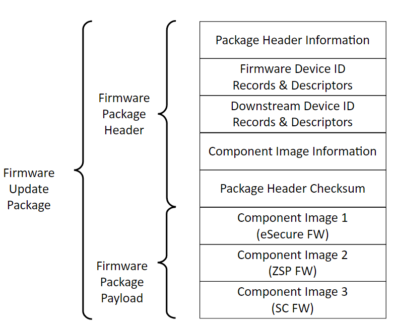
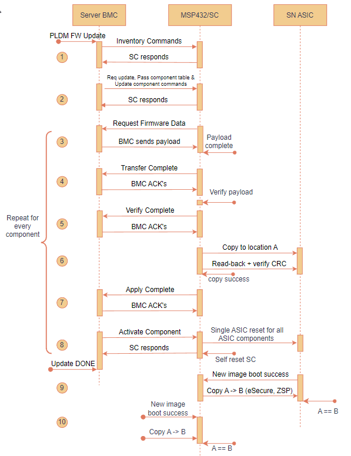
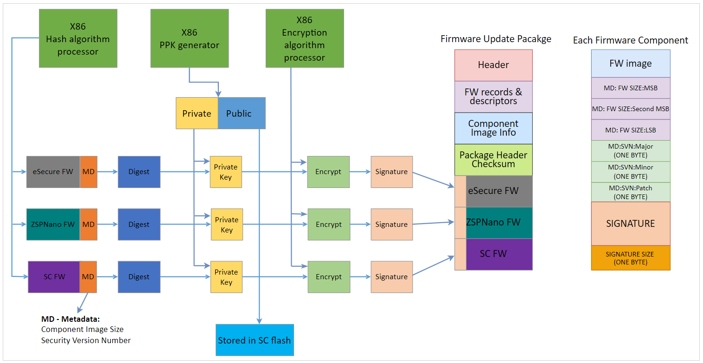

PLDM IFWI Update
----------------

PLDM Type-5 Over MCTP Over SMBus
~~~~~~~~~~~~~~~~~~~~~~~~~~~~~~~~

**Acronyms:**

* UA   - Update Agent (aka BMC)
* FD   - Firmware Device (aka SC firmmare)
* IFWI - Integrated Firmware Image

In Alveo™ MA35D, SC supports IFWI updates via PLDM Over MCTP Over SMBus at slave address 0x30 (8-bit).  The IFWI is packaged following PLDM Type-5 bundle as described in the spec:	

*PLDM for FW Update Spec v1.0.0* (`[DSP0267] <https://www.dmtf.org/dsp/DSP0267>`__)

Alveo™ MA35D IFWI has 3 distinct updatable firmware components:

1. ASIC: eSecure Firmware (128 KB)
2. ASIC: ZSP Firmware (124 KB)
3. SC Firmware (512 KB)

Table: Supported PLDM Type-5 commands and description

+------------------+------------------------+------------------------+
| **Command Code** |  **Command Name**      | **Command Originator** |
+==================+========================+========================+
|  0x01            | QueryDeviceIdentifiers | UA/BMC                 |
+------------------+------------------------+------------------------+
|  0x02            | GetFirmwareParameters  | UA/BMC                 |
+------------------+------------------------+------------------------+
|  0x10            | RequestUpdate          | UA/BMC                 |
+------------------+------------------------+------------------------+
|  0x13            | PassComponentTable     | UA/BMC                 |
+------------------+------------------------+------------------------+
|  0x14            | UpdateComponent        | UA/BMC                 |
+------------------+------------------------+------------------------+
|  0x15            | RequestFirmwareData    | FD/SC                  |
+------------------+------------------------+------------------------+
|  0x16            | TransferComplete       | FD/SC                  |
+------------------+------------------------+------------------------+
|  0x17            | VerifyComplete         | FD/SC                  |
+------------------+------------------------+------------------------+
|  0x18            | ApplyComplete          | FD/SC                  |
+------------------+------------------------+------------------------+
|  0x1A            | ActivateFirmware       | UA/BMC                 |
+------------------+------------------------+------------------------+
|  0x1B            | GetStatus              | UA/BMC                 |
+------------------+------------------------+------------------------+
|  0x1C            | CancelUpdateComponent  | UA/BMC                 |
+------------------+------------------------+------------------------+
|  0x1D            | CancelUpdate           | UA/BMC                 |
+------------------+------------------------+------------------------+

The following figure illustrates the PLDM firmware update bundle/package containing three firmware components.

*Figure:* PLDM firmware update bundle

A|B firmware scheme
~~~~~~~~~~~~~~~~~~~

-  MA35D SC as well as ASIC supports A|B firmware scheme, where A is Active, and B is Backup.

-  In the steady state, images A & B must be identical (i.e.) A == B. In other words, after the PLDM firmware update is completed, the firmware in partition A will be copied to partition B. This is done after the new firmware written to partition A boots up successfully. 

-  Initially, the new firmware components, one at a time, are downloaded to staging area within SC's flash memory.

-  After the verification of each firmware component, SC firmware copies the new firmware to the partition A within respective ASIC SPI flash.

-  After the new firmware from partition A boots-up successfully, SC copies that firmware image from partition A to partition B. This process is repeated for all firmware components.

-  ASIC flash has a reserved space of 512K to store the SC firmware, to enable in-band SC firmware update use-cases.

PLDM FW update process
~~~~~~~~~~~~~~~~~~~~~~

The following state diagram illustrates the PLDM firmware update process

*Figure:* PLDM firmware update flow - state diagram

**NOTE 1:** Only the component(s) that need updating will be packaged. For exmaple, if there is no new eSecure FW when preparing a PLDM FW update bundle for new ZSP & SC FW, the update bundle skips the eSecure FW.

**NOTE 2:** All the updates are ‘forced’. In other words, if a FW component is packaged within the released PLDM bundle, that component will be force updated irrespective of the firmware version. There’s no version check in place and hence all PLDM updates will be treated as ‘forced’ updates.

**NOTE 3:** Steps 3 through 8 below are repeated for all components within the FW update bundle - starting with eSecure FW, ZSP FW and finally the SC FW.

**PRE-UPDATE:** 
AMD delivers the firmware update bundle to the customer via secure means. Server BMC (aka UA) parsers PLDM bundle using the format specified as spec DSP0267 v1.0.0.

1.	**INVENTORY COMMANDS:** 
BMC/UA initiates the firmware update process and queries meta-data about the firmware components from SC/FD via inventory commands 0x01 & 0x02.

2.	**REQUEST UPDATE & COMPONENT INFO:**

a.	**REQUEST UPDATE:** BMC requests SC to initiate new PLDM FW update process. 

b.	**PASS COMPONENT INFO:** BMC sends necessary information about all firmware components contained in the FW update package.

c.	**UPDATE COMPONENT:** BMC sends this command to request update of a specific firmware component. 

3.	**REQUEST FIRMWARE:** 
After receiving component info, SC sets up necessary receive buffers and then sends Request_Firmware command to BMC. BMC starts sending the firmware payload until end of file/component.

4.	**TRANSFER COMPLETE:** 
SC notifies BMC after the component transfer is success.

5.	**VERIFY COMPLETE:** 
SC verifies the firmware component against any tampering by using the public key stored in SC flash. Result is notified to BMC. See Secure FW update section below for details. 

6.	**APPLY:** 

a.	After successful verification, SC copies the ASIC firmware (ZSP & eSecure) images to its respective partition A in the SPI flash. 

b.	New SC FW stays in the MSP's staging area of the flash. SC notifies the Bootloader of MSP to move the new SC binary from the staging area to partition A after reset/ACTIVATION is triggered.

7.	**APPLY COMPLTE:** 
SC notifies BMC about the apply complete status.

8.	**ACTIVATE:** 
BMC sends this command to activate the new firmware component.

a.	The SC features a self-contained activation method, enabling it to autonomously initiate an auto-reboot, transition to bootloader mode, and start up with the updated firmware. Alternatively, the new firmware can be activated upon the AC cycle during the maintenance window.

b.	ASIC FW (both ZSP & eSecure) are non-self-contained (i.e.) BMC must initiate AC cycle of the server to cold reset the ASICs in-order for the new FW to take effect.

**GET_STATUS:** 
At any time, BMC can send Get_Status command to query the update status from SC.

**CANCEL UPDATE:** 
BMC has the option to cancel the update process - component specific (0x1C) or the entire update (0x1D) process. BMC shall issue one of these commands any time prior to sending ACTIVATE command. 

•	When the cancel command arrives before APPLY, SC/FD shall erase the firmware component from the MSP staging area in the flash. 

•	On the other hand, when the cancel command arrives after APPLY, but before ACTIVATE, SC performs the restoration in the background (i.e.) by erasing the new component version ‘n+1’ from A and copying the current version ‘n’ from B to A. 

**NOTE:** When busy servicing previous command from BMC or accessing ASIC SPI flash, SC shall respond *BUSY_IN_BACKGROUND* if BMC sends one of 0x1C or 0x1D cancel commands.

9.	After the successful completion of PLDM FW update, ASIC boots-up with new FW and notifies SC about the boot status/success. SC subsequently performs a backup of A to B (i.e.) copies the newly update FW at A to partition B. After the copy, A == B.

10. After the successful completion of PLDM FW update, new SC firmware boots from location A. After deeming the new SC good, SC performs a backup of A to B (i.e.) copies the newly update FW at A to partition B. After the copy, A == B.

11. BMC can query the respective PLDM T2 firmware version sensor to identify whether the FW update process followed by the copy of A to B is success or not. SC keeps the ‘sensorOperationalState = Not-Enabled’ until both the update and backup are success. The goal is for both the flash partitions A & B to have the new firmware version ‘n+1’ or rolledback to current firmware version ‘n’.

**NOTE:** SC shall send PLDM *NOT_READY* error code when BMC sends any PLDM Type-5 commands while SC is busy with one of the following scenario: 

* Pervious pending firmware updates
* Waiting for ASIC FW to boot-up
* SPDM boot-up measurement
* Another thread accessing SPI flash access 

Secure FW update
~~~~~~~~~~~~~~~~

•	MA35D OoB firmware update process uses signed/verified image scheme. 

•	AMD applies digital signature to each firmware component at the build time using SHA3_384 and ECDSA_384. See figure below for details.

•	**DIGEST:** For digest creation, firmware component payload and metadata are used. Metadata contains 3-byte component image size and 3-byte Security Version Number (SVN) to prevent replay attacks.

•	**ENCRYPT:** One PPK pair (384-bit key size) is generated, and the same private key is used to sign/encrypt all 3 firmware components. The public key is stored within the SC flash.

•	The respective signature is appended to each firmware component and then the final PLDM firmware update package is created. See figure below for details.

•	Upon receiving each component, SC uses the stored public key to decrypt the signature and verifies the component against tamper and partial updates.

**NOTE:** No key rotation and revocation are supported in SC and there is no OTP (read-only) flash memory available within SC MCU to store the key securely.

The following diagram illustrates PLDM secure update process:

*Figure:* PLDM firmware package - secure update flow

**AMD Support**

For support resources such as answers, documentation, downloads, and forums, see the `Alveo Accelerator Cards AMD/Xilinx Community Forum <https://forums.xilinx.com/t5/Alveo-Accelerator-Cards/bd-p/alveo>`_.

**License**

Licensed under the Apache License, Version 2.0 (the "License"); you may not use this file except in compliance with the License.

You may obtain a copy of the License at
`http://www.apache.org/licenses/LICENSE-2.0 <http://www.apache.org/licenses/LICENSE-2.0>`_

All images and documentation, including all debug and support documentation, are licensed under the Creative Commons (CC) Attribution 4.0 International License (the "CC-BY-4.0 License"); you may not use this file except in compliance with the CC-BY-4.0 License.

You may obtain a copy of the CC-BY-4.0 License at
`https://creativecommons.org/licenses/by/4.0/ <https://creativecommons.org/licenses/by/4.0/>`_

Unless required by applicable law or agreed to in writing, software distributed under the License is distributed on an "AS IS" BASIS, WITHOUT WARRANTIES OR CONDITIONS OF ANY KIND, either express or implied. See the License for the specific language governing permissions and limitations under the License.

.. raw:: html

	
XD038 | &copy; Copyright 2023, Advanced Micro Devices Inc.

   
