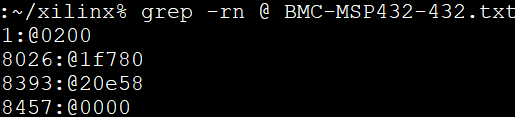
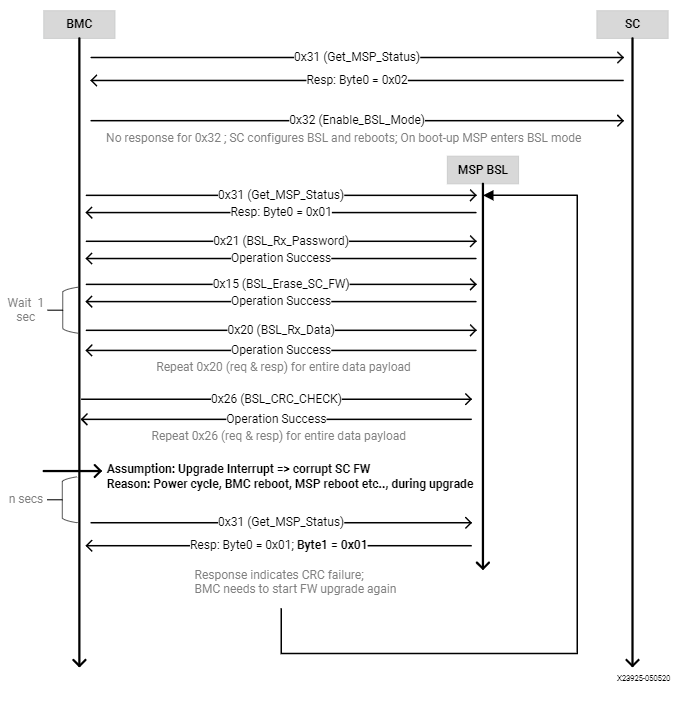

SC Firmware Update
------------------

In the Alveo™ U30 Hyperscaler only SKU, the satellite controller supports out-of-band method of SC FW upgrade in Xilinx® Alveo™ cards. The out-of-band SC FW update is supported at I2C address 0x65 (0xCA in 8-bit). Server BMC is expected to initiate the FW upgrade process by sending I2C commands to the SC FW. After the initial handshake with the SC FW, the server BMC will need to communicate with the MSP432 boot loader (BSL) to transfer the FW into MSP Flash and complete the upgrade process.

**Note:** Currently, the SC FW upgrades are always force upgrades, there is no version check supported by MSP's Bootloader. The old FW file will be overwritten by the new FW. Server BMC is expected to check and decide if the SC FW upgrade is needed. I2C speed of only 100 KHz is supported for all the commands mentioned in this chapter.

The following table lists the commands supported/needed for the FW upgrade.

**Table: BMC to SC Commands**

+------------------+------------------------+------------------------------------------------------------+
| **Command Code** | **Command Name**       | **Description**                                            |
+==================+========================+============================================================+
| 0x04             | GET\_SC\_FW\_VER       | Get SC FW version (xx.yy.zz format)                        |
+------------------+------------------------+------------------------------------------------------------+
| 0x31             | GET\_SC\_STATUS        | Returns status about what is running in MSP, FW, or BSL.   |
+------------------+------------------------+------------------------------------------------------------+
| 0x32             | ENABLE\_BSL\_MODE      | OoB command to reboot the SC and invoke BSL.               |
+------------------+------------------------+------------------------------------------------------------+

**Table: BMC to BSL Commands**

+------------------+------------------------+------------------------------------------------------------+
| **Command Code** | **Command Name**       | **Description**                                            |
+==================+========================+============================================================+
| 0x31             | GET\_SC\_STATUS        | Returns status weather SC is in SC FW mode or BSL mode     |
+------------------+------------------------+------------------------------------------------------------+
| 0x21             | BSL\_RX\_PASSWORD      | Sends 56 bytes password to unlock the BSL                  |
+------------------+------------------------+------------------------------------------------------------+
| 0x15             | BSL\_ERASE\_SC\_FW     | BSL erases old SC FW                                       |
+------------------+------------------------+------------------------------------------------------------+
| 0x20             | BSL\_RX\_DATA\_BLOCK   | Sends 32-bit data block to write (256 bytes max)           |
+------------------+------------------------+------------------------------------------------------------+
| 0x26             | BSL\_CRC\_CHECK        | Ask BSL to perform CRC check for validation                |
+------------------+------------------------+------------------------------------------------------------+
| 0x27             | BSL\_LOAD\_PC          | Jump to the SC's application FW , after FW upgrade         |
+------------------+------------------------+------------------------------------------------------------+

**Table: SC flash write and read-back Commands**

+------------------+--------------------------------+-----------------------------------------------+
| **Command Code** | **Command Name**               | **Description**                               |
+==================+================================+===============================================+
| 0x34             | GET\_SC\_FLASH\_WRITE\_STATUS  | SC sends the status for SC sector writes      |
+------------------+--------------------------------+-----------------------------------------------+
| 0x35             | GET\_SC\_WRITE\_SECTOR\_RANGE  | SC sends the SC flash sector range for writes |
+------------------+--------------------------------+-----------------------------------------------+
| 0x36             | SC\_FLASH\_WRITE\_DATA\_BLOCK  | BMC sends payload for writes into SC sectors  |
+------------------+--------------------------------+-----------------------------------------------+
| 0x37             | SC\_FLASH\_READ\_DATA\_BLOCK   | SC sends entire SC flash data to BMC          |
+------------------+--------------------------------+-----------------------------------------------+

0x31 - GET\_SC\_STATUS (SC firmware)
~~~~~~~~~~~~~~~~~~~~~~~~~~~~~~~~~~~~

The GET\_SC\_STATUS command serves as the status command, revealing
if the MSP432 processor is running in the application code (SC FW)
or in BSL mode. Upon receiving this command, the SC FW responds with
0x02 in Byte 0.

**Note:** The same command is supported by BSL. BSL will respond
saying *'am in BSL mode'*.

**Table: GET\_SC\_STATUS Server BMC Request**

+-------------------------+------------+
| **Server BMC Request**               |
+=========================+============+
| Command code            |     0x31   |
+-------------------------+------------+
| Data bytes              |     N/A    |
+-------------------------+------------+

**Table: GET\_SC\_STATUS Xilinx Alveo Card Response**

+----------------+--------------+------------+
| **Xilinx Alveo Card Response**             |
+================+==============+============+
| Data bytes     |     Byte 0   |     0x02   |
+----------------+--------------+------------+
|                |     Byte 1   |     N/A    |
+----------------+--------------+------------+

0x32 - ENABLE\_BSL\_MODE
~~~~~~~~~~~~~~~~~~~~~~~~

Upon receiving the ENABLE\_BSL\_MODE command, the SC FW configures
FW update mode in the BSL and reboots itself. The next boot up takes
the control to BSL mode. Absence of this step results in normal
reboots, where the application code/FW will boot-up instead of
staying in BSL to enable the FW update process.

**Note:** For this command, the SC FW will not be able to respond
to the BMC with success or failure before rebooting itself.

**Table: ENABLE\_BSL\_MODE Server BMC Request**

+-------------------------+------------+
| **Server BMC Request**               |
+=========================+============+
| Command code            |     0x32   |
+-------------------------+------------+
| Data bytes              |     N/A    |
+-------------------------+------------+

**Table: ENABLE\_BSL\_MODE Xilinx Alveo Card Response**

+----------------+--------------+------------+
| **Xilinx Alveo Card Response**             |
+================+==============+============+
| Data bytes     | N/A          | N/A        |
+----------------+--------------+------------+

BSL Communication
~~~~~~~~~~~~~~~~~

**IMPORTANT!** The following is a recommendation from TI. Refer to TI's MSP432P4xx `SimpleLink Microcontrollers Bootloader user guide <https://www.ti.com/lit/ug/slau622j/slau622j.pdf>`_ (BSL)for more information.

The I2C protocol used by the BSL is defined as:

-  The master must request data from the BSL slave.

-  7-bit addressing mode is used. By default, the slave listens to
   address 0x65 (0xCA 8-bit).

-  In addition to the I2C protocol-based hardware ACK, handshake for
   commands is performed by an acknowledged character in the BSL core
   response format, as specified in the I2C BSL response table of
   `MSP432P4xx SimpleLink Microcontrollers Bootloader
   (BSL) <https://www.ti.com/lit/ug/slau622j/slau622j.pdf>`_.

-  Repeated starts are not required by the BSL, but can be used.

-  TI recommends waiting 1.2 ms after sending a command to the BSL and
   receiving the response. TI also recommends waiting 1.2 ms before
   sending the next command after a response was received.

-  The I2C BSL interface supports a maximum clock speed of 400 kHz.

**CRC Calculation**
               

For the purposes of CRC calculation in the BSL, the MSP432 device
performs a 16-bit CRC check using the CRC16-CCITT standard. This CRC
signature is based on the polynomial given in the CRC16-CCITT with
the following function:

*f* (*x*) = *x*\ :sup:`16` + *x*\ :sup:`12` + *x*\ :sup:`5` + 1

**CRC Checksum Low, CRC Checksum High**
                                   

The checksum is computed on bytes in the BSL core command section
only. The BSL uses CRC16-CCITT for the checksum and computes it
using the MSP432 CRC module. CRC bytes (CKL, CKH) are mandatory for
all commands. The ACK, header, and length bytes must be ignored.

**Length Low Byte, Length High Byte**
                                 

Length low byte, length high byte is the number of bytes in the BSL
core data packet, broken into high and low bytes. The number of
bytes must include only core data packets, as detailed below, and
does not include the length bytes and checksum bytes.

-  Command code

-  All address bytes (if applicable)

-  All data bytes (if applicable)

**Note:** All commands with prefix BSL\_ are core commands supported by BSL. The request and response bytes are pre-defined by TI.

0x31 - GET\_SC\_STATUS (BSL)
~~~~~~~~~~~~~~~~~~~~~~~~~~~~

The GET\_SC\_STATUS command serves as a status command telling
whether the MSP432 processor is running the application code (SC FW)
or in BSL mode. Upon receiving this command, BSL responds with 0x01
in byte 0 MSP BSL mode. Byte 1 serves as status byte.

**Note:** The same command is supported by the SC application FW,
where the SC responds with SC FW mode.

**Table: GET\_SC\_STATUS (BSL) Server BMC Request**

+-------------------------+------------+
| **Server BMC Request**               |
+=========================+============+
| Command code            |     0x31   |
+-------------------------+------------+
| Data bytes              |     N/A    |
+-------------------------+------------+

**Table: GET\_SC\_STATUS (BSL) Xilinx Alveo Card Response**

+----------------+-----------------+---------------------------------+
| **Xilinx Alveo Card Response**                                     |
+================+=================+=================================+
| Data bytes     | Byte 0          | 0x01                            |
+----------------+-----------------+---------------------------------+
|                | Byte 1 (status) | 0x00: BSL\_OK                   |
|                |                 |                                 |
|                |                 | 0x01: BSL\_CRC\_CHECK\_FAIL     |
|                |                 |                                 |
|                |                 | 0x02: BSL\_PARTIAL\_FW\_UPGRADE |
|                |                 |                                 |
|                |                 | 0x03: BSL\_FLASH\_WRITE\_ERROR  |
+----------------+-----------------+---------------------------------+

0x21 - BSL\_RX\_PASSWORD
~~~~~~~~~~~~~~~~~~~~~~~~

The BSL core receives the password contained in the packet and
unlocks the BSL protected commands if the password matches the 56
bytes in the BSL. When an incorrect password is given, BSL responds
with *Password Error* and subsequent commands sent to the BSL result
in no-operation.

**Note:** Contact Xilinx® for the password information.

**Table: BSL\_RX\_PASSWORD Server BMC Request**

+----------------------+--------------------------------------+
| **Server BMC Request**                                      |
+======================+======================================+
| Header               | 0x80                                 |
+----------------------+--------------------------------------+
| Length (low byte)    | 0x39                                 |
+----------------------+--------------------------------------+
| Length (high byte)   | 0x00                                 |
+----------------------+--------------------------------------+
| Command code         | 0x21                                 |
+----------------------+--------------------------------------+
| Data bytes           | D1…D56                               |
|                      |                                      |
|                      | D1-D56–Xilinx Password D57–D256–0xFF |
+----------------------+--------------------------------------+

**Table: BSL\_RX\_PASSWORD Xilinx Alveo Card (BSL) Response**

+--------------------+---------------+-----------------------------------------------------------------+
| **Xilinx Alveo Card (BSL) Response**                                                                 |
+====================+===============+=================================================================+
| Data bytes B0 … B7 | B0: ACK       | 0x00                                                            |
+--------------------+---------------+-----------------------------------------------------------------+
|                    | B1: Header    | 0x80                                                            |
+--------------------+---------------+-----------------------------------------------------------------+
|                    | B2: Length    | 0x02                                                            |
+--------------------+---------------+-----------------------------------------------------------------+
|                    | B3: Length    | 0x00                                                            |
+--------------------+---------------+-----------------------------------------------------------------+
|                    | B4: CMD       | 0x3B                                                            |
+--------------------+---------------+-----------------------------------------------------------------+
|                    | B5: Message   | 0x00 – Operation successful                                     |
|                    |               |                                                                 |
|                    |               | 0x04– BSL locked. Password incorrect resulted in BSL locking    |
|                    |               |                                                                 |
|                    |               | 0x05– BSL password error. Incorrect password sent to unlock BSL |
|                    |               |                                                                 |
|                    |               | 0x07– Unknown Command                                           |
+--------------------+---------------+-----------------------------------------------------------------+
|                    | B6: CKL       | 0x60                                                            |
+--------------------+---------------+-----------------------------------------------------------------+
|                    | B7: CKH       | 0xC4                                                            |
+--------------------+---------------+-----------------------------------------------------------------+

**Table: BSL\_RX\_PASSWORD BSL Command Response for a Successful Password**

+--------+----------+----------+----------+--------+--------+--------+--------+
| ACK    | Header   | Length   | Length   | CMD    | MSG    | CKL    | CKH    |
+========+==========+==========+==========+========+========+========+========+
| 0x00   | 0x80     | 0x02     | 0x00     | 0x3B   | 0x00   | 0x60   | 0xC4   |
+--------+----------+----------+----------+--------+--------+--------+--------+

**Table: BSL\_RX\_PASSWORD Command Example** 

+---------+--------+--------+-------+--------+--------+--------+--------+--------+--------+
| Header  | Length | Length |  CMD  |   D1   |   D2   |   D3   |   D4   |   D5   |   D6   |
+=========+========+========+=======+========+========+========+========+========+========+
| 0x80    | 0x01   | 0x01   | 0x21  | 0xFF   | 0xFF   | 0xFF   | 0xFF   | 0xFF   | 0xFF   |
+---------+--------+--------+-------+--------+--------+--------+--------+--------+--------+

+--------+---------+---------+---------+--------+--------+--------+---------+-------+-------+
| D7     | /././.  |  D251   |  D252   |  D253  |  D254  |  D255  |  D256   |  CKL  |  CKH  |
+========+=========+=========+=========+========+========+========+=========+=======+=======+
| 0xFF   | 0xFF    |   0xFF  | 0xFF    | 0xFF   | 0xFF   |  0xFF  |  0xFF   | 0xAD  | 0x08  |
+--------+---------+---------+---------+--------+--------+--------+---------+-------+-------+

0x15 - BSL\_ERASE\_SC\_FW
~~~~~~~~~~~~~~~~~~~~~~~~~

The BSL\_ERASE\_SC\_FW command erases the entire SC FW code in the MSP432 MCU flash. Other flash sectors will not be erased. This function does not erase RAM.

**Note:** Allow at least 1 second for the erase operation to
complete before proceeding with next set of commands.

**Table: BSL\_ERASE\_SC\_FW Server BMC Request**

+------------------------+------------+
|     **Server BMC Request**          |
+========================+============+
|     Header             |     0x80   |
+------------------------+------------+
|     Length (low byte)  |     0x01   |
+------------------------+------------+
|     Length (high byte) |     0x00   |
+------------------------+------------+
|     Command code       |     0x15   |
+------------------------+------------+
|     CKL                |     TBD    |
+------------------------+------------+
|     CKH                |     TBD    |
+------------------------+------------+

**Table: BSL\_ERASE\_SC\_FW Xilinx Alveo Card (BSL) Response**

+--------------------+---------------+-----------------------------------------------------------------+
| **Xilinx Alveo Card (BSL) Response**                                                                 |
+====================+===============+=================================================================+
| Data bytes B0 … B7 | B0: ACK       | 0x00                                                            |
+--------------------+---------------+-----------------------------------------------------------------+
|                    | B1: Header    | 0x80                                                            |
+--------------------+---------------+-----------------------------------------------------------------+
|                    | B2: Length    | 0x02                                                            |
+--------------------+---------------+-----------------------------------------------------------------+
|                    | B3: Length    | 0x00                                                            |
+--------------------+---------------+-----------------------------------------------------------------+
|                    | B4: CMD       | 0x3B                                                            |
+--------------------+---------------+-----------------------------------------------------------------+
|                    | B5: Message   | 0x00 – Operation successful                                     |
|                    |               |                                                                 |
|                    |               | 0x04– BSL locked. Password incorrect resulted in BSL locking    |
|                    |               |                                                                 |
|                    |               | 0x05– BSL password error. Incorrect password sent to unlock BSL |
|                    |               |                                                                 |
|                    |               | 0x07– Unknown Command                                           |
+--------------------+---------------+-----------------------------------------------------------------+
|                    | B6: CKL       | 0x60                                                            |
+--------------------+---------------+-----------------------------------------------------------------+
|                    | B7: CKH       | 0xC4                                                            |
+--------------------+---------------+-----------------------------------------------------------------+

**Command Example**
               

**Table: BSL\_ERASE\_SC\_FW Initiate Erase**

+-------------+--------------+--------------+------------+------------+------------+
|     Header  |     Length   |     Length   |     CMD    |     CKL    |     CKH    |
+=============+==============+==============+============+============+============+
|     0x80    |     0x01     |     0x00     |     0x15   |     0x64   |     0xA3   |
+-------------+--------------+--------------+------------+------------+------------+

**Table: BSL\_ERASE\_SC\_FW BSL Response (Successful Operation)**

+-------------+--------------+--------------+----------+------------+------------+------------+------------+
|     ACK     |     Header   |     Length   | Length   |     CMD    |     MSG    |     CKL    |     CKH    |
+=============+==============+==============+==========+============+============+============+============+
|     0x00    |     0x80     |     0x02     | 0x00     |     0x3B   |     0x00   |     0x60   |     0xC4   |
+-------------+--------------+--------------+----------+------------+------------+------------+------------+

0x20 - BSL\_RX\_DATA\_BLOCK
~~~~~~~~~~~~~~~~~~~~~~~~~~~

The BSL core writes bytes data byte 1 (D1)–data byte n (Dn) starting
from the location specified in the address fields. The
BSL\_RX\_DATA\_BLOCK command allows the BSL to address the device
with the full 32-bit range.

**Table: BSL\_RX\_DATA\_BLOCK Server BMC Request**

+----------------------------+------------------+
|     **Server BMC Request**                    |
+============================+==================+
| Header                     | 0x80             |
+----------------------------+------------------+
| Length (low byte)          | 0x05             |
+----------------------------+------------------+
| Length (high byte)         | 0x01             |
+----------------------------+------------------+
| Command code               | 0x20             |
+----------------------------+------------------+
| Address bytes              | A0, A1, A2, A3   |
+----------------------------+------------------+
| Data bytes                 | D1, D2 ... D256  |
+----------------------------+------------------+
| CKL                        | TBD              |
+----------------------------+------------------+
| CKH                        | TBD              |
+----------------------------+------------------+

**Table: BSL\_RX\_DATA\_BLOCK Xilinx Alveo Card (BSL) Response**

+--------------------+---------------+-----------------------------------------------------------------+
| **Xilinx Alveo Card (BSL) Response**                                                                 |
+====================+===============+=================================================================+
| Data bytes B0 … B7 | B0: ACK       | 0x00                                                            |
+--------------------+---------------+-----------------------------------------------------------------+
|                    | B1: Header    | 0x80                                                            |
+--------------------+---------------+-----------------------------------------------------------------+
|                    | B2: Length    | 0x02                                                            |
+--------------------+---------------+-----------------------------------------------------------------+
|                    | B3: Length    | 0x00                                                            |
+--------------------+---------------+-----------------------------------------------------------------+
|                    | B4: CMD       | 0x3B                                                            |
+--------------------+---------------+-----------------------------------------------------------------+
|                    | B5: Message   | 0x00 – Operation successful                                     |
|                    |               |                                                                 |
|                    |               | 0x04– BSL locked. Password incorrect resulted in BSL locking    |
|                    |               |                                                                 |
|                    |               | 0x05– BSL password error. Incorrect password sent to unlock BSL |
|                    |               |                                                                 |
|                    |               | 0x07– Unknown Command                                           |
+--------------------+---------------+-----------------------------------------------------------------+
|                    | B6: CKL       | 0x60                                                            |
+--------------------+---------------+-----------------------------------------------------------------+
|                    | B7: CKH       | 0xC4                                                            |
+--------------------+---------------+-----------------------------------------------------------------+

BSL\_RX\_DATA\_BLOCK Command Example
                                    

**Table: Write Data** 0x76543210 **to Address** 0x0001:0000

+---------+----------+----------+------+------+-------+------+------+------+------+------+------+-------+--------+
| Header  | Length   | Length   | CMD  | A0   |  A1   | A2   | A3   | D1   | D2   | D3   | D4   | CKL   | CKH    |
+=========+==========+==========+======+======+=======+======+======+======+======+======+======+=======+========+
| 0x80    | 0x09     | 0x00     | 0x20 | 0x00 | 0x00  | 0x01 | 0x00 | 0x10 | 0x32 | 0x54 | 0x76 | 0x66  | 0x96   |
+---------+----------+----------+------+------+-------+------+------+------+------+------+------+-------+--------+

**Table: BSL\_RX\_DATA\_BLOCK BSL Response for a Successful Data Write**

+------+----------+----------+----------+--------+--------+--------+--------+
| ACK  | Header   | Length   | Length   | CMD    | MSG    | CKL    | CKH    |
+======+==========+==========+==========+========+========+========+========+
| 0x00 | 0x80     | 0x02     | 0x00     | 0x3B   | 0x00   | 0x60   | 0xC4   |
+------+----------+----------+----------+--------+--------+--------+--------+

**Note:** The BMC will need to parse through the SC FW file to
identify the start location for each segment. To be specific, search
for '@' and use the following 4-byte address to frame and send the
address bytes: A0, A1, A2, and A3 (LSB first).

**Figure: Linux grep Command**

There are 4 segments in the following example:

-  @200– Segment starting at (0x00000200 A0 = 0x00; A1 = 0x02; A2 =
   0x00; A3 = 0x00)

-  @1f780– Segment starting at 0x0001F780 (A0 = 0x80; A1 = 0xF7; A2 =
   0x01; A3 = 0x00)

-  @20e58– Segment starting at 0x00020E58 (A0 = 0x58; A1 = 0x0E; A2 =
   0x02; A3 = 0x00)

-  @0000– Segment starting at 0x00000000 (A0 = 0x00; A1 = 0x00; A2 =
   0x00; A3 = 0x00)

This figure captures the linux grep command and response for the
string '@' within the FW file.

**Note:** The string '@' represents the start of a new section in
the flash memory.

Because the BSL\_RX\_DATA\_BLOCK command's maximum data size is 256
bytes, the address needs to be incremented by 256 or 0x100.

-  For the first packet in every segment, the BMC will send the 4-byte
   address as parsed above

    0x80 0x09 0x00 0x20 0x00 0x02 0x00 0x00 0x00 0x01 .. 0xFF 0x66 0x96.

-  For all subsequent packets, the BMC will increment the address by
   0x100 while sending the commands 0x80 0x09 0x00 0x20 0x00 0x03 0x00
   0x00 0x00 0x01 .. 0xFF 0x66 0x96
   Header-Length-CMD-Address-Data-Checksum.

0x26 - BSL\_CRC\_CHECK
~~~~~~~~~~~~~~~~~~~~~~

**Note:** The BSL\_CRC\_CHECK command is an optional command.

The MSP432 device performs a 16-bit CRC check using the CCITT standard. The address given is the first byte of the CRC check; 2 bytes are used for the length.

**Table: BSL\_CRC\_CHECK Server BMC Request**

+--------------------------+------------------------+
|     **Server BMC Request**                        |
+==========================+========================+
|     Header               |     0x80               |
+--------------------------+------------------------+
|     Length (low Byte)    |     TBD                |
+--------------------------+------------------------+
|     Length (high Byte)   |     0x00               |
+--------------------------+------------------------+
|     Command code         |     0x26               |
+--------------------------+------------------------+
|     Address bytes        |     A0, A1, A2, A3     |
+--------------------------+------------------------+
| Data bytes               | D1: length (low byte)  |
|                          |                        |
|                          | D2: length (high byte) |
+--------------------------+------------------------+
| CKL                      |     TBD                |
+--------------------------+------------------------+
| CKH                      |     TBD                |
+--------------------------+------------------------+

**Table: BSL\_CRC\_CHECK Xilinx Alveo Card (BSL) Response** 

+---------------------+---------------+------------+
|     **Xilinx Alveo Card (BSL) Response**         |
+=====================+===============+============+
| Data bytes B0 … B8  | B0: ACK       |     0x00   |
+---------------------+---------------+------------+
|                     | B1: Header    |     0x80   |
+---------------------+---------------+------------+
|                     | B2: Length    |     0x02   |
+---------------------+---------------+------------+
|                     | B3: Length    |     0x00   |
+---------------------+---------------+------------+
|                     | B4: CMD       |     0x3A   |
+---------------------+---------------+------------+
|                     | B5: Data1     |     TBD    |
+---------------------+---------------+------------+
|                     | B6: Data2     |     TBD    |
+---------------------+---------------+------------+
|                     | B7: CKL       |     TBD    |
+---------------------+---------------+------------+
|                     | B8: CKH       |     TBD    |
+---------------------+---------------+------------+

BSL\_CRC\_CHECK Command Example
                               

Perform a CRC check from address 0x0000:4400 to 0x0000:47FF (size of 1024 bytes of data).

**Table: BSL\_CRC\_CHECK Command Example**

+----------+----------+----------+--------+--------+--------+--------+--------+--------+--------+--------+--------+
| Header   | Length   | Length   | CMD    | A0     | A1     | A2     | A3     | D1     | D2     | CKL    | CKH    |
+==========+==========+==========+========+========+========+========+========+========+========+========+========+
| 0x80     | 0x07     | 0x00     | 0x26   | 0x00   | 0x44   | 0x00   | 0x00   | 0x00   | 0x04   | 0xF7   | 0xE6   |
+----------+----------+----------+--------+--------+--------+--------+--------+--------+--------+--------+--------+

The BSL response where 0x55 is the low byte of the calculated checksum and 0xAA is the high byte of the calculated checksum:

**Table: BSL\_CRC\_CHECK Response for a Successful CRC Calculation**

+----------+----------+----------+----------+--------+--------+--------+--------+--------+
| ACK      | Header   | Length   | Length   | CMD    | D1     | D2     | CKL    | CKH    |
+==========+==========+==========+==========+========+========+========+========+========+
| 0x00     | 0x80     | 0x03     | 0x00     | 0x3A   | 0x55   | 0xAA   | 0x12   | 0x2B   |
+----------+----------+----------+----------+--------+--------+--------+--------+--------+

**Note:** As noted in the
`BSL\_RX\_DATA\_BLOCK <#bsl_rx_data_block>`__ command, BMC will need
to parse through the SC FW file to identify the start address for
each command.

0x27 - BSL\_LOAD\_PC
~~~~~~~~~~~~~~~~~~~~

The BSL\_LOAD\_PC command causes the BSL to jump and begin execution
at the given address. The BSL responds with 0x00. In this case, the
jump address is 0x0000:0201.

**Table: BSL\_LOAD\_PC Server BMC Request**

+--------------------+----------------------------------------------------------+
|     **Server BMC Request**                                                    |
+====================+==========================================================+
| Header             |     0x80                                                 |
+--------------------+----------------------------------------------------------+
| Length (low byte)  |     0x05                                                 |
+--------------------+----------------------------------------------------------+
| Length (high byte) |     0x00                                                 |
+--------------------+----------------------------------------------------------+
| Command code       |     0x27                                                 |
+--------------------+----------------------------------------------------------+
| Address bytes      |     A0, A1, A2, A3 A0: 0x01 A1: 0x02 A2: 0x00 A3: 0x00   |
+--------------------+----------------------------------------------------------+
| CKL                |     TBD                                                  |
+--------------------+----------------------------------------------------------+
| CKH                |     TBD                                                  |
+--------------------+----------------------------------------------------------+

**Table: BSL\_LOAD\_PC Xilinx Alveo Card Response**

+-------------+--------------+--------------------+
|     **Xilinx Alveo Card Response**              |
+=============+==============+====================+
| Data bytes  |     Byte 0   |     0x00–Success   |
+-------------+--------------+--------------------+

Command Example
               

The program counter is set to 0x0000:0201. The server BMC must send
the address bytes as A0=0x01, A1=0x02, A2=0x00, and A3=0x00.

+----------+----------+----------+--------+--------+--------+--------+--------+--------+--------+
| Header   | Length   | Length   | CMD    | A0     | A1     | A2     | A3     | CKL    | CKH    |
+==========+==========+==========+========+========+========+========+========+========+========+
| 0x80     | 0x05     | 0x00     | 0x27   | 0x01   | 0x02   | 0x00   | 0x00   | 0x8E   | 0xBC   |
+----------+----------+----------+--------+--------+--------+--------+--------+--------+--------+

The BSL responds with 0x00.

**Note:** Functionality of the BSL core command has been modified
to improve robustness around the SC FW upgrade process. When BMC
issues this command to jump to SC application code, BSL checks the
CRC of the entire SC FW image. If the CRC check is successful, BSL
loads the new SC application code. If not, the MSP stays in BSL mode
with the assumption that SC FW is corrupted/interrupted due to CRC
failure.

Sample BSL Commands
~~~~~~~~~~~~~~~~~~~

The contents from the following table have been imported from
TotalPhase Aardvark I2C adapter.

**Figure: I2C Transaction captured using I2C Aardvark Tool**

.. image:: ./images/aardvark_capture_SC_FW_update.PNG
   :align: center

 
Timing Diagram: Normal Flow of OoB SC FW Upgrade
~~~~~~~~~~~~~~~~~~~~~~~~~~~~~~~~~~~~~~~~~~~~~~~~

1. The BMC sends the 0x31 GET\_SC\_STATUS command to the SC, which responds with 0x02 - MSP SC FW mode.

2. The BMC sends the 0x32 Enable\_BSL\_Mode command to the SC which
   configures the BSL parameters and reboots itself. The MSP enters BSL
   mode on the next boot up. No response is sent to BMC.

3. The BMC waits 1 second and sends the 0x31 GET\_SC\_STATUS command to
   BSL and gets response 0x01 from the BSL MSP in BSL mode.

4. The BMC unlocks the BSL by sending the password (0x21
   BSL\_RX\_PASSWORD) and the BSL sends the status in response.

5. The BMC sends the 0x15 BSL\_ERASE\_SC\_FW command to the BSL asking
   that the entire SC FW image to be erased. BSL erases the FW and sends
   the response back to BMC.

6. The BMC sends the entire SC FW via repeated 0x20 BSL\_RX\_Data
   command with the correct start address and BSL sends the status in
   response.

7. The BMC (optionally) sends the 0x26 BSL\_CRC\_CHECK command with the
   correct start address and the BSL sends the status in response.

8. The BMC sends the 0x27 BSL\_Load\_PC command and the BSL checks the
   CRC on the full FW. If CRC passes, the new SC FW loads. If not, it
   stays in BSL mode, enabling the BMC to restart the SC FW upgrade (see
   step 3).

*Figure:* Timing Diagram: Normal flow of Out-of-Band SC FW Upgrade

.. image:: ./images/sc-update-normal-flow.png
   :align: center

Timing Diagram: Interrupted Flow of the OoB SC FW Upgrade
~~~~~~~~~~~~~~~~~~~~~~~~~~~~~~~~~~~~~~~~~~~~~~~~~~~~~~~~~

1. If the SC FW upgrade is interrupted mid-way due to power cycle (i.e.,
   BMC reboot, MSP reboot, etc.,) the BSL takes corrective action by
   prohibiting the partial/corrupt FW to boot.

2. The BSL disables the SC FW application code and hangs in BSL, waiting
   for a new SC FW upgrade process by BMC.

3. The BMC will need to re-trigger the upgrade process from the start.
   This is done by sending a 0x31 GET\_SC\_STATUS command to get the
   status and following `Timing Diagram: Normal Flow of OoB SC FW
   Upgrade <#timing-diagram-normal-flow-of-oob-sc-fw-upgrade>`__.

**Note:** It is possible the I2C engine in the BSL can get stuck
if the transaction got interrupted (as mentioned in step 1). Because
the BSL does not have I2C recovery mechanisms, the only way to get
back to BSL mode is to reboot the MSP. This can be only done by the
AC power cycle of the server.

**Figure: Interrupted flow of OoB SC FW Upgrade**

SC flash write and read-back Commands
~~~~~~~~~~~~~~~~~~~~~~~~~~~~~~~~~~~~~

0x34 - GET\_SC\_FLASH\_WRITE\_STATUS
~~~~~~~~~~~~~~~~~~~~~~~~~~~~~~~~~~~~

BMC sends this command to get the status for the SC flash sector write operations.

**Table: GET\_SC\_FLASH\_WRITE\_STATUS Server BMC Request**

+---------------+--------+
| **Server BMC Request** |
+===============+========+
| Command code  | 0x34   |
+---------------+--------+
| Byte0         | N/A    |
+---------------+--------+

**Table: GET\_SC\_FLASH\_WRITE\_STATUS Xilinx Alveo Card Response**

+-------------+---------+-------------------------------------------+
| **Xilinx Alveo Card Response**                                    |
+=============+=========+===========================================+
| Data bytes  | B0      | 0x01 - Operation success (No error)       |
|             |         |                                           |
|             |         | 0x02 - Operation failed                   |
|             |         |                                           |
|             |         | 0x03 - Operation in progress              |
|             |         |                                           |
|             |         | 0x04 - Invalid input parameters           |
|             |         |                                           |
|             |         | 0x05 - Device busy, recheck later         |
|             |         |                                           |
|             |         | 0x06 - Invalid CRC (for I2C transaction)  |
|             |         |                                           |
|             |         | 0x07 - Data sector overflow               |
|             |         |                                           |
|             |         | 0x08 - SC flash write error               |
|             |         |                                           |
|             |         | 0x09 - Unwritable sector                  |
|             |         |                                           |
+-------------+---------+-------------------------------------------+

0x35 - GET\_SC\_WRITE\_SECTOR\_RANGE
~~~~~~~~~~~~~~~~~~~~~~~~~~~~~~~~~~~~

The BMC sends this command to get the valid SC flash sector range for the write operations. Based on the response code in Byte 0 and the sector range (B1 - B4), BMC can calculate the total number of bytes of writable data to be sent to SC flash. SC's total flash size is 2 MB and there are 512 sectors (4 KB each) in total. BMC can write only in the writable sectors. Refer the table below for flash sector partition and valid writable sector range (156 - 511). 

**Note:** BMC must send command 0x35 to get valid write sectors before sending the command 0x36 to transfer write data payload. Additionally, if BMC resends the command 0x35 in the middle of the write data payload transfer, SC will reset the entire write flow (i.e.) the start & end sectors. Optionally, BMC can also send the command 0x35 to reset the flow, in case it is needed. 

**Table: SC flash sector partition information**

+---------------------------+-----------------------------+----------------------+
| **SC flash sector range** | **Usage**                   | **Writable to BMC**  |
+===========================+=============================+======================+
| 0 - 127                   | SC firmware                 | NO                   |
+---------------------------+-----------------------------+----------------------+
| 128 - 129                 | Run-time config data        | NO                   |
+---------------------------+-----------------------------+----------------------+
| 130 - 147                 | BSL (Boot-loader) firmware  | NO                   |
+---------------------------+-----------------------------+----------------------+
| 148 - 155                 | Run-time config data & logs | NO                   |
+---------------------------+-----------------------------+----------------------+
| 156 - 511                 | Unused                      | YES                  |
+---------------------------+-----------------------------+----------------------+

**Table: GET\_SC\_WRITE\_SECTOR\_RANGE Server BMC Request**

+---------------+--------+
| **Server BMC Request** |
+===============+========+
| Command code  | 0x35   |
+---------------+--------+
| Byte0         | N/A    |
+---------------+--------+

**Table: GET\_SC\_WRITE\_SECTOR\_RANGE Xilinx Alveo Card Response**

+-------------+---------+-------------------------------------------+
| **Xilinx Alveo Card Response**                                    |
+=============+=========+===========================================+
| Data bytes  | B0      | 0x01 - Operation success (No error)       |
|             |         |                                           |
|             |         | 0x02 - Operation failed                   |
|             |         |                                           |
|             |         | 0x03 - Unwritable sector range            |
|             |         |                                           |
+-------------+---------+-------------------------------------------+
|             | B1      | Start sector number (low byte)            |
+-------------+---------+-------------------------------------------+
|             | B2      | Start sector number (high byte)           |
+-------------+---------+-------------------------------------------+
|             | B3      | End sector number (low byte)              |
+-------------+---------+-------------------------------------------+
|             | B4      | End sector number (high byte)             |
+-------------+---------+-------------------------------------------+

0x36 - SC\_FLASH\_WRITE\_DATA\_BLOCK
~~~~~~~~~~~~~~~~~~~~~~~~~~~~~~~~~~~~

BMC sends this command iteratively to send payload to write into SC flash sectors. Upon receiving the write payload, SC automatically starts writing the data from the 1st available writable flash sector as informed via command 0x35. Each transaction is limited to 251 bytes to accommodate 2 bytes of CRC. BMC must use the CRC16-CCITT signature based on the polynomial function below:
*f* (*x*) = *x*\ :sup:`16` + *x*\ :sup:`12` + *x*\ :sup:`5` + 1

In case of CRC mismatch (return code 0x05), BMC must resend the transaction. And it is BMC's responsibility to keep track of the total number of bytes written/sent. After the completion of each transaction, BMC must check the write status via command 0x34 and proceed to next transaction only if SC returns 0x01 as response. SC performs the flash write operation in the background and will not be able to handle parallel/multiple transactions.

**Note:** BMC must send command 0x35 to set valid write sectors before sending the command 0x36 to send write data. Additionally, if BMC resends the command 0x35 in the middle of the write data payload transfer, SC will reset the entire write flow (i.e.) the start & end sectors. Optionally, BMC can also send the command 0x35 to reset the flow, in case it is needed.

**Table: SC\_FLASH\_WRITE\_DATA\_BLOCK Server BMC Request**

+---------------+---------------------+
| **Server BMC Request**              |
+===============+=====================+
| Command code  | 0x36                |
+---------------+---------------------+
| Data Bytes    | D1, D2, ... D251    |
+---------------+---------------------+
| CKL           | CRC Low byte        |
+---------------+---------------------+
| CKH           | CRC High byte       |
+---------------+---------------------+

**Table: SC\_FLASH\_WRITE\_DATA\_BLOCK Xilinx Alveo Card Response**

+-------------+---------+-----------------------------------------------+
| **Xilinx Alveo Card Response**                                        |
+=============+=========+===============================================+
| Data bytes  | B0      | 0x01 - Operation success (No error)           |
|             |         |                                               |
|             |         | 0x02 - Operation failed                       |
|             |         |                                               |
|             |         | 0x03 - Invalid CRC (for I2C transaction)      |
|             |         |                                               |
|             |         | 0x04 - Send command 0x35 first and retry 0x36 |
|             |         |                                               |
+-------------+---------+-----------------------------------------------+

0x37 - SC\_FLASH\_READ\_DATA\_BLOCK
~~~~~~~~~~~~~~~~~~~~~~~~~~~~~~~~~~~

BMC sends this command iteratively to read the data from entire SC flash. Each transaction is limited to 251 bytes to accommodate 2 bytes of CRC. BMC must use the CRC16-CCITT signature based on the polynomial function below:
*f* (*x*) = *x*\ :sup:`16` + *x*\ :sup:`12` + *x*\ :sup:`5` + 1

At the end of each transaction, BMC must perform CRC check and then only proceed to read the next sector. In case of CRC mismatch, BMC must ask SC to resend the previous transaction. For the last transaction, SC may send a payload less than 251 bytes and it is BMC's responsibility to keep track of the total number of bytes read. 

**Table: SC\_FLASH\_READ\_DATA\_BLOCK Server BMC Request**

+---------------+-----------------------------------+
| **Server BMC Request**                            |
+===============+===================================+
| Command code  | 0x37                              |
+---------------+-----------------------------------+
| Byte0         | 0x00: Resend previous transaction |
|               |                                   |
|               | 0x01: Send next transaction       |
|               |                                   |
+---------------+-----------------------------------+

**Table: SC\_FLASH\_READ\_DATA\_BLOCK Xilinx Alveo Card Response**

+---------------+---------------------+
| **Xilinx Alveo Card Response**      |
+===============+=====================+
| Data Bytes    | D1, D2, ... D251    |
+---------------+---------------------+
| CKL           | CRC Low byte        |
+---------------+---------------------+
| CKH           | CRC High byte       |
+---------------+---------------------+

**AMD Support**

For support resources such as answers, documentation, downloads, and forums, see the `Alveo Accelerator Cards AMD/Xilinx Community Forum <https://forums.xilinx.com/t5/Alveo-Accelerator-Cards/bd-p/alveo>`_.

**License**

Licensed under the Apache License, Version 2.0 (the "License"); you may not use this file except in compliance with the License.

You may obtain a copy of the License at
`http://www.apache.org/licenses/LICENSE-2.0 <http://www.apache.org/licenses/LICENSE-2.0>`_

All images and documentation, including all debug and support documentation, are licensed under the Creative Commons (CC) Attribution 4.0 International License (the "CC-BY-4.0 License"); you may not use this file except in compliance with the CC-BY-4.0 License.

You may obtain a copy of the CC-BY-4.0 License at
`https://creativecommons.org/licenses/by/4.0/ <https://creativecommons.org/licenses/by/4.0/>`_

Unless required by applicable law or agreed to in writing, software distributed under the License is distributed on an "AS IS" BASIS, WITHOUT WARRANTIES OR CONDITIONS OF ANY KIND, either express or implied. See the License for the specific language governing permissions and limitations under the License.

.. raw:: html

	
XD038 | &copy; Copyright 2023, Advanced Micro Devices Inc.

