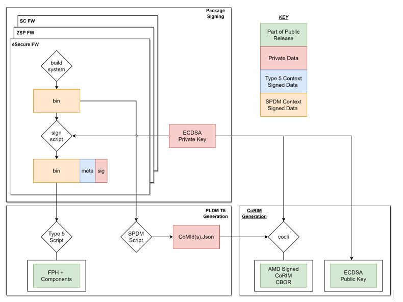

SPDM Attestation
----------------

SPDM Over SMBus
~~~~~~~~~~~~~~~

Alveo™ supports SPDM Over MCTP Over SMBus at slave address 0x30 (8-bit). MA35D SC supports the SPDM discovery and attestation via SPDM over MCTP over SMBus.

1. *SPDM Spec v1.1* (`[DSP0274] <https://www.dmtf.org/sites/default/files/standards/documents/DSP0274_1.1.0.pdf>`__)
2. *SPDM over MCTP Binding Spec* (`[DSP0275] <https://www.dmtf.org/dsp/DSP0275>`__)

For the SPDM discovery, the following commands are supported by SC (SPDM responder):

1. GET_VERSION
2. GET_CAPABILITIES
3. NEGOTIATE_ALGORITHMS

For the run-time attestation, the following commands are supported by SC (SPDM responder):

1. GET_MEASUREMENTS
2. RESPOND_IF_READY

**Table: Supported SPDM commands and description**

+------------------+-----------------------+--------------------------------------------------------------------------------------+
| **Command Code** |  **Command**          | **Description**                                                                      |
+==================+=======================+======================================================================================+
|  0x84            | GET_VERSION           | Command to retrieve the SPDM version of the endpoint                                 |
+------------------+-----------------------+--------------------------------------------------------------------------------------+
|  0xE1            | GET_CAPABILITIES      | Command to retrieve the SPDM capabilities of the endpoint                            |
+------------------+-----------------------+--------------------------------------------------------------------------------------+
|  0xE3            | NEGOTIATE_ALGORITHMS  | Command to negotiate cryptographic algorithms                                        |
+------------------+-----------------------+--------------------------------------------------------------------------------------+
|  0xE0            | GET_MEASUREMENTS      | Command to retrieve firmware measurements in the form of measurements blocks         |
+------------------+-----------------------+--------------------------------------------------------------------------------------+
|  0xFF            | RESPOND_IF_READY      | Get the response to the original request upon receipt of ResponseNotReady error code |
+------------------+-----------------------+--------------------------------------------------------------------------------------+

**NOTE:** SC does not support measurement of all blocks queried at once. When Cerberus/BMC sends GET_MEASUREMENTS command with MeasOperation = 0xFF, SC responds with error response packet with Error Code = 0x01 (Invalid Request).

**Capabilities**

SC supports the following capabilities:

1.	CACHE_CAP - 1b
2.	MEAS_CAP - 01b

**Algorithms**

1.	SC imports Mbed TLS v3.4.0 as a library to handle cryptographic hash operations.
2.	For hashing/measurements, SC firmware advertises SHA_384 as MeasurementHashAlgo and BaseHashSel in ALGORITHMS response.
3.  For SPDM measurement digest, SC uses SHA3_384 to calculate the hash.

**Firmware Measurements**

In MA35D, there are 10 firmware components that are measurable, including the firmware images stored in both the flash partitions (Active & Backup).

1.	Satellite Controller (SC) firmware - A & B
2.	ASIC1: eSecure firmware - A & B
3.	ASIC1: ZSPNano firmware - A & B
4.  ASIC2: eSecure firmware - A & B
5.	ASIC2: ZSPNano firmware - A & B

**NOTE:** Signature and Challenge are not supported.

**Timing specification for SPDM messages**

**Table: SPDM timing spec**

+-----------------------+----------------------+-------------------------------------------------------------------------------------------+
|  **Timing Parameter** | **Value**            | **Description**                                                                           |
+=======================+======================+===========================================================================================+
| RTT                   |  Requestor specific  | Set by BMC; Max time for SPDM round trip message at transport layer SMBus                 |
+-----------------------+----------------------+-------------------------------------------------------------------------------------------+
| ST1                   |  100 ms              | Max amount of time before SC must response to non-crypto requests                         |
+-----------------------+----------------------+-------------------------------------------------------------------------------------------+
| T1                    |  Requestor specific  | Min amount of time BMC should wait before issuing a retry for requests                    |
+-----------------------+----------------------+-------------------------------------------------------------------------------------------+
| CT                    |  134.21 s            | Max time in which SC must response to crypto messages                                     |
+-----------------------+----------------------+-------------------------------------------------------------------------------------------+
| T2                    |  Requestor specific  | Min amount of time BMC shall wait before issuing a retry for requests                     |
+-----------------------+----------------------+-------------------------------------------------------------------------------------------+
| RDT                   |  536.87 s            | Min delay when SC can't complete response within CT; Provide this value as Error response |
+-----------------------+----------------------+-------------------------------------------------------------------------------------------+
| WT                    |  Requestor specific  | Min time BMC must wait before issuing RESPOND_IF_READY request message                    |
+-----------------------+----------------------+-------------------------------------------------------------------------------------------+
| WT_MAX                |  Requestor specific  | Max wait time BMC must issue RESPOND_IF_READY unless the BMC issued that request earlier  |
+-----------------------+----------------------+-------------------------------------------------------------------------------------------+

Cerberus Compliance
~~~~~~~~~~~~~~~~~~~

Adhering to Cerberus discovery & attestation requirements, the measurements are sent in the following process:

**Discovery flow**

1.	Cerberus sends the GET_MEASUREMENT command with MeasOperation = 0 (i.e.) Byte offset 3, Param 2
2.	SC responds with total # of measurement indices = 15
3.	Cerberus sends the GET_MEASUREMENT command with MeasOperation = 15
4.	SC responds with QueryDeviceIdentifiers Data structure in raw bit stream (see table below)

.. image:: ./images/ma35d-query-dev-id-table.png
   :align: center

**Attestation flow**

In the Attestation flow, Cerberus creates a mapping of CoRIM file, one per MA35D firmware component, based on the # of FW measurements and their version numbers. Version set # are monotonically increasing values to prevent roll-back attacks.

1.	Cerberus sends GET_MEASUREMENT command with MeasOperation = 1, 2... or 14 (i.e.) one at a time
2.	SC responds with the measurement for that component.
3.	Cerberus maps the responses within the corresponding Co_MID# and Co_RIM# as below:

Co_RIM1
      Co_MID1
            1. MEAS_ID_1   // 9-bytes Unique ID (raw bit stream) - Concatenation of MEAS_IDs 2, 7 & 12
            2. MEAS_ID_2   // ASIC1/2 eSecure A & B version set (raw bit stream)
            3. MEAS_ID_3   // ASIC1: eSecure A hash
            4. MEAS_ID_4   // ASIC1: eSecure B hash
            5. MEAS_ID_5   // ASIC2: eSecure A hash
            6. MEAS_ID_6   // ASIC2: eSecure B hash
            7. MEAS_ID_7   // ASIC1/2 ZSP A & B version set (raw bit stream)
            8. MEAS_ID_8   // ASIC1: ZSP A hash
            9. MEAS_ID_9   // ASIC1: ZSP B hash
            10. MEAS_ID_10 // ASIC2: ZSP A hash
            11. MEAS_ID_11 // ASIC2: ZSP B hash
            12. MEAS_ID_12 // SC: SC A & B version set (raw bit stream)
            13. MEAS_ID_13 // SC: SC A hash
            14. MEAS_ID_14 // SC: SC B hash

**NOTE:** The 1st Measurement Index is a 9-bytes unique ID, which is nothing but the concatenation of version numbers of eSecure, ZSP & SC firwmare components (3-bytes each) in that respective order.

**CoRIM Reference Measurement File**

In the scope of MA35D, `[colci] <https://github.com/veraison/corim/tree/main/cocli>`__ is used to generate a `[COSE_Sign1] <https://datatracker.ietf.org/wg/cose/about/>`__ CoRIM structure that describes the measurements that are obtained via SPDM at runtime.

*Figure:* CoRIM reference measurement file generation

.. image:: ./images/ma35d-corim-file.png
   :align: center

*Figure:* CoRIM reference measurement file

The Measurement array “key” value is used to map to the SPDM Measurement Index (SPDM IDX N in previous figure). Cocli JSON Input examples - Measurements [0] – Raw Measurement and Measurements [1] - Digest are shown in the figure below.

.. image:: ./images/ma35d-cocli-json-input.png
   :align: center

*Figure:* Cocli JSON Input Example

**AMD Support**

For support resources such as answers, documentation, downloads, and forums, see the `Alveo Accelerator Cards AMD/Xilinx Community Forum <https://forums.xilinx.com/t5/Alveo-Accelerator-Cards/bd-p/alveo>`_.

**License**

Licensed under the Apache License, Version 2.0 (the "License"); you may not use this file except in compliance with the License.

You may obtain a copy of the License at
`http://www.apache.org/licenses/LICENSE-2.0 <http://www.apache.org/licenses/LICENSE-2.0>`_

All images and documentation, including all debug and support documentation, are licensed under the Creative Commons (CC) Attribution 4.0 International License (the "CC-BY-4.0 License"); you may not use this file except in compliance with the CC-BY-4.0 License.

You may obtain a copy of the CC-BY-4.0 License at
`https://creativecommons.org/licenses/by/4.0/ <https://creativecommons.org/licenses/by/4.0/>`_

Unless required by applicable law or agreed to in writing, software distributed under the License is distributed on an "AS IS" BASIS, WITHOUT WARRANTIES OR CONDITIONS OF ANY KIND, either express or implied. See the License for the specific language governing permissions and limitations under the License.

.. raw:: html

	
XD038 | &copy; Copyright 2023, Advanced Micro Devices Inc.

