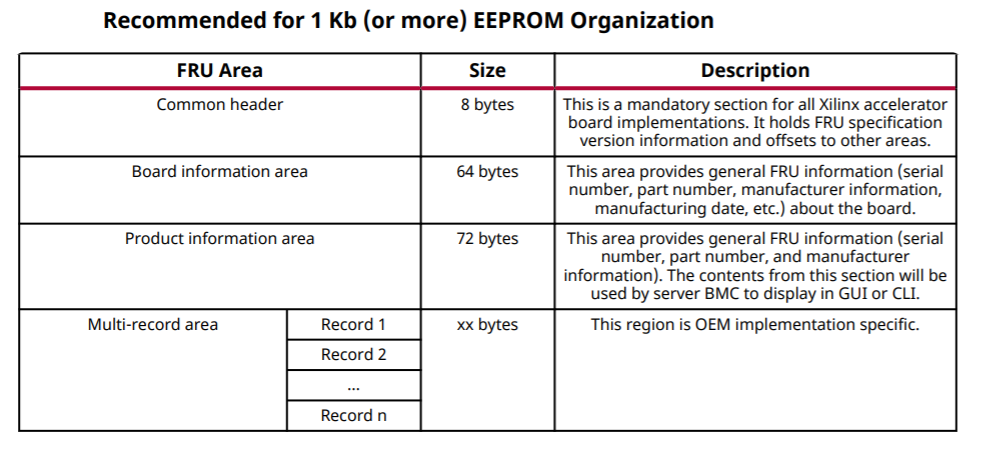
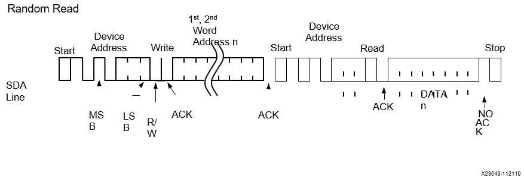

Alveo™ FRU Support 
------------------

The satellite controller firmware supports FRU data via a dedicated I2C slave address 0x50 (0xA0 in 8-bit). Alveo™ FRU implementation is fully compliant with Intelligent Platform Management Interface (IPMI) FRU specification v1.0 r1.3

**Note:** Only 2-byte FRU addressing is supported in Alveo™ FRU data. 1-byte (8-bit) FRU read requests are unsupported and will be responded with 0xFF.

The satellite controller firmware accesses on-board EEPROM and emulates the traditional EEPROM's FRU data within the firmware. This enables server BMCs that are traditionally used to interface with a non-private EEPROM that resides in the same I2C bus, along with the satellite controller.

Accessing the FRU data is supported via SMBus block write block read method, where block write provides a 2-byte FRU offset (address byte 0 or LS byte and address byte 1 MS byte) and the block read retrieves FRU data. The SMBus transaction with the repeated start option will be used to fetch the entire FRU data.

The maximum response per transaction is 255 bytes, as set by the underlying I2C driver. For example, in-order to fetch the FRU data of 300 bytes length, the server BMC is expected to send two repeated START transactions. For the first transaction, the satellite controller firmware sends 255 FRU bytes. For the second transaction, 44 FRU bytes + 212 bytes of 0xFF are sent. Additionally, BMC has the option to request smaller transaction from SC (i.e.) 16 or 32 bytes per transaction.

For the high-level FRU Storage Organization, see the figure below:

Detailed FRU information like sections, length, field definition and description have been captured in  
(`Alveo™ FRU Data Specification <https://xilinx.github.io/Alveo-Cards/master/FRU/index.html>`__).

    *Figure:* **FRU Random Read**

Format: START, SA+W, addr-byte0, addr-byte1, RepeatedSTART, SA+R,
BYTE0, BYTE1…… BYTEN, STOP

Where: [addr-byte0][addr-byte1] are FRU offsets (block writes)
[BYTE0][BYTE1]… [BYTEN] are FRU data response (block reads).

**Note:** 2-byte FRU offset follows [LS Byte] [MS Byte].

Example of Read FRU Data Starting at Offset 0x0
                                               

-  **Block Write Operation:** [N] 0x50 0x00 0x00

    [I2C Bus Number = N ] [I2C Slave = 0x50] [FRU Offset LS Byte] [FRU Offset MS Byte]

-  **Block Read Operation:** [N] 0x50

    [I2C Bus Number = N ] [I2C Slave = 0x50]

Example of Read FRU Data Starting at Offset 50
                                              

-  **Block Write Operation:** [N] 0x50 0x32 0x00

    [I2C Bus Number = N ] [I2C Slave = 0x50] [FRU Offset LS Byte] [FRU Offset MS Byte]

-  **Block Read Operation:** [N] 0x50

    [I2C Bus Number = N ] [I2C Slave = 0x50]

Block Write
~~~~~~~~~~~

**Table: Block Write, Server BMC Request**

+-----------------+-------------------------+---------------------------------+
|     **Server BMC Request**                                                  |
+=================+=========================+=================================+
|     Data bytes  |     [Byte 0] [Byte 1]   |     [Byte 0] – FRU Offset LSB   |
|                 |                         |                                 |
|                 |                         |     [Byte 1] – FRU Offset MSB   |
+-----------------+-------------------------+---------------------------------+

**Table: Block Write, Xilinx® Alveo™ Card Response**

+-------------+------------------------------+
|     **Xilinx Alveo™ Card Response**        |
+=============+==============================+
| Data bytes  |     ACK sent by I2C Driver   |
+-------------+------------------------------+

Block Read
~~~~~~~~~~

**Table: Block Read, Server BMC Request**

+------------+-----------+---------------------------------+
|     **Server BMC Request**                               |
+============+===========+=================================+
| Data bytes |     N/A   |     [Byte 0] – FRU offset LSB   |
|            |           |                                 |
|            |           |     [Byte 1] – FRU offset MSB   |
+------------+-----------+---------------------------------+

**Table: Block Read, Xilinx Alveo™ Card Response**

+-------------+----------------------------------------+-------------------------+
|     **Xilinx Alveo™ Card Response**                                            |
+=============+========================================+=========================+
| Data bytes  |     [Byte 0] [Byte 1] …. [Byte 254]]   |     255-byte FRU data   |
+-------------+----------------------------------------+-------------------------+

**Xilinx Support**

For support resources such as answers, documentation, downloads, and forums, see the `Alveo Accelerator Cards Xilinx Community Forum <https://forums.xilinx.com/t5/Alveo-Accelerator-Cards/bd-p/alveo>`_.

**License**

Licensed under the Apache License, Version 2.0 (the "License"); you may not use this file except in compliance with the License.

You may obtain a copy of the License at
`http://www.apache.org/licenses/LICENSE-2.0 <http://www.apache.org/licenses/LICENSE-2.0>`_

All images and documentation, including all debug and support documentation, are licensed under the Creative Commons (CC) Attribution 4.0 International License (the "CC-BY-4.0 License"); you may not use this file except in compliance with the CC-BY-4.0 License.

You may obtain a copy of the CC-BY-4.0 License at
`https://creativecommons.org/licenses/by/4.0/ <https://creativecommons.org/licenses/by/4.0/>`_

Unless required by applicable law or agreed to in writing, software distributed under the License is distributed on an "AS IS" BASIS, WITHOUT WARRANTIES OR CONDITIONS OF ANY KIND, either express or implied. See the License for the specific language governing permissions and limitations under the License.

.. raw:: html

	
XD038 | &copy; Copyright 2021 Xilinx, Inc.

