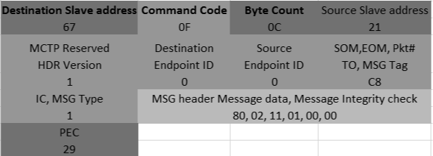

DMTF Implementation
-------------------

Alveo™ supports PLDM Over MCTP Over SMBus at slave address 0x18 (0x30 in 8-bit). The latest sensor information is stored locally in SC FW and is exposed on-demand to server BMC via PLDM Type-2 commands. Sensor information is stored and represented in the platform descriptor record (PDR). 
	
**PLDM Over MCTP Over SMBus Protocol**

SC supports the SMBus discovery via the default SMBus 2.0 at I2C slave address 0x61 (0xC2 in 8-bit) and the MCTP/PLDM protocol at I2C slave address 0x18 (0x30 in 8-bit). Alveo OoB implementation adheres to the following DMTF specifications:

1. *PLDM Base Specification* (`[DSP0240] <https://www.dmtf.org/dsp/DSP0240>`__)
2. *PLDM for Platform Monitoring and Control Specification* (`[DSP0248] <https://www.dmtf.org/dsp/DSP0248>`__)
3. *MCTP Base Specification* (`[DSP0236] <https://www.dmtf.org/dsp/DSP0236>`__)
4. *MCTP SMBus Binding Spec* (`[DSP0237] <https://www.dmtf.org/dsp/DSP0237>`__)

Currently, the following sensor readings are reported via PLDM Type-2 commands:

	1. FPGA die/junction temperature 
	2. Board temperature
	3. QSFP0 temperature
	4. QSFP1 temperature

**Default SMBus 2.0 commands**

For the purposes of SMBus address discovery (at default SMBus address 0xC2 (8-bit)), Alveo™ cards are 'Fixed and Non-Discoverable Device'. Only Get UDID (general) and Get UDID (directed) commands are supported.

**MCTP control messages**
The following MCTP control commands are supported in the SC:

*Table:* **Supported MCTP control commands and description**

+--------------------------+--------+--------------------------------------------------------------------------------+
|  **Command**             | **ID** | **Description**                                                                |
+==========================+========+================================================================================+
| Set Endpoint ID          |  0x01  | Assigns an EID to the endpoint at the given physical address                   |
+--------------------------+--------+--------------------------------------------------------------------------------+
| Get Endpoint ID          |  0x02  | Returns the EID presently assigned to an endpoint                              |
+--------------------------+--------+--------------------------------------------------------------------------------+
| Get Endpoint UUID        |  0x03  | Retrieves a per-device unique UUID associated with the endpoint                |
+--------------------------+--------+--------------------------------------------------------------------------------+
| Get MCTP Version Support |  0x04  | Lists which versions of the MCTP control protocol are supported on an endpoint |
+--------------------------+--------+--------------------------------------------------------------------------------+
| Get Message Type Support |  0x05  | Lists the message types that an endpoint supports                              |
+--------------------------+--------+--------------------------------------------------------------------------------+

**PLDM commands**

The following PLDM commands are supported in the SC:

*Table:* **Supported PLDM commands and description**

+----------------------------+--------+----------------------------------------------------------------------------------+
|  **Command**               | **ID** | **Description**                                                                  |
+============================+========+==================================================================================+
| SetTID                     |  0x01  | Sets the terminus ID (TID) for a PLDM terminus                                   |
+----------------------------+--------+----------------------------------------------------------------------------------+
| GetTID                     |  0x02  | Returns the present TID setting for a PLDM terminus                              |
+----------------------------+--------+----------------------------------------------------------------------------------+
| GetPLDMVersion             |  0x03  | Returns versions for PLDM base & type specification                              |
+----------------------------+--------+----------------------------------------------------------------------------------+
| GetPLDMTypes               |  0x04  | Returns PLDM type capabilities and list of the supported PLDM types              |
+----------------------------+--------+----------------------------------------------------------------------------------+
| GetPLDMCommands            |  0x04  | Returns PLDM command capabilities supported for a specific PLDM type and version |
+----------------------------+--------+----------------------------------------------------------------------------------+
| GetSensorReading           |  0x11  | Returns present reading and threshold event state values from a numeric sensor   |
+----------------------------+--------+----------------------------------------------------------------------------------+
| GetSensorThresholds        |  0x13  | Returns the present threshold settings for a PLDM numeric sensor                 |
+----------------------------+--------+----------------------------------------------------------------------------------+
| GetPDRRepositoryInfo       |  0x50  | Returns size & number of records in PDR and time stamps on last PRD update       |
+----------------------------+--------+----------------------------------------------------------------------------------+
| GetPDR                     |  0x51  | Returns individual PDRs from a PDR repository                                    |
+----------------------------+--------+----------------------------------------------------------------------------------+
| GetPDRRepositorySignature  |  0x53  | Returns a signature that changes when the repo has been changed                  |
+----------------------------+--------+----------------------------------------------------------------------------------+

These PLDM commands are categorized into type 0 and type 2, as detailed in the following table.

*Table:* **Supported Type 0 and Type 2 PLDM commands**

+----------------------------+----------------------------------+
|  **PLDM Type 0 Commands**  |  **PLDM Type 2 Commands**        |
+============================+==================================+
| SetTID (0x01)              | SetTID (0x01)                    |
+----------------------------+----------------------------------+
| GetTID (0x02)              | GetTID (0x02)                    |
+----------------------------+----------------------------------+
| GetPLDMVersion (0x03)      | GetSensorReading (0x11)          |
+----------------------------+----------------------------------+
| GetPLDMTypes (0x04)        | GetSensorThresholds (0x12)       |
+----------------------------+----------------------------------+
| GetPLDMCommands (0x05)     | GetPDRRepositoryInfo (0x50)      |
+----------------------------+----------------------------------+
|                            | GetPDRRepositorySignature (0x53) |
+----------------------------+----------------------------------+

Platform Descriptor Record (PDR)
~~~~~~~~~~~~~~~~~~~~~~~~~~~~~~~~

PDRs provide semantic information for sensors and effects their relationship to the entities that are monitored or controlled. The SC FW has nine PDRs in total:

-  `Terminus Locator PDR`_

-  `Numeric Sensor PDR for FPGA Temperature`_

-  `Numeric Sensor PDR for Board Temperature`_

-  `Numeric Sensor PDR for QSFP0 Temperature`_

-  `Numeric Sensor PDR for QSFP1 Temperature Fields`_

-  `Sensor Auxiliary Names PDR for FPGA Temperature`_

-  `Sensor Auxiliary Names PDR for Board Temperature`_

-  `Sensor Auxiliary Names PDR for QSFP0 Temperature`_

-  `Sensor Auxiliary Names PDR for QSFP1 Temperature`_

    For more details on PDR and the different types, refer to the *PLDM for Platform Monitoring and Control Specification* .

Terminus Locator PDR
~~~~~~~~~~~~~~~~~~~~

The terminus locator PDR provides information that associates a PLDM terminus handle with values that uniquely identify the device or software that contains the PLDM terminus. The fields populated in the terminus locator PDR are listed in the following table.

*Table:* **Populated Terminus Locator Fields**

+------------------------+-----------------+
|     **Field**          |     **Value**   |
+========================+=================+
| PLDM\_TERMINUS\_HANDLE |     0x0000      |
+------------------------+-----------------+
| VALIDITY               |     0x1         |
+------------------------+-----------------+
| CONTAINER\_ID          |     0x7f7f      |
+------------------------+-----------------+

*Table:* **Populated Terminus Locator Fields** *(cont'd)*

+------------------------------+-------------------------------------------------------+
|     **Field**                |     **Value**                                         |
+==============================+=======================================================+
| TERMINUS\_LOCATOR\_TYPE      |     UID (0x0)                                         |
+------------------------------+-------------------------------------------------------+
| TERMINUS\_LOCATOR\_VALUESIZE |     17                                                |
+------------------------------+-------------------------------------------------------+
| TERMINUS\_INSTANCE           |     1                                                 |
+------------------------------+-------------------------------------------------------+
| DEVICE\_UID                  |     62 bf a1 a4 c2 a4 11 e8 be 1f e0 3f 49 e8 97 a4   |
+------------------------------+-------------------------------------------------------+

Numeric Sensor PDR
~~~~~~~~~~~~~~~~~~

The numeric sensor PDR is primarily used to describe the semantics of a PLDM numeric sensor and includes factors to convert raw sensor readings to normalized units.

Numeric Sensor PDR for FPGA Temperature
~~~~~~~~~~~~~~~~~~~~~~~~~~~~~~~~~~~~~~~

*Table:* **Numeric Sensor PDR for FPGA Temperature Fields**

+-----------------------------------------+------------------------------------------------+
|     **Field**                           |     **Value**                                  |
+=========================================+================================================+
|     PLDM\_TERMINUS\_HANDLE              |     0x0000                                     |
+-----------------------------------------+------------------------------------------------+
|     SENSOR\_ID                          |     0x0001                                     |
+-----------------------------------------+------------------------------------------------+
|     ENTITY\_TYPE                        | 0x0051 (P/L PHYSICAL (0x0), ENTITY\_ID 0x0051) |
+-----------------------------------------+------------------------------------------------+
|     ENTITY\_INSTANCE\_NUMBER            |     0x0002                                     |
+-----------------------------------------+------------------------------------------------+
|     CONTAINER\_ID                       |     0x7f7f                                     |
+-----------------------------------------+------------------------------------------------+
|     SENSOR\_INIT                        |     NO\_INIT (0x0)                             |
+-----------------------------------------+------------------------------------------------+
|     SENSOR\_AUXILIARY\_NAMES\_PDR       |     True                                       |
+-----------------------------------------+------------------------------------------------+
|     BASE\_UNIT                          |     DEGREES\_C (0x2)                           |
+-----------------------------------------+------------------------------------------------+
|     UNIT\_MODIFIER                      |     0                                          |
+-----------------------------------------+------------------------------------------------+
|     RATE\_UNIT                          |     NONE (0x0)                                 |
+-----------------------------------------+------------------------------------------------+
|     BASE\_OEM\_UNIT\_HANDLE             |     0                                          |
+-----------------------------------------+------------------------------------------------+
|     AUX\_UNIT                           |     NONE (0x0)                                 |
+-----------------------------------------+------------------------------------------------+
|     AUX\_UNIT\_MODIFIER                 |     0                                          |
+-----------------------------------------+------------------------------------------------+
|     AUX\_RATE\_UNIT                     |     NONE (0x0)                                 |
+-----------------------------------------+------------------------------------------------+
|     REL                                 |     DIVIDED\_BY (0x0)                          |
+-----------------------------------------+------------------------------------------------+
|     AUX\_OEM\_UNIT\_HANDLE              |     0                                          |
+-----------------------------------------+------------------------------------------------+
|     IS\_LINEAR                          |     True                                       |
+-----------------------------------------+------------------------------------------------+
|     SENSOR\_DATA\_SIZE                  |     SINT16 (0x3)                               |
+-----------------------------------------+------------------------------------------------+
|     RESOLUTION                          |     1                                          |
+-----------------------------------------+------------------------------------------------+
|     OFFSET                              |     0                                          |
+-----------------------------------------+------------------------------------------------+
|     ACCURACY                            |     +/– 0.0%                                   |
+-----------------------------------------+------------------------------------------------+
|     PLUS\_TOLERANCE                     |     3                                          |
+-----------------------------------------+------------------------------------------------+
|     MINUS\_TOLERANCE                    |     3                                          |
+-----------------------------------------+------------------------------------------------+
|     HYSTERESIS                          |     0                                          |
+-----------------------------------------+------------------------------------------------+
|     SUPPORTED\_THRESHOLDS               | UPPER\_THRESHOLD\_FATAL(0x2)                   |
|                                         |                                                |
|                                         | UPPER\_THRESHOLD\_CRITICAL (0x1)               |
|                                         |                                                |
|                                         | UPPER\_THRESHOLD\_WARNING (0x0)                |
+-----------------------------------------+------------------------------------------------+
| THRESHOLD\_AND\_HYSTERESIS\_VOLATILITY  |     None                                       |
+-----------------------------------------+------------------------------------------------+
|     STATE\_TRANSITION\_INTERVAL         |     0.0 sec                                    |
+-----------------------------------------+------------------------------------------------+
|     UPDATE\_INTERVAL                    |     0.10000000149011612 sec                    |
+-----------------------------------------+------------------------------------------------+
|     MAX\_READABLE                       |     127                                        |
+-----------------------------------------+------------------------------------------------+
|     MIN\_READABLE                       |     –40                                        |
+-----------------------------------------+------------------------------------------------+
|     RANGE\_FIELD\_FORMAT                |     SINT16 (0x3)                               |
+-----------------------------------------+------------------------------------------------+
|     RANGE\_FIELD\_SUPPORT               | FATAL\_HIGH (0x5) CRITICAL\_HIGH (0x3)         |
|                                         |                                                |
|                                         | NORMAL\_MIN(0x2) NORMAL\_MAX(0x1)              |
+-----------------------------------------+------------------------------------------------+
|     NOMINAL\_VALUE                      |     0                                          |
+-----------------------------------------+------------------------------------------------+
|     NORMAL\_MAX                         |     88                                         |
+-----------------------------------------+------------------------------------------------+
|     NORMAL\_MIN                         |     3                                          |
+-----------------------------------------+------------------------------------------------+
|     WARNING\_HIGH                       |     88                                         |
+-----------------------------------------+------------------------------------------------+
|     WARNING\_LOW                        |     0                                          |
+-----------------------------------------+------------------------------------------------+
|     CRITICAL\_HIGH                      |     97                                         |
+-----------------------------------------+------------------------------------------------+
|     CRITICAL\_LOW                       |     0                                          |
+-----------------------------------------+------------------------------------------------+
|     FATAL\_HIGH                         |     107                                        |
+-----------------------------------------+------------------------------------------------+
|     FATAL\_LOW                          |     0                                          |
+-----------------------------------------+------------------------------------------------+

Numeric Sensor PDR for Board Temperature
~~~~~~~~~~~~~~~~~~~~~~~~~~~~~~~~~~~~~~~~

*Table:* **Numeric Sensor PDR for Board Temperature Fields**

+-----------------------------------------+------------------------------------------------+
|     **Field**                           |     **Value**                                  |
+=========================================+================================================+
|     PLDM\_TERMINUS\_HANDLE              |     0x0000                                     |
+-----------------------------------------+------------------------------------------------+
|     SENSOR\_ID                          |     0x0002                                     |
+-----------------------------------------+------------------------------------------------+
|     ENTITY\_TYPE                        | 0x0051 (P/L PHYSICAL (0x0), ENTITY\_ID 0x0051) |
+-----------------------------------------+------------------------------------------------+
|     ENTITY\_INSTANCE\_NUMBER            |     0x0002                                     |
+-----------------------------------------+------------------------------------------------+
|     CONTAINER\_ID                       |     0x7f7f                                     |
+-----------------------------------------+------------------------------------------------+
|     SENSOR\_INIT                        |     NO\_INIT (0x0)                             |
+-----------------------------------------+------------------------------------------------+
|     SENSOR\_AUXILIARY\_NAMES\_PDR       |     True                                       |
+-----------------------------------------+------------------------------------------------+
|     BASE\_UNIT                          |     DEGREES\_C (0x2)                           |
+-----------------------------------------+------------------------------------------------+
|     UNIT\_MODIFIER                      |     0                                          |
+-----------------------------------------+------------------------------------------------+
|     RATE\_UNIT                          |     NONE (0x0)                                 |
+-----------------------------------------+------------------------------------------------+
|     BASE\_OEM\_UNIT\_HANDLE             |     0                                          |
+-----------------------------------------+------------------------------------------------+
|     AUX\_UNIT                           |     NONE (0x0)                                 |
+-----------------------------------------+------------------------------------------------+
|     AUX\_UNIT\_MODIFIER                 |     0                                          |
+-----------------------------------------+------------------------------------------------+
|     AUX\_RATE\_UNIT                     |     NONE (0x0)                                 |
+-----------------------------------------+------------------------------------------------+
|     REL                                 |     DIVIDED\_BY (0x0)                          |
+-----------------------------------------+------------------------------------------------+
|     AUX\_OEM\_UNIT\_HANDLE              |     0                                          |
+-----------------------------------------+------------------------------------------------+
|     IS\_LINEAR                          |     True                                       |
+-----------------------------------------+------------------------------------------------+
|     SENSOR\_DATA\_SIZE                  |     SINT16 (0x3)                               |
+-----------------------------------------+------------------------------------------------+
|     RESOLUTION                          |     1                                          |
+-----------------------------------------+------------------------------------------------+
|     OFFSET                              |     0                                          |
+-----------------------------------------+------------------------------------------------+
|     ACCURACY                            |     +/– 0.0%                                   |
+-----------------------------------------+------------------------------------------------+
|     PLUS\_TOLERANCE                     |     3                                          |
+-----------------------------------------+------------------------------------------------+
|     MINUS\_TOLERANCE                    |     3                                          |
+-----------------------------------------+------------------------------------------------+
|     HYSTERESIS                          |     0                                          |
+-----------------------------------------+------------------------------------------------+
|     SUPPORTED\_THRESHOLDS               | UPPER\_THRESHOLD\_FATAL(0x2)                   |
|                                         |                                                |
|                                         | UPPER\_THRESHOLD\_CRITICAL (0x1)               |
|                                         |                                                |
|                                         | UPPER\_THRESHOLD\_WARNING (0x0)                |
+-----------------------------------------+------------------------------------------------+
| THRESHOLD\_AND\_HYSTERESIS\_VOLATILITY  |     None                                       |
+-----------------------------------------+------------------------------------------------+
|     STATE\_TRANSITION\_INTERVAL         |     0.0 sec                                    |
+-----------------------------------------+------------------------------------------------+
|     UPDATE\_INTERVAL                    |     0.10000000149011612 sec                    |
+-----------------------------------------+------------------------------------------------+
|     MAX\_READABLE                       |     127                                        |
+-----------------------------------------+------------------------------------------------+
|     MIN\_READABLE                       |     –40                                        |
+-----------------------------------------+------------------------------------------------+
|     RANGE\_FIELD\_FORMAT                |     SINT16 (0x3)                               |
+-----------------------------------------+------------------------------------------------+
|     RANGE\_FIELD\_SUPPORT               | FATAL\_HIGH (0x5) CRITICAL\_HIGH (0x3)         |
|                                         |                                                |
|                                         | NORMAL\_MIN (0x2) NORMAL\_MAX (0x1)            |
+-----------------------------------------+------------------------------------------------+
|     NOMINAL\_VALUE                      |     0                                          |
+-----------------------------------------+------------------------------------------------+
|     NORMAL\_MAX                         |     80                                         |
+-----------------------------------------+------------------------------------------------+
|     NORMAL\_MIN                         |     –40                                        |
+-----------------------------------------+------------------------------------------------+
|     WARNING\_HIGH                       |     80                                         |
+-----------------------------------------+------------------------------------------------+
|     WARNING\_LOW                        |     0                                          |
+-----------------------------------------+------------------------------------------------+
|     CRITICAL\_HIGH                      |     85                                         |
+-----------------------------------------+------------------------------------------------+
|     CRITICAL\_LOW                       |     0                                          |
+-----------------------------------------+------------------------------------------------+
|     FATAL\_HIGH                         |     125                                        |
+-----------------------------------------+------------------------------------------------+
|     FATAL\_LOW                          |     0                                          |
+-----------------------------------------+------------------------------------------------+

Numeric Sensor PDR for QSFP0 Temperature
~~~~~~~~~~~~~~~~~~~~~~~~~~~~~~~~~~~~~~~~

*Table:* **Numeric Sensor PDR for QSFPO Temperature Fields**

+-----------------------------------------+------------------------------------------------+
|     **Field**                           |     **Value**                                  |
+=========================================+================================================+
| PLDM\_TERMINUS\_HANDLE                  |     0x0000                                     |
+-----------------------------------------+------------------------------------------------+
| SENSOR\_ID                              |     0x0002                                     |
+-----------------------------------------+------------------------------------------------+
| ENTITY\_TYPE                            | 0x0051 (P/L PHYSICAL (0x0), ENTITY\_ID (0x0051)|
+-----------------------------------------+------------------------------------------------+
| ENTITY\_INSTANCE\_NUMBER                |     0x0002                                     |
+-----------------------------------------+------------------------------------------------+
| CONTAINER\_ID                           |     0x7f7f                                     |
+-----------------------------------------+------------------------------------------------+
| SENSOR\_INIT                            |     NO\_INIT (0x0)                             |
+-----------------------------------------+------------------------------------------------+
| SENSOR\_AUXILIARY\_NAMES\_PDR           |     True                                       |
+-----------------------------------------+------------------------------------------------+
| BASE\_UNIT                              |     DEGREES\_C (0x2)                           |
+-----------------------------------------+------------------------------------------------+
| UNIT\_MODIFIER                          |     0                                          |
+-----------------------------------------+------------------------------------------------+
| RATE\_UNIT                              |     NONE (0x0)                                 |
+-----------------------------------------+------------------------------------------------+
| BASE\_OEM\_UNIT\_HANDLE                 |     0                                          |
+-----------------------------------------+------------------------------------------------+
| AUX\_UNIT                               |     NONE (0x0)                                 |
+-----------------------------------------+------------------------------------------------+
| AUX\_UNIT\_MODIFIER                     |     0                                          |
+-----------------------------------------+------------------------------------------------+
| AUX\_RATE\_UNIT                         |     NONE (0x0)                                 |
+-----------------------------------------+------------------------------------------------+
| REL                                     |     DIVIDED\_BY (0x0)                          |
+-----------------------------------------+------------------------------------------------+
| AUX\_OEM\_UNIT\_HANDLE                  |     0                                          |
+-----------------------------------------+------------------------------------------------+
| IS\_LINEAR                              |     True                                       |
+-----------------------------------------+------------------------------------------------+
| SENSOR\_DATA\_SIZE                      |     SINT16 (0x3)                               |
+-----------------------------------------+------------------------------------------------+
| RESOLUTION                              |     1                                          |
+-----------------------------------------+------------------------------------------------+
| OFFSET                                  |     0                                          |
+-----------------------------------------+------------------------------------------------+
| ACCURACY                                |     +/– 0.0%                                   |
+-----------------------------------------+------------------------------------------------+
| PLUS\_TOLERANCE                         |     3                                          |
+-----------------------------------------+------------------------------------------------+
| MINUS\_TOLERANCE                        |     3                                          |
+-----------------------------------------+------------------------------------------------+
| HYSTERESIS                              |     0                                          |
+-----------------------------------------+------------------------------------------------+
| SUPPORTED\_THRESHOLDS                   |     UPPER\_THRESHOLD\_FATAL (0x2)              |
|                                         |                                                |
|                                         |     UPPER\_THRESHOLD\_CRITICAL (0x1)           |
|                                         |                                                |
|                                         |     UPPER\_THRESHOLD\_WARNING (0x0)            |
+-----------------------------------------+------------------------------------------------+
| THRESHOLD\_AND\_HYSTERESIS\_VOLATILITY  |     None                                       |
+-----------------------------------------+------------------------------------------------+
| STATE\_TRANSITION\_INTERVAL             |     0.0 sec                                    |
+-----------------------------------------+------------------------------------------------+
|     UPDATE\_INTERVAL                    |     0.10000000149011612 sec                    |
+-----------------------------------------+------------------------------------------------+
|     MAX\_READABLE                       |     127                                        |
+-----------------------------------------+------------------------------------------------+
|     MIN\_READABLE                       |     –40                                        |
+-----------------------------------------+------------------------------------------------+
|     RANGE\_FIELD\_FORMAT                |     SINT16 (0x3)                               |
+-----------------------------------------+------------------------------------------------+
|     RANGE\_FIELD\_SUPPORT               |  FATAL\_HIGH (0x5) CRITICAL\_HIGH (0x3)        |
|                                         |                                                |
|                                         |  NORMAL\_MIN (0x2)   NORMAL\_MAX (0x1)         |
+-----------------------------------------+------------------------------------------------+
|     NOMINAL\_VALUE                      |     0                                          |
+-----------------------------------------+------------------------------------------------+
|     NORMAL\_MAX                         |     80                                         |
+-----------------------------------------+------------------------------------------------+
|     NORMAL\_MIN                         |     –40                                        |
+-----------------------------------------+------------------------------------------------+
|     WARNING\_HIGH                       |     80                                         |
+-----------------------------------------+------------------------------------------------+
|     WARNING\_LOW                        |     0                                          |
+-----------------------------------------+------------------------------------------------+
|     CRITICAL\_HIGH                      |     85                                         |
+-----------------------------------------+------------------------------------------------+
|     CRITICAL\_LOW                       |     0                                          |
+-----------------------------------------+------------------------------------------------+
|     FATAL\_HIGH                         |     125                                        |
+-----------------------------------------+------------------------------------------------+
|     FATAL\_LOW                          |     0                                          |
+-----------------------------------------+------------------------------------------------+

Numeric Sensor PDR for QSFP1 Temperature Fields
~~~~~~~~~~~~~~~~~~~~~~~~~~~~~~~~~~~~~~~~~~~~~~~

*Table* **Numeric Sensor PDR for QSFP1 Temperature Fields**

+-----------------------------------------+------------------------------------------------+
|     **Field**                           |     **Value**                                  |
+=========================================+================================================+
|     PLDM\_TERMINUS\_HANDLE              |     0x0000                                     |
+-----------------------------------------+------------------------------------------------+
|     SENSOR\_ID                          |     0x0004                                     |
+-----------------------------------------+------------------------------------------------+
|     ENTITY\_TYPE                        | 0x0051 (P/L PHYSICAL (0x0), ENTITY\_ID (0x0051)|
+-----------------------------------------+------------------------------------------------+
|     ENTITY\_INSTANCE\_NUMBER            |     0x0004                                     |
+-----------------------------------------+------------------------------------------------+
|     CONTAINER\_ID                       |     0x7f7f                                     |
+-----------------------------------------+------------------------------------------------+
|     SENSOR\_INIT                        |     NO\_INIT (0x0)                             |
+-----------------------------------------+------------------------------------------------+
|     SENSOR\_AUXILIARY\_NAMES\_PDR       |     True                                       |
+-----------------------------------------+------------------------------------------------+
|     BASE\_UNIT                          |     DEGREES\_C (0x2)                           |
+-----------------------------------------+------------------------------------------------+
|     UNIT\_MODIFIER                      |     0                                          |
+-----------------------------------------+------------------------------------------------+
|     RATE\_UNIT                          |     NONE (0x0)                                 |
+-----------------------------------------+------------------------------------------------+
|     BASE\_OEM\_UNIT\_HANDLE             |     0                                          |
+-----------------------------------------+------------------------------------------------+
|     AUX\_UNIT                           |     NONE (0x0)                                 |
+-----------------------------------------+------------------------------------------------+
|     AUX\_UNIT\_MODIFIER                 |     0                                          |
+-----------------------------------------+------------------------------------------------+
|     AUX\_RATE\_UNIT                     |     NONE (0x0)                                 |
+-----------------------------------------+------------------------------------------------+
|     REL                                 |     DIVIDED\_BY (0x0)                          |
+-----------------------------------------+------------------------------------------------+
|     AUX\_OEM\_UNIT\_HANDLE              |     0                                          |
+-----------------------------------------+------------------------------------------------+
|     IS\_LINEAR                          |     True                                       |
+-----------------------------------------+------------------------------------------------+
|     SENSOR\_DATA\_SIZE                  |     SINT16 (0x3)                               |
+-----------------------------------------+------------------------------------------------+
|     RESOLUTION                          |     1                                          |
+-----------------------------------------+------------------------------------------------+
|     OFFSET                              |     0                                          |
+-----------------------------------------+------------------------------------------------+
|     ACCURACY                            |     +/– 0.0%                                   |
+-----------------------------------------+------------------------------------------------+
|     PLUS\_TOLERANCE                     |     3                                          |
+-----------------------------------------+------------------------------------------------+
|     MINUS\_TOLERANCE                    |     3                                          |
+-----------------------------------------+------------------------------------------------+
|     HYSTERESIS                          |     0                                          |
+-----------------------------------------+------------------------------------------------+
|     SUPPORTED\_THRESHOLDS               |     UPPER\_THRESHOLD\_FATAL (0x2)              |
|                                         |                                                |
|                                         |     UPPER\_THRESHOLD\_CRITICAL (0x1)           |
|                                         |                                                |
|                                         |     UPPER\_THRESHOLD\_WARNING (0x0)            |
+-----------------------------------------+------------------------------------------------+
| THRESHOLD\_AND\_HYSTERESIS\_VOLATILITY  |     None                                       |
+-----------------------------------------+------------------------------------------------+
|     STATE\_TRANSITION\_INTERVAL         |     0.0 sec                                    |
+-----------------------------------------+------------------------------------------------+
|     UPDATE\_INTERVAL                    |     0.10000000149011612 sec                    |
+-----------------------------------------+------------------------------------------------+
|     MAX\_READABLE                       |     127                                        |
+-----------------------------------------+------------------------------------------------+
|     MIN\_READABLE                       |     –40                                        |
+-----------------------------------------+------------------------------------------------+
|     RANGE\_FIELD\_FORMAT                |     SINT16(0x3)                                |
+-----------------------------------------+------------------------------------------------+
|     RANGE\_FIELD\_SUPPORT               | FATAL\_HIGH (0x5) CRITICAL\_HIGH (0x3)         |
|                                         |                                                |
|                                         | NORMAL\_MIN (0x2) NORMAL\_MAX (0x1)            |
+-----------------------------------------+------------------------------------------------+
|     NOMINAL\_VALUE                      |     0                                          |
+-----------------------------------------+------------------------------------------------+
|     NORMAL\_MAX                         |     80                                         |
+-----------------------------------------+------------------------------------------------+
|     NORMAL\_MIN                         |     –40                                        |
+-----------------------------------------+------------------------------------------------+
|     WARNING\_HIGH                       |     80                                         |
+-----------------------------------------+------------------------------------------------+
|     WARNING\_LOW                        |     0                                          |
+-----------------------------------------+------------------------------------------------+
|     CRITICAL\_HIGH                      |     85                                         |
+-----------------------------------------+------------------------------------------------+
|     CRITICAL\_LOW                       |     0                                          |
+-----------------------------------------+------------------------------------------------+
|     FATAL\_HIGH                         |     90                                         |
+-----------------------------------------+------------------------------------------------+
|     FATAL\_LOW                          |     0                                          |
+-----------------------------------------+------------------------------------------------+

Sensor Auxiliary Names PDR
~~~~~~~~~~~~~~~~~~~~~~~~~~

The sensor auxiliary names PDR may be used to provide optional information that names the sensor.

Sensor Auxiliary Names PDR for FPGA Temperature
~~~~~~~~~~~~~~~~~~~~~~~~~~~~~~~~~~~~~~~~~~~~~~~

*Table:* **Sensor Auxiliary Names PDR for FPGFA Temperature Fields**

+-----------------------------+------------------------+
|     **Field**               |     **Value**          |
+=============================+========================+
|     PLDM\_TERMINUS\_HANDLE  |     0x0000             |
+-----------------------------+------------------------+
|     SENSOR\_ID              |     0x0001             |
+-----------------------------+------------------------+
|     SENSOR\_COUNT           |     1                  |
+-----------------------------+------------------------+
|     NAME\_STRING\_COUNT     |     1                  |
+-----------------------------+------------------------+
|     NAME\_LANGUAGE\_TAG     |     en-US              |
+-----------------------------+------------------------+
|     SENSOR\_NAME            |     FPGA temperature   |
+-----------------------------+------------------------+

Sensor Auxiliary Names PDR for Board Temperature
~~~~~~~~~~~~~~~~~~~~~~~~~~~~~~~~~~~~~~~~~~~~~~~~

*Table:* **Sensor Auxiliary Names PDR for Board Temperature Fields**

+-----------------------------+------------------------+
|     **Field**               |     **Value**          |
+=============================+========================+
| PLDM\_TERMINUS\_HANDLE      |     0x0000             |
+-----------------------------+------------------------+
| SENSOR\_ID                  |     0x0002             |
+-----------------------------+------------------------+
| SENSOR\_COUNT               |     1                  |
+-----------------------------+------------------------+
| NAME\_STRING\_COUNT         |     1                  |
+-----------------------------+------------------------+
| NAME\_LANGUAGE\_TAG         |     en-US              |
+-----------------------------+------------------------+
| SENSOR\_NAME                |     Board temperature  |
+-----------------------------+------------------------+

Sensor Auxiliary Names PDR for QSFP0 Temperature
~~~~~~~~~~~~~~~~~~~~~~~~~~~~~~~~~~~~~~~~~~~~~~~~

*Table:* **Sensor Auxiliary Names PDR for QSFP0 Temperature Fields**

+-----------------------------+------------------------+
|     **Field**               |     **Value**          |
+=============================+========================+
|     PLDM\_TERMINUS\_HANDLE  |     0x0000             |
+-----------------------------+------------------------+
|     SENSOR\_ID              |     0x0003             |
+-----------------------------+------------------------+
|     SENSOR\_COUNT           |     1                  |
+-----------------------------+------------------------+
|     NAME\_STRING\_COUNT     |     1                  |
+-----------------------------+------------------------+
|     NAME\_LANGUAGE\_TAG     |     en-US              |
+-----------------------------+------------------------+
|     SENSOR\_NAME            | QSFP-0 temperature     |
+-----------------------------+------------------------+

Sensor Auxiliary Names PDR for QSFP1 Temperature
~~~~~~~~~~~~~~~~~~~~~~~~~~~~~~~~~~~~~~~~~~~~~~~~

*Table:* **Sensor Auxiliary Names PDR for QSFP1 Temperature Fields**

+-----------------------------+------------------------+
|     **Field**               |     **Value**          |
+=============================+========================+
|     PLDM\_TERMINUS\_HANDLE  |     0x0000             |
+-----------------------------+------------------------+
|     SENSOR\_ID              |     0x0004             |
+-----------------------------+------------------------+
|     SENSOR\_COUNT           |     1                  |
+-----------------------------+------------------------+
|     NAME\_STRING\_COUNT     |     1                  |
+-----------------------------+------------------------+
|     NAME\_LANGUAGE\_TAG     |     en-US              |
+-----------------------------+------------------------+
|     SENSOR\_NAME            | QSFP-1 temperature     |
+-----------------------------+------------------------+

Sample PLDM Transaction
~~~~~~~~~~~~~~~~~~~~~~~

This section examines a sample PLDM request and response message. For this example, the BMC on the server has a I2C address of 0x20 and the SC has an I2C address of 0xCE.

PLDM Request
~~~~~~~~~~~~

The PLDM request originates from the server BMC and SC FW receives this request via I2C interface at address 0xCE. The MCTP packet encapsulation and the different fields are explained in the *MCTP SMBus/I2C Transport Binding Specification*

    *Figure:* **PLDM Request**

A request sent from the BMC to the SC will resemble the following table.

The blue section is the PLDM message that can be decoded, as explained in the *PLDM Base Specification*

*Table:* **PLDM Message Payload**

.. image:: ./images/payload.png
   :align: center

***Note*:** The PLDM completion code is present only in PDM response
messages.

The blue section in the previous message decoded using the PLDM message scheme resembles the following figure.

*Table:* **PLDM Message Scheme**

.. image:: ./images/message-scheme.png
   :align: center

Hdr and PLDM completion code field only applies to PLDM responses,
not PLDM requests. PLDM Command code 0x11 corresponds to the
GetSensorReading and the payload can now be decoded, as detailed in
the following table.

*Table:* **PLDM Completion Codes**

+--------------+------------------------+---------------------------------+
|     **Type** |     **Request Data**   |     **Value In Our Examples**   |
+==============+========================+=================================+
|     uint16   |     Sensor ID          |     0x0001                      |
+--------------+------------------------+---------------------------------+
|     bool8    |     rearmEventState    |     0x00                        |
+--------------+------------------------+---------------------------------+

Now the SC knows that the server BMC is requesting a sensor reading
with sensor ID 0x01.

PLDM Response
~~~~~~~~~~~~~

The SC frames the response to each valid PLDM request in the background and 
sends the response in SMBus master mode. This section provides a detailed explanation 
of how the SC PLDM packets. Additionally, the details about how MCTP packets are within each 
PLDM packet gets built is also provided.

The following table details the response for GetSensorReading.

*Table:* **GetSensorReading Response**

+---------------+--------------------------------+---------------------------------+
|     **Type**  |     **Request Data**           |     **Value In Our Examples**   |
+===============+================================+=================================+
|     enum8     |     completionCode             |     0x00                        |
+---------------+--------------------------------+---------------------------------+
|     enum8     |     sensorDataSize             |     0x02                        |
+---------------+--------------------------------+---------------------------------+
|     enum8     |     sensorOperationalState     |     0x00                        |
+---------------+--------------------------------+---------------------------------+
|     enum8     |     sensoreventMessageEnable   |     0x00                        |
+---------------+--------------------------------+---------------------------------+
|     enum8     |     presentState               |     0x01                        |
+---------------+--------------------------------+---------------------------------+
|     enum8     |     previousState              |     0x00                        |
+---------------+--------------------------------+---------------------------------+
|     enum8     |     eventState                 |     0x01                        |
+---------------+--------------------------------+---------------------------------+
|     uint16    |     presentReading             |     0x002A                      |
+---------------+--------------------------------+---------------------------------+

The response that gets plugged into the PLDM message scheme resembles the following table.

.. image:: ./images/response.png
   :align: center

The PLDM message encapsulated inside MCTP response resembles the following table.

*Table:* **PDLM Message in MCTP Response**

The server BMC decodes the MCTP response it receives to obtain the sensor readings.

**Xilinx Support**

For support resources such as answers, documentation, downloads, and forums, see the `Alveo Accelerator Cards Xilinx Community Forum <https://forums.xilinx.com/t5/Alveo-Accelerator-Cards/bd-p/alveo>`_.

**License**

Licensed under the Apache License, Version 2.0 (the "License"); you may not use this file except in compliance with the License.

You may obtain a copy of the License at
`http://www.apache.org/licenses/LICENSE-2.0 <http://www.apache.org/licenses/LICENSE-2.0>`_

All images and documentation, including all debug and support documentation, are licensed under the Creative Commons (CC) Attribution 4.0 International License (the "CC-BY-4.0 License"); you may not use this file except in compliance with the CC-BY-4.0 License.

You may obtain a copy of the CC-BY-4.0 License at
`https://creativecommons.org/licenses/by/4.0/ <https://creativecommons.org/licenses/by/4.0/>`_

Unless required by applicable law or agreed to in writing, software distributed under the License is distributed on an "AS IS" BASIS, WITHOUT WARRANTIES OR CONDITIONS OF ANY KIND, either express or implied. See the License for the specific language governing permissions and limitations under the License.

.. raw:: html

	
XD038 | &copy; Copyright 2021 Xilinx, Inc.

