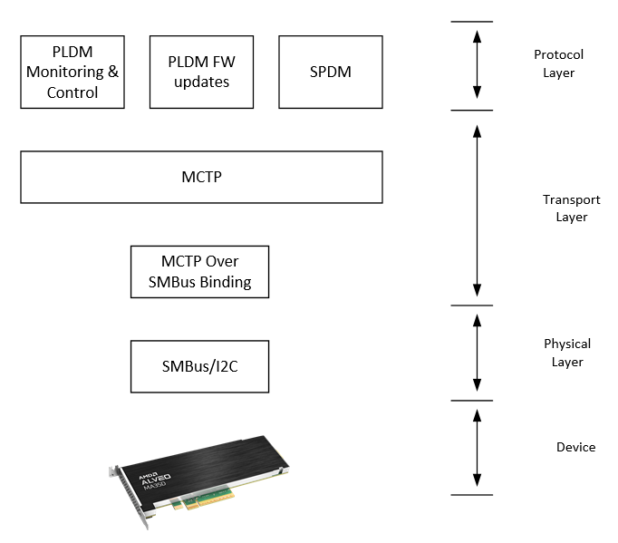

PMCI Support
------------

All Alveo™ products, SC firmware supports the SMBus discovery via the default SMBus 2.0 at I2C slave address 0x61 (0xC2 in 8-bit) and the MCTP/PLDM protocol at I2C slave address 0x18 (0x30 in 8-bit). Alveo OoB implementation adheres to the following DMTF specifications:

1. *MCTP Base Specification* (`[DSP0236] <https://www.dmtf.org/dsp/DSP0236>`__)
2. *MCTP SMBus Binding Spec* (`[DSP0237] <https://www.dmtf.org/dsp/DSP0237>`__)
3. *PLDM Base Specification* (`[DSP0240] <https://www.dmtf.org/dsp/DSP0240>`__)
4. *PLDM for Platform Monitoring and Control Specification* (`[DSP0248] <https://www.dmtf.org/dsp/DSP0248>`__)
5. *PLDM for FW Update Spec* (`[DSP0267] <https://www.dmtf.org/dsp/DSP0267>`__)
	
**PLDM Over MCTP Over SMBus Protocol**

The following figure illustrates the PLDM over MCTP over SMBus binding specification stack.

*Figure:* PLDM Over MCTP Over SMBus Binding Spec stack

SMBus 2.0 commands
~~~~~~~~~~~~~~~~~~

Alveo™ supports SMBus discovery via default address 0xC2 (8-bit). Alveo™ products are 'Fixed and Non-Discoverable Device'. Only the following SMBus commands are supported: 

1. Get UDID (general) 
2. Get UDID (directed)

MCTP control messages
~~~~~~~~~~~~~~~~~~~~~

The following MCTP control commands are supported in the SC:

**Table: Supported MCTP control commands and description**

+------------------+--------------------------+--------------------------------------------------------------------------------+
| **Command Code** |  **Command Name**        | **Description**                                                                |
+==================+==========================+================================================================================+
|  0x01            | Set Endpoint ID          | Assigns an EID to the endpoint at the given physical address                   |
+------------------+--------------------------+--------------------------------------------------------------------------------+
|  0x02            | Get Endpoint ID          | Returns the EID presently assigned to an endpoint                              |
+------------------+--------------------------+--------------------------------------------------------------------------------+
|  0x03            | Get Endpoint UUID        | Retrieves a per-device unique UUID associated with the endpoint                |
+------------------+--------------------------+--------------------------------------------------------------------------------+
|  0x04            | Get MCTP Version Support | Lists which versions of the MCTP control protocol are supported on an endpoint |
+------------------+--------------------------+--------------------------------------------------------------------------------+
|  0x05            | Get Message Type Support | Lists the message types that an endpoint supports                              |
+------------------+--------------------------+--------------------------------------------------------------------------------+

PLDM Telemetry Commands
~~~~~~~~~~~~~~~~~~~~~~~

The following PLDM Type-0 (Control & Discovery) commands are supported in the SC:

**Table: Supported PLDM Type-0 commands and description**

+------------------+-------------------+----------------------------------------------------------------------------------+
| **Command Code** |  **Command Name** | **Description**                                                                  |
+==================+===================+==================================================================================+
|  0x01            | SetTID            | Sets the terminus ID (TID) for a PLDM terminus                                   |
+------------------+-------------------+----------------------------------------------------------------------------------+
|  0x02            | GetTID            | Returns the present TID setting for a PLDM terminus                              |
+------------------+-------------------+----------------------------------------------------------------------------------+
|  0x03            | GetPLDMVersion    | Returns versions for PLDM base & type specification                              |
+------------------+-------------------+----------------------------------------------------------------------------------+
|  0x04            | GetPLDMTypes      | Returns PLDM type capabilities and list of the supported PLDM types              |
+------------------+-------------------+----------------------------------------------------------------------------------+
|  0x05            | GetPLDMCommands   | Returns PLDM command capabilities supported for a specific PLDM type and version |
+------------------+-------------------+----------------------------------------------------------------------------------+

The following PLDM Type-2 (Numeric, Effecter & PDR) commands are supported in the SC:

**Table: Supported PLDM Type-2 commands and description**

+------------------+--------------------------+----------------------------------------------------------------------------------+
| **Command Code** |  **Command Name**        | **Description**                                                                  |
+==================+==========================+==================================================================================+
|  0x10            | SetNumericSensorEnable   | Command to set the operational state of the sensor                               |
+------------------+--------------------------+----------------------------------------------------------------------------------+
|  0x11            | GetSensorReading         | Command to get present reading and threshold event state values from a numeric   |
|                  |                          | sensor, as well as the operating state of the sensor itself                      |
+------------------+--------------------------+----------------------------------------------------------------------------------+
|  0x12            | GetSensorThresholds      | Returns the present threshold settings for a PLDM numeric sensor                 |
+------------------+--------------------------+----------------------------------------------------------------------------------+
|  0x30            | SetNumericEffecterEnable | Command is used to enable or disable Effecter operation                          |
+------------------+--------------------------+----------------------------------------------------------------------------------+
|  0x31            | SetNumericEffecterValue  | Command is used to set the value for a PLDM Numeric Effecter                     |
+------------------+--------------------------+----------------------------------------------------------------------------------+
|  0x32            | GetNumericEffecterValue  | Command is used to return the present numeric setting of a PLDM Numeric Effecter |
+------------------+--------------------------+----------------------------------------------------------------------------------+
|  0x50            | GetPDRRepositoryInfo     | Returns size & number of records in PDR and time stamps on last PRD update       |
+------------------+--------------------------+----------------------------------------------------------------------------------+
|  0x51            | GetPDR                   | Returns individual PDRs from a PDR repository                                    |
+------------------+--------------------------+----------------------------------------------------------------------------------+
|  0x53            | GetPDRRepoSignature      | Returns a signature that changes when the PDR repo has been changed              |
+------------------+--------------------------+----------------------------------------------------------------------------------+

**NOTE:** Effecter commands are supported only in Alveo™ MA35D product

PLDM FW update commands
~~~~~~~~~~~~~~~~~~~~~~~

**Acronyms:**

* UA   - Update Agent (aka BMC)
* FD   - Firmware Device (aka SC firmmare)
* IFWI - Integrated Firmware Image

In ALVEO MA35D, SC supports the IFWI update via PLDM Type-5 over MCTP over SMBus. The following commands are supported:

Table: Supported PLDM Type-5 commands and description

+------------------+------------------------+------------------------+
| **Command Code** |  **Command Name**      | **Command Originator** |
+==================+========================+========================+
|  0x01            | QueryDeviceIdentifiers | UA/BMC                 |
+------------------+------------------------+------------------------+
|  0x02            | GetFirmwareParameters  | UA/BMC                 |
+------------------+------------------------+------------------------+
|  0x10            | RequestUpdate          | UA/BMC                 |
+------------------+------------------------+------------------------+
|  0x13            | PassComponentTable     | UA/BMC                 |
+------------------+------------------------+------------------------+
|  0x14            | UpdateComponent        | UA/BMC                 |
+------------------+------------------------+------------------------+
|  0x15            | RequestFirmwareData    | FD/SC                  |
+------------------+------------------------+------------------------+
|  0x16            | TransferComplete       | FD/SC                  |
+------------------+------------------------+------------------------+
|  0x17            | VerifyComplete         | FD/SC                  |
+------------------+------------------------+------------------------+
|  0x18            | ApplyComplete          | FD/SC                  |
+------------------+------------------------+------------------------+
|  0x1A            | ActivateFirmware       | UA/BMC                 |
+------------------+------------------------+------------------------+
|  0x1B            | GetStatus              | UA/BMC                 |
+------------------+------------------------+------------------------+
|  0x1C            | CancelUpdateComponent  | UA/BMC                 |
+------------------+------------------------+------------------------+
|  0x1D            | CancelUpdate           | UA/BMC                 |
+------------------+------------------------+------------------------+

**AMD Support**

For support resources such as answers, documentation, downloads, and forums, see the `Alveo Accelerator Cards AMD/Xilinx Community Forum <https://forums.xilinx.com/t5/Alveo-Accelerator-Cards/bd-p/alveo>`_.

**License**

Licensed under the Apache License, Version 2.0 (the "License"); you may not use this file except in compliance with the License.

You may obtain a copy of the License at
`http://www.apache.org/licenses/LICENSE-2.0 <http://www.apache.org/licenses/LICENSE-2.0>`_

All images and documentation, including all debug and support documentation, are licensed under the Creative Commons (CC) Attribution 4.0 International License (the "CC-BY-4.0 License"); you may not use this file except in compliance with the CC-BY-4.0 License.

You may obtain a copy of the CC-BY-4.0 License at
`https://creativecommons.org/licenses/by/4.0/ <https://creativecommons.org/licenses/by/4.0/>`_

Unless required by applicable law or agreed to in writing, software distributed under the License is distributed on an "AS IS" BASIS, WITHOUT WARRANTIES OR CONDITIONS OF ANY KIND, either express or implied. See the License for the specific language governing permissions and limitations under the License.

.. raw:: html

	
XD038 | &copy; Copyright 2023, Advanced Micro Devices Inc.

