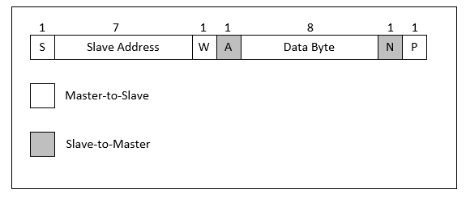

I2C/SMBus Implementation and Protocol Recap
-------------------------------------------

The latest sensor information is stored locally in the SC FW and is exposed on-demand to server BMC via the OOB channel
I2C/SMBus, at slave address 0x65. The implementation is SMBus v2.0 Specification compliant.

*Figure:* **SMBus Packet**

*Table:* **SMBus Packet diagram element Key**

+-------------------+----------------------------------------------------------------------------------------------+
|     **Key**       |     **Description**                                                                          |
+===================+==============================================================================================+
|     S             |     Start condition                                                                          |
+-------------------+----------------------------------------------------------------------------------------------+
|     Sr            |     Repeated start condition                                                                 |
+-------------------+----------------------------------------------------------------------------------------------+
|     R             |     Read (bit value of 1)                                                                    |
+-------------------+----------------------------------------------------------------------------------------------+
|     W             |     Write (bite value of 0)                                                                  |
+-------------------+----------------------------------------------------------------------------------------------+
|     x             |     When shown under a field, indicates that the field is required to have the value of x.   |
+-------------------+----------------------------------------------------------------------------------------------+
|     A             |     Acknowledge (this bit position may be 0 for an ACK or 1 for a NACK)                      |
+-------------------+----------------------------------------------------------------------------------------------+
|     P             |     Stop condition                                                                           |
+-------------------+----------------------------------------------------------------------------------------------+
|     PEC           |     Packet error code                                                                        |
+-------------------+----------------------------------------------------------------------------------------------+
|     □             |     Master-to-slave                                                                          |
+-------------------+----------------------------------------------------------------------------------------------+
|     ■             |     Slave-to-master                                                                          |
+-------------------+----------------------------------------------------------------------------------------------+
|     ...           |     Continuation of protocol                                                                 |
+-------------------+----------------------------------------------------------------------------------------------+

*Read-Byte*

*Read-Word*

*Block-Read*

*Block-Write Block-Read*

**Xilinx Support**

For support resources such as answers, documentation, downloads, and forums, see the `Alveo Accelerator Cards Xilinx Community Forum <https://forums.xilinx.com/t5/Alveo-Accelerator-Cards/bd-p/alveo>`_.

**License**

Licensed under the Apache License, Version 2.0 (the "License"); you may not use this file except in compliance with the License.

You may obtain a copy of the License at
`http://www.apache.org/licenses/LICENSE-2.0 <http://www.apache.org/licenses/LICENSE-2.0>`_

All images and documentation, including all debug and support documentation, are licensed under the Creative Commons (CC) Attribution 4.0 International License (the "CC-BY-4.0 License"); you may not use this file except in compliance with the CC-BY-4.0 License.

You may obtain a copy of the CC-BY-4.0 License at
`https://creativecommons.org/licenses/by/4.0/ <https://creativecommons.org/licenses/by/4.0/>`_

Unless required by applicable law or agreed to in writing, software distributed under the License is distributed on an "AS IS" BASIS, WITHOUT WARRANTIES OR CONDITIONS OF ANY KIND, either express or implied. See the License for the specific language governing permissions and limitations under the License.

.. raw:: html

	
XD038 | &copy; Copyright 2021 Xilinx, Inc.

